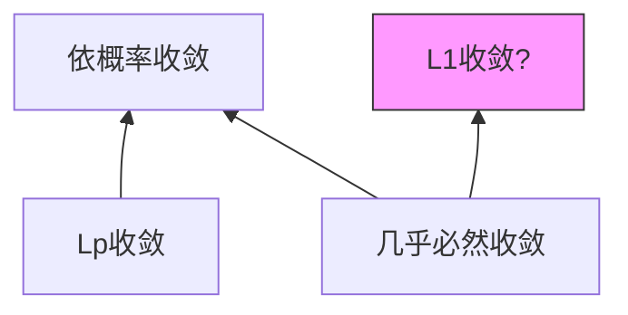
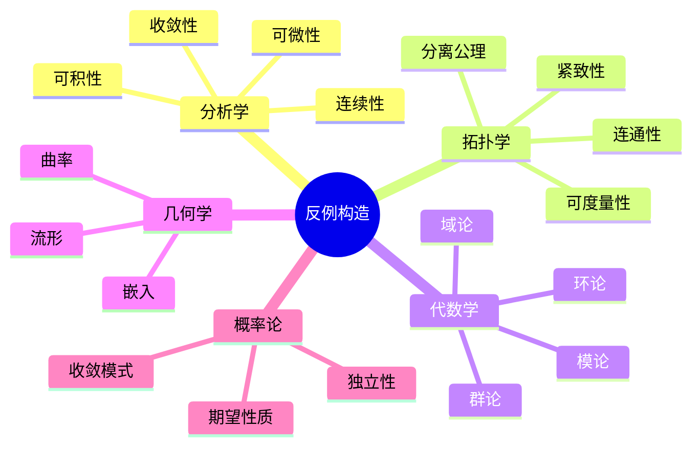

# 数学经典反例大全

---

## 说明

反例在数学中具有核心地位，它们：
- **澄清概念边界**：明确定理条件的必要性
- **加深理解**：揭示直觉的局限性
- **推动理论发展**：引导更精确的表述

本文档收集各数学分支的经典反例，按分支组织。

---

## 1. 分析学反例

### 1.1 连续性相关

| 反例 | 说明 | 来源 |
|-----|------|-----|
| **Dirichlet函数** | $D(x) = \begin{cases} 1 & x \in \mathbb{Q} \\ 0 & x \notin \mathbb{Q} \end{cases}$ | 处处不连续 |
| **Thomae函数** | $R(x) = \begin{cases} 1/q & x = p/q \text{最简} \\ 0 & x \notin \mathbb{Q} \end{cases}$ | 有理点间断，无理点连续 |
| **Weierstrass函数** | $W(x) = \sum a^n \cos(b^n \pi x)$ | 处处连续处处不可微 |

**Thomae函数详解**：
- 在无理点连续：$\lim_{x \to x_0} R(x) = 0 = R(x_0)$
- 在有理点 $p/q$：$R(p/q) = 1/q > 0$，但附近有任意接近的无理点使 $R = 0$

### 1.2 收敛性反例

```mermaid
flowchart TD
    A[函数序列收敛] --> B{逐点收敛}
    B --> C{一致收敛?}
    C -->|否| D[极限函数不连续]
    C -->|是| E[极限函数连续]
    
    D --> F[例: $f_n(x) = x^n$ on [0,1]]
    F --> G[逐点收敛到不连续函数]
```

**经典反例**：$f_n(x) = x^n$ 在 $[0,1]$ 上
- 逐点收敛：$f(x) = \begin{cases} 0 & x \in [0,1) \\ 1 & x = 1 \end{cases}$
- 非一致收敛：$\sup |f_n(x) - f(x)| = 1$ 不趋于0

### 1.3 可积性反例

| 条件 | 反例 | 说明 |
|-----|------|-----|
| 有界+间断点可数 ⟹ Riemann可积 | Volterra函数 | 有界，导数处处存在但有界变差，导数不Riemann可积 |
| 连续 ⟹ 绝对连续 | Cantor函数 | 连续单调，但非绝对连续（在Cantor集上导数为0 a.e.但函数值从0到1） |

**Cantor函数（魔鬼楼梯）**：
- 定义在 $[0,1]$ 上
- 连续、单调递增
- $f(0) = 0, f(1) = 1$
- $f'(x) = 0$ a.e.（在Cantor集外）
- 但 $f(1) - f(0) = 1 \neq \int_0^1 f' = 0$

---

## 2. 拓扑学反例

### 2.1 分离公理反例

| 空间 | $T_0$ | $T_1$ | $T_2$ (Hausdorff) | 说明 |
|-----|------|------|------------------|-----|
| Sierpinski空间 | ✅ | ❌ | ❌ | $\{0,1\}$，开集为 $\{\emptyset, \{1\}, \{0,1\}\}$ |
| 余有限拓扑(无限集) | ✅ | ✅ | ❌ | 任意两点不能分离 |
| 标准拓扑 $\mathbb{R}^n$ | ✅ | ✅ | ✅ | 良好行为 |

### 2.2 紧致性反例

**非紧空间的例子**：
1. **实数线** $\mathbb{R}$：开覆盖 $\{(n, n+2) : n \in \mathbb{Z}\}$ 无有限子覆盖
2. **开区间** $(0,1)$：序列 $1/n$ 无收敛子列
3. **离散拓扑（无限集）**：单点开覆盖无有限子覆盖

**局部紧但非紧**：$\mathbb{R}^n$ 中任何开球

### 2.3 连通性反例

**拓扑学家的正弦曲线**：
$$S = \{(x, \sin(1/x)) : x \in (0,1]\} \cup \{(0,y) : y \in [-1,1]\}$$

- **连通**：不能分离为两个不交开集
- **非道路连通**：无法从y轴上的点连续连接到右侧曲线

---

## 3. 代数学反例

### 3.1 群论反例

| 命题 | 反例 | 说明 |
|-----|------|-----|
| 子群的并是子群 | $H = 2\mathbb{Z}, K = 3\mathbb{Z}$ | $H \cup K$ 不是子群（$2+3=5 \notin H \cup K$） |
| 正规子群的传递性 | $K \trianglelefteq H \trianglelefteq G$ ⟹ $K \trianglelefteq G$? | $D_8$ 中的反例 |
| 直积分解唯一 | $
| 有限生成 ⟹ 有限表现 | 某些群 | 存在有限生成但不可有限表现的群 |

### 3.2 环论反例

**非主理想整环**：$\mathbb{Z}[\sqrt{-5}]$
- 是整环
- 理想 $(2, 1+\sqrt{-5})$ 不是主理想
- 因式分解不唯一：$6 = 2 \cdot 3 = (1+\sqrt{-5})(1-\sqrt{-5})$

**非唯一分解整环**：上例中6有两种本质上不同的分解

### 3.3 模论反例

**平坦但非投射的模**：$\mathbb{Q}$ 作为 $\mathbb{Z}$-模
- 平坦：与张量积正合
- 非投射：非自由模的直和项

---

## 4. 微分几何反例

### 4.1 流形相关

| 概念 | 反例 | 说明 |
|-----|------|-----|
| 拓扑流形 ⟹ 微分流形 | 某些 exotic $R^4$ | 存在与标准$\mathbb{R}^4$同胚但不微分同胚的流形 |
| 嵌入 ⟹ 正则嵌入 | 拓扑嵌入曲线填满正方形 | 连续但非微分嵌入 |

### 4.2 曲率相关

**平坦但不等距于欧氏空间**：
- 平坦环面 $T^2 = S^1 \times S^1$
- Gauss曲率处处为0
- 但不是等距于平面的任何子集（紧致性不同）

---

## 5. 概率论反例

### 5.1 收敛模式



**关键反例**：

1. **依概率收敛但不a.s.收敛**：
   - 在 $[0,1]$ 上取Lebesgue测度
   - $X_{n,k} = \mathbf{1}_{[\frac{k-1}{n}, \frac{k}{n}]}$，$k=1,\ldots,n$
   - 按 $X_{1,1}, X_{2,1}, X_{2,2}, X_{3,1}, \ldots$ 排序
   - 依概率收敛到0，但每点无穷多次取1，不a.s.收敛

2. **a.s.收敛但不L1收敛**：
   - $X_n = n \cdot \mathbf{1}_{[0,1/n]}$
   - a.s.收敛到0
   - $E[X_n] = 1$ 不收敛到0

### 5.2 独立性反例

**两两独立但不相互独立**：
- 抛两枚公平硬币
- $A$ = 第一枚正面，$B$ = 第二枚正面，$C$ = 恰好一枚正面
- $P(A \cap B) = 1/4 = P(A)P(B)$，等等
- 但 $P(A \cap B \cap C) = 0 \neq P(A)P(B)P(C) = 1/8$

---

## 6. 逻辑与集合论反例

### 6.1 选择公理相关

**不可测集（Vitali集）**：
- 在 $[0,1]$ 上定义等价关系：$x \sim y$ ⟺ $x-y \in \mathbb{Q}$
- 从每个等价类选一个代表，构成Vitali集 $V$
- $V$ 不是Lebesgue可测的

### 6.2 自指反例

**Russell悖论**：
$$R = \{x : x \notin x\}$$
$R \in R$ ⟺ $R \notin R$，矛盾

这导致了公理化集合论的发展（ZFC）。

---

## 7. 反例方法论

### 7.1 构造反例的策略

| 策略 | 说明 | 示例 |
|-----|------|-----|
| **极端化** | 取边界情况 | 有理/无理的分界函数 |
| **振荡** | 高频振荡破坏连续性/可微性 | Weierstrass函数 |
| **分段定义** | 不同区域不同行为 | Thomae函数 |
| **基数论证** | 利用可数/不可数差异 | Dirichlet函数 |
| **拓扑扭曲** | 改变拓扑结构 | 各种反直觉拓扑空间 |

### 7.2 反例思维导图



---

## 参考文献

1. Gelbaum, B.R. & Olmsted, J.M.H. *Counterexamples in Analysis*.
2. Steen, L.A. & Seebach, J.A. *Counterexamples in Topology*.
3. Aliprantis, C.D. & Burkinshaw, O. *Problems in Real Analysis*.
4. 汪林. *数学分析中的问题和反例*.

---

*本文档收集数学各分支经典反例，用于澄清概念边界*  
*质量等级：A（系统性+经典性）*
