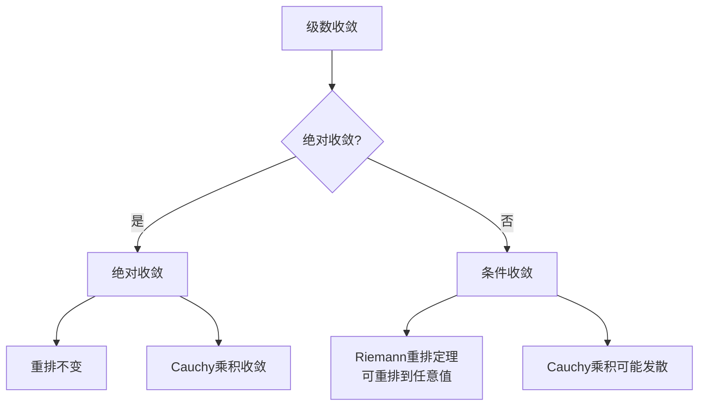
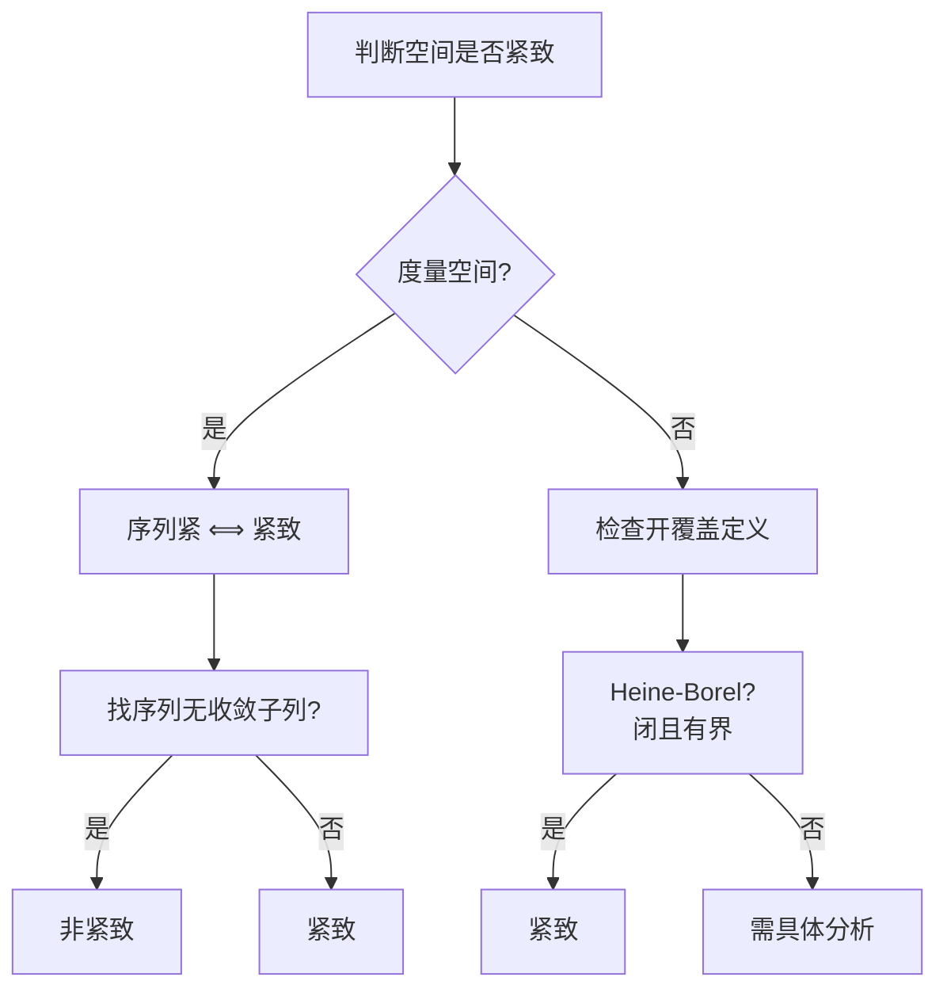
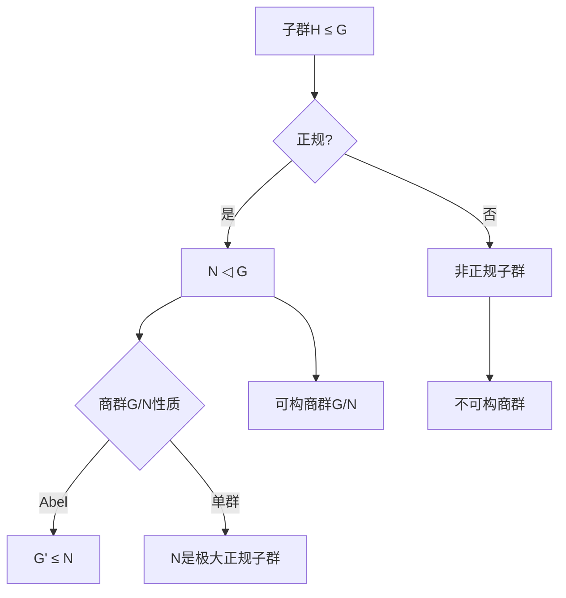
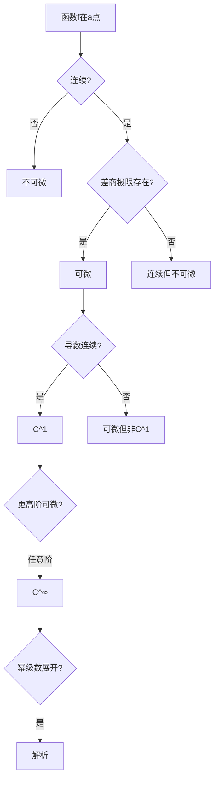
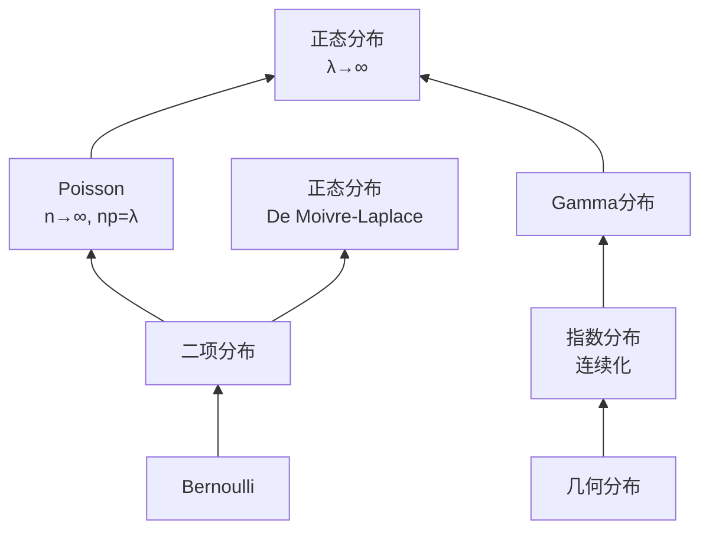
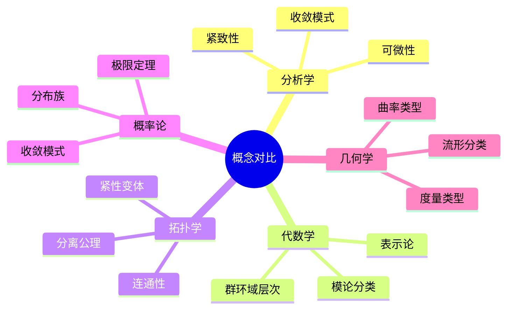

# 数学概念多维对比矩阵

---

## 1. 收敛性概念对比矩阵

### 1.1 函数序列收敛模式

| 收敛类型 | 定义 | 蕴含 | 被蕴含 | 关键条件 | 典型反例 |
|---------|------|-----|-------|---------|---------|
| **一致收敛** | $\sup\|f_n-f\| \to 0$ | 逐点、$L^\infty$、$L^p$ | 有界收敛 | 全局控制 | 罕见需要反例 |
| **逐点收敛** | $f_n(x) \to f(x)$ $\forall x$ | 无 | 一致、控制收敛 | 点态控制 | $x^n$ on [0,1] |
| **几乎处处** | $f_n \to f$ a.e. | 依测度(有限测度) | 逐点、$L^p$ | 测度论框架 | 滑动峰函数 |
| **依测度** | $\mu(\|f_n-f\|>\varepsilon) \to 0$ | 子列a.e. | a.e.(有限测度)、$L^p$ | 概率解释 | 无(a.e.不强于依测度) |
| **$L^p$收敛** | $\int|f_n-f|^p \to 0$ | 依测度 | 一致、控制收敛 | 积分控制 | $n^{1/p}\mathbf{1}_{[0,1/n]}$ |
| **弱收敛** | $\int f_n g \to \int fg$ | 有界性 | 范数收敛 | 对偶配对 | 震荡函数列 |

### 1.2 级数收敛对比

| 性质 | 绝对收敛 | 条件收敛 |
|-----|---------|---------|
| **三角不等式** | $\|\sum a_n\| \leq \sum \|a_n\|$ | 不成立 |
| **重排** | 不变 | 可重排到任意值或发散 |
| **子级数** | 绝对收敛 | 可能发散 |
| **乘法** | 乘积级数收敛 | 可能发散 |
| **例子** | $\sum 1/n^2$ | $\sum (-1)^n/n$ |

---

## 2. 紧致性概念层次

### 2.1 各类紧致性对比

| 类型 | 定义 | 蕴含 | 等价(度量空间) | 例子 |
|-----|------|-----|---------------|-----|
| **紧致** | 任意开覆盖有有限子覆盖 | 极限点紧、序列紧、可数紧 | 三者等价 | $[0,1]$ |
| **序列紧** | 任意序列有收敛子列 | 可数紧 | 紧致 | $[0,1]$ |
| **极限点紧** | 无限子集有极限点 | 可数紧 | 紧致 | $
| **可数紧** | 可数开覆盖有有限子覆盖 | 非度量空间较弱 | 紧致 | $
| **局部紧** | 每点有紧邻域基 | 非紧致 | 非紧致 | $\mathbb{R}^n$ |
| **仿紧** | 任意开覆盖有局部有限加细 | 正规(Hausdorff) | 度量空间 | 流形 |

### 2.2 紧致性决策树

---

## 3. 代数结构层次

### 3.1 群-环-域层次结构

| 结构 | 运算 | 性质 | 例子 | 理想/子结构 |
|-----|------|-----|------|-----------|
| **半群** | 一个结合二元运算 | 结合律 | $(\mathbb{N}, +)$ | - |
| **幺半群** | 半群+单位元 | 结合+单位元 | $(\mathbb{N}_0, +)$ | - |
| **群** | 幺半群+逆元 | 结合+单位+逆元 | $(\mathbb{Z}, +)$ | 正规子群 |
| **Abel群** | 群+交换 | 交换群 | $(\mathbb{Z}, +)$ | 子群皆正规 |
| **环** | 两个分配运算 | Abel群(+) + 半群(×) | $(\mathbb{Z}, +, \times)$ | 理想 |
| **交换环** | 环+乘法交换 | 乘法交换 | $\mathbb{Z}[x]$ | 素理想、极大理想 |
| **整环** | 交换环+无零因子 | $ab=0 \Rightarrow a=0$ or $b=0$ | $\mathbb{Z}$ | 素理想 |
| **域** | 整环+逆元(非零) | 非零元可逆 | $\mathbb{Q}, \mathbb{R}, \mathbb{C}$ | 只有平凡理想 |

### 3.2 正规子群层次

---

## 4. 可微性层次

### 4.1 函数光滑性对比

| 光滑性 | 定义 | 蕴含 | 性质 | 例子 |
|-------|------|-----|------|-----|
| **连续** | $\lim_{x \to a} f(x) = f(a)$ | 无 | 介值性 | $|x|$ |
| **Lipschitz** | $|f(x)-f(y)| \leq L|x-y|$ | 一致连续 | 几乎处处可微 | $|x|$ |
| **可微** | $\lim_{h \to 0} \frac{f(a+h)-f(a)}{h}$ 存在 | 连续 | 线性近似 | $x^2$ |
| **连续可微** | $f'$ 连续 | 可微 | $C^1$ | 光滑函数 |
| **$C^k$** | $k$ 阶导数连续 | $C^{k-1}$ | 高阶光滑 | 多项式 |
| **$C^\infty$** | 任意阶可导 | $C^k$ ∀k | 光滑 | $e^x$, sin |
| **解析** | 幂级数展开 | $C^\infty$ | 唯一延拓 | 实解析函数 |

### 4.2 可微性决策树

---

## 5. 拓扑性质对比

### 5.1 连通性层次

| 性质 | 定义 | 蕴含 | 反例分离 | 例子 |
|-----|------|-----|---------|-----|
| **连通** | 不能分离为两不交开集 | - | - | $[0,1]$ |
| **道路连通** | 任意两点有道路连接 | 连通 | 拓扑学家正弦曲线 | $\mathbb{R}^n$ |
| **弧连通** | 任意两点有弧(嵌入)连接 | 道路连通 | 某些病态空间 | 流形 |
| **局部连通** | 每点有连通邻域基 | - | Topologist's sine closure | 流形 |
| **局部道路连通** | 每点有道路连通邻域基 | 局部连通+道路连通 ⟹ 道路连通 | - | 流形 |
| **单连通** | 道路连通+基本群平凡 | 道路连通 | $S^1$ | $\mathbb{R}^n$, $S^n(n \geq 2)$ |

### 5.2 分离公理层次

$$T_0 \supset T_1 \supset T_2 \text{(Hausdorff)} \supset T_3 \text{(正则)} \supset T_{3.5} \text{(Tychonoff)} \supset T_4 \text{(正规)}$$

| 公理 | 分离条件 | 性质 | 典型空间 |
|-----|---------|-----|---------|
| $T_0$ | 任意两点，一点有邻域不含另一点 | Kolmogorov | Sierpinski空间 |
| $T_1$ | 单点集闭 | 点可闭分离 | 余有限拓扑 |
| $T_2$ | 任意两点有不相交邻域 | Hausdorff | 度量空间 |
| $T_3$ | $T_1$ + 点与闭集可分离 | 正则 | 正则空间 |
| $T_4$ | $T_1$ + 任意两闭集可分离 | 正规 | 度量空间、紧Hausdorff |

---

## 6. 概率分布对比

### 6.1 常见分布关系

| 分布 | 类型 | 均值 | 方差 | 特征 | 极限行为 |
|-----|------|-----|------|-----|---------|
| **Bernoulli** | 离散 | $p$ | $p(1-p)$ | 0-1试验 | - |
| **二项** | 离散 | $np$ | $np(1-p)$ | $n$次Bernoulli | → Poisson ($n \to \infty$, $np = \lambda$) |
| **Poisson** | 离散 | $\lambda$ | $\lambda$ | 稀有事件 | → Normal ($\lambda \to \infty$) |
| **几何** | 离散 | $1/p$ | $(1-p)/p^2$ | 首次成功 | - |
| **均匀** | 连续 | $(a+b)/2$ | $(b-a)^2/12$ | 等可能 | - |
| **指数** | 连续 | $1/\lambda$ | $1/\lambda^2$ | 无记忆性 | - |
| **正态** | 连续 | $\mu$ | $\sigma^2$ | CLT极限 | 稳定分布 |
| **Gamma** | 连续 | $\alpha/\beta$ | $\alpha/\beta^2$ | 等待时间 | → Normal |

### 6.2 分布关系图

---

## 7. 思维导图：对比矩阵体系

---

## 参考文献

1. Rudin, W. *Principles of Mathematical Analysis*.
2. Munkres, J. *Topology*.
3. Dummit & Foote. *Abstract Algebra*.
4. Durrett, R. *Probability: Theory and Examples*.

---

*本文档提供数学概念的多维对比矩阵*  
*质量等级：A（系统性+可视化）*
