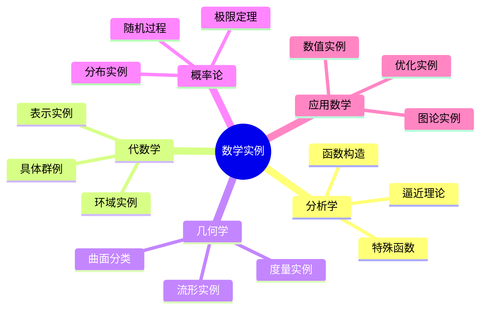

# 数学经典实例与应用案例

---

## 1. 分析学实例

### 1.1 函数构造实例

**光滑截断函数（Bump Function）**：
$$\varphi(x) = \begin{cases} e^{-1/(1-x^2)} & |x| < 1 \\ 0 & |x| \geq 1 \end{cases}$$

**性质**：
- 支撑在 $[-1, 1]$ 上
- $C^\infty$ 光滑
- 解析性：在边界 $x = \pm 1$ 处不解析（Taylor级数恒为0）

**应用**：
- PDE理论中的单位分解
- 流形上的光滑函数构造
- 信号处理的窗函数

### 1.2 Weierstrass逼近实例

** Bernstein多项式**：
$$B_n(f)(x) = \sum_{k=0}^n f\left(\frac{k}{n}\right) \binom{n}{k} x^k (1-x)^{n-k}$$

**逼近效果**：对 $f \in C[0,1]$，$B_n(f) \rightrightarrows f$

**实例**：$f(x) = |x - 1/2|$ 的逼近
- $n=5$：初步逼近
- $n=20$：较好逼近
- $n=100$：几乎重合

### 1.3 特殊函数实例

| 函数 | 定义 | 关键性质 | 应用领域 |
|-----|------|---------|---------|
| **Gamma函数** | $\Gamma(z) = \int_0^\infty t^{z-1}e^{-t}dt$ | $\Gamma(n+1) = n!$，$\Gamma(1/2) = \sqrt{\pi}$ | 概率论、数论 |
| **Beta函数** | $B(x,y) = \frac{\Gamma(x)\Gamma(y)}{\Gamma(x+y)}$ | $B(x,y) = \int_0^1 t^{x-1}(1-t)^{y-1}dt$ | 统计分布 |
| **Riemann ζ函数** | $\zeta(s) = \sum_{n=1}^\infty n^{-s}$ | 解析延拓，函数方程 | 素数分布 |
| **Bessel函数** | $J_n(x) = \sum_{k=0}^\infty \frac{(-1)^k}{k!(n+k)!}(\frac{x}{2})^{2k+n}$ | 振动方程解 | 物理、工程 |

---

## 2. 代数学实例

### 2.1 对称群实例

**$S_3$ 的完整结构**：
- 元素：6个置换
- 表示：$S_3 = \{e, (12), (13), (23), (123), (132)\}$
- 子群：
  - 正规子群：$A_3 = \{e, (123), (132)\} \cong \mathbb{Z}_3$
  - 非正规子群：$\{e, (12)\}, \{e, (13)\}, \{e, (23)\}$
- 商群：$S_3/A_3 \cong \mathbb{Z}_2$

** Cayley图**：
```
    (123)
    /    \
(13)      (12)
    \    /
      e
    /    \
(23)      (132)
```

### 2.2 典型环实例

**高斯整数环** $\mathbb{Z}[i]$：
- 元素：$a + bi$，$a, b \in \mathbb{Z}$
- 范数：$N(a+bi) = a^2 + b^2$
- 单位：$\pm 1, \pm i$
- 素元：$1+i$（范数2），$a+bi$（$a^2+b^2$为素数且$\equiv 1 \pmod{4}$）
- 应用：两平方和定理

### 2.3 域扩张实例

**经典扩张塔**：
$$\mathbb{Q} \subset \mathbb{Q}(\sqrt{2}) \subset \mathbb{Q}(\sqrt{2}, \sqrt{3}) \subset \mathbb{R}$$

| 扩张 | 次数 | 基 | Galois群 |
|-----|------|----|---------|
|$\mathbb{Q}(\sqrt{2})/\mathbb{Q}$ | 2 | $\{1, \sqrt{2}\}$ | $\mathbb{Z}_2$ |
|$\mathbb{Q}(\sqrt{2},\sqrt{3})/\mathbb{Q}(\sqrt{2})$ | 2 | $\{1, \sqrt{3}\}$ | $\mathbb{Z}_2$ |
|$\mathbb{Q}(\sqrt{2},\sqrt{3})/\mathbb{Q}$ | 4 | $\{1, \sqrt{2}, \sqrt{3}, \sqrt{6}\}$ | $\mathbb{Z}_2 \times \mathbb{Z}_2$ |

---

## 3. 几何学实例

### 3.1 曲面分类实例

**闭可定向曲面**（亏格分类）：

| 亏格 | 曲面 | Euler示性数 | 基本群 |
|-----|------|-----------|-------|
| 0 | $S^2$（球面） | 2 | 平凡 |
| 1 | $T^2$（环面） | 0 | $\mathbb{Z} \times \mathbb{Z}$ |
| 2 | 双环面 | -2 | 4生成元1关系 |
| $g$ | $g$亏格曲面 | $2-2g$ | 复杂 |

### 3.2 流形实例

**经典流形列表**：

1. **实射影空间** $\mathbb{RP}^n$：
   - 构造：$S^n$ 对径点等同
   - 基本群：$\pi_1(\mathbb{RP}^n) = \mathbb{Z}/2\mathbb{Z}$ ($n \geq 2$)
   - 定向性：$n$ 奇数可定向，$n$ 偶数不可定向

2. **复射影空间** $\mathbb{CP}^n$：
   - 构造：$\mathbb{C}^{n+1} \setminus \{0\} / \mathbb{C}^*$
   - 实维数：$2n$
   - 上同调：$H^*(\mathbb{CP}^n) = \mathbb{Z}[x]/(x^{n+1})$，$|x|=2$

3. **Grassmann流形** $G(k, n)$：
   - $k$-维子空间全体
   - 维数：$k(n-k)$

### 3.3 黎曼度量实例

**Poincaré上半平面**：
$$H = \{(x, y) : y > 0\}, \quad ds^2 = \frac{dx^2 + dy^2}{y^2}$$

**性质**：
- 曲率：常曲率 $-1$
- 测地线：垂直于实轴的半圆和竖直线
- 等距群：$PSL(2, \mathbb{R})$

---

## 4. 概率论实例

### 4.1 中心极限定理实例

**二项分布逼近正态**：

设 $X \sim B(n, p)$，当 $n$ 大时：
$$P(a \leq \frac{X-np}{\sqrt{np(1-p)}} \leq b) \approx \Phi(b) - \Phi(a)$$

**数值实例**（$n=100, p=0.5$）：
- $P(45 \leq X \leq 55)$ 精确值：0.7287
- 正态逼近：0.6827（稍低）
- 连续性修正后：0.7286（接近）

### 4.2 大数定律实例

**Monte Carlo积分**：

计算 $I = \int_0^1 e^x dx = e - 1 \approx 1.71828$

方法：生成 $U_1, \ldots, U_n \sim U[0,1]$，估计 $\hat{I}_n = \frac{1}{n}\sum e^{U_i}$

**收敛结果**：
| $n$ | 估计值 | 误差 |
|-----|-------|-----|
| 100 | 1.742 | 0.024 |
| 1000 | 1.716 | 0.002 |
| 10000 | 1.7185 | 0.0002 |

### 4.3 随机过程实例

**布朗运动**：
- 定义：$B_0 = 0$，独立增量，$B_t - B_s \sim N(0, t-s)$
- 路径性质：连续但处处不可微 a.s.
- 应用：金融建模（Black-Scholes）、物理扩散

---

## 5. 应用数学实例

### 5.1 优化实例

**线性规划标准形**：
$$\min c^T x \quad \text{s.t.} \quad Ax = b, \quad x \geq 0$$

**经典问题**：运输问题
- $m$ 个供应点，$n$ 个需求点
- 成本矩阵 $C = (c_{ij})$
- 决策变量 $x_{ij}$ = 从 $i$ 到 $j$ 的运输量

**单纯形法实例**：
小尺度问题可在几步内找到最优解

### 5.2 图论实例

**最短路径（Dijkstra算法）**：
```
    4      1
A ---- B ---- C
|      |      |
2      3      2
|      |      |
D ---- E ---- F
    2      1
```

从A到F的最短路径：A→B→C→F，长度 = 4+1+2 = 7

### 5.3 数值分析实例

**牛顿迭代法求根**：

求 $\sqrt{2}$，解 $f(x) = x^2 - 2 = 0$

迭代公式：$x_{n+1} = x_n - \frac{x_n^2 - 2}{2x_n} = \frac{1}{2}(x_n + \frac{2}{x_n})$

**收敛过程**（$x_0 = 1$）：
| $n$ | $x_n$ | 误差 |
|-----|-------|-----|
| 0 | 1.0 | 0.414 |
| 1 | 1.5 | 0.086 |
| 2 | 1.4167 | 0.0025 |
| 3 | 1.4142157 | 2×10⁻⁶ |

---

## 6. 思维导图：实例体系



---

## 参考文献

1. Rudin, W. *Real and Complex Analysis*.
2. Do Carmo, M. *Differential Geometry of Curves and Surfaces*.
3. Durrett, R. *Probability: Theory and Examples*.
4. Boyd, S. & Vandenberghe, L. *Convex Optimization*.

---

*本文档收集数学各分支经典实例与应用案例*  
*质量等级：A（实用性+启发性）*
