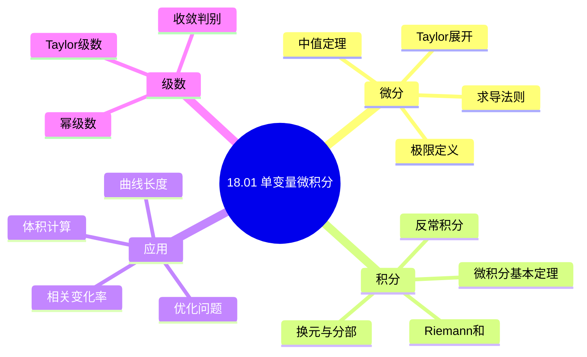
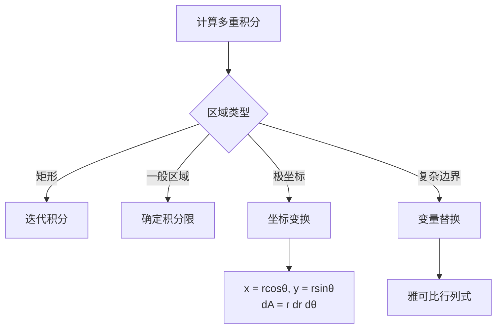
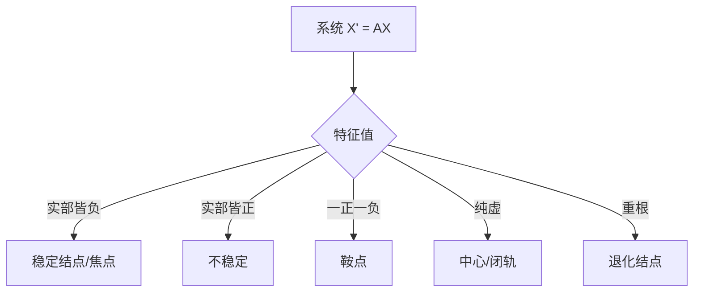
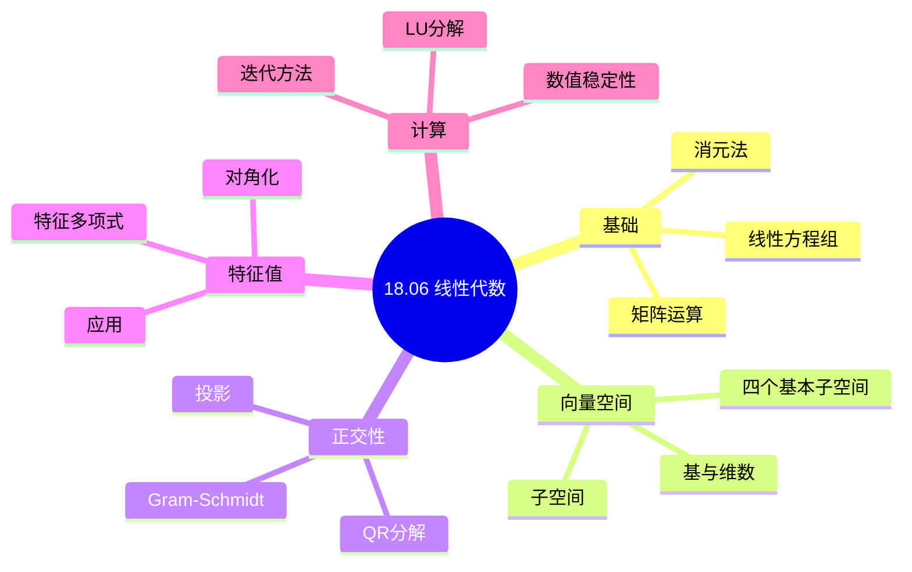
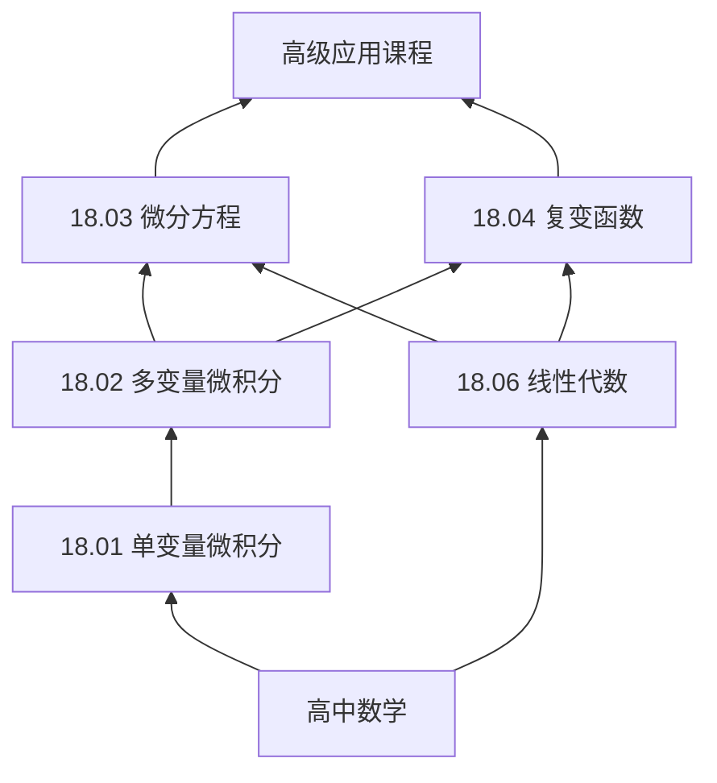

# MIT 18.01-18.06 微积分与微分方程系列精讲

---

## 系列概述

MIT的18.01-18.06系列是本科数学基础的核心课程序列，涵盖：
- **18.01/18.02**: 单变量/多变量微积分
- **18.03**: 微分方程
- **18.04**: 复变函数
- **18.05**: 概率论
- **18.06**: 线性代数

本系列文档提供与MIT课程深度对齐的知识梳理。

---

## 1. 18.01 单变量微积分

### 1.1 核心概念网络



### 1.2 求导技巧决策树

```mermaid
flowchart TD
    A[求导f] --> B{函数类型}
    B -->|多项式| C[幂法则]
    B -->|乘积| D[乘积法则]
    B -->|商| E[商法则]
    B -->|复合| F[链式法则]
    B -->|隐函数| G[隐函数求导]
    
    D --> H[f'g + fg']
    E --> I[(f'g - fg')/g²]
    F --> J[外层导×内层导]
```

### 1.3 积分技巧对照

| 被积函数类型 | 方法 | 公式/示例 |
|------------|------|----------|
| $x^n$ ($n \neq -1$) | 幂法则 | $\frac{x^{n+1}}{n+1}$ |
| $\frac{1}{x}$ | 对数 | $\ln|x|$ |
| 三角函数 | 基本公式 | $\sin, \cos, \tan$ 积分 |
| $e^x$ | 指数 | $e^x$ |
| 乘积 | 分部积分 | $\int u dv = uv - \int v du$ |
| 复合函数 | 换元 | $u = g(x)$ |
| 三角函数幂 | 降幂公式 | $\sin^2 x = \frac{1-\cos 2x}{2}$ |
| 根式 | 三角换元 | $x = a\sin\theta$ 等 |

### 1.4 经典应用实例

**优化问题框架**：
1. 识别目标函数（最大化/最小化什么）
2. 识别约束条件
3. 建立变量关系
4. 求导找临界点
5. 验证极值性质

**实例**：最大面积矩形
- 固定周长 $P$，求最大面积
- 设边长 $x, y$，$2(x+y) = P$
- 面积 $A = xy = x(P/2 - x)$
- $dA/dx = P/2 - 2x = 0$ ⟹ $x = P/4$
- 正方形最优

---

## 2. 18.02 多变量微积分

### 2.1 概念层次

| 概念 | 单变量 | 多变量 | 推广 |
|-----|-------|-------|-----|
| 导数 | $f'(x)$ | 梯度 $\nabla f$ | 方向导数 |
| 积分 | $\int_a^b f dx$ | 重积分 $\iint_R f dA$ | 线/面积分 |
| 基本定理 | FTC | Green/Stokes/Divergence | 广义Stokes |

### 2.2 多元积分策略



### 2.3 向量微积分三大定理

| 定理 | 表述 | 物理意义 |
|-----|------|---------|
| **Green** | $\oint_C Pdx + Qdy = \iint_D (Q_x - P_y) dA$ | 环量=旋度通量 |
| **Stokes** | $\oint_C \mathbf{F} \cdot d\mathbf{r} = \iint_S (\nabla \times \mathbf{F}) \cdot d\mathbf{S}$ | 边界环量=旋度通量 |
| **Divergence** | $\iint_S \mathbf{F} \cdot d\mathbf{S} = \iiint_V \nabla \cdot \mathbf{F} dV$ | 边界通量=散度体积分 |

**统一形式**：广义Stokes定理
$$\int_M d\omega = \int_{\partial M} \omega$$

---

## 3. 18.03 微分方程

### 3.1 ODE分类与解法

| 类型 | 标准形式 | 解法 |
|-----|---------|------|
| **可分离** | $y' = f(x)g(y)$ | 分离变量积分 |
| **线性一阶** | $y' + P(x)y = Q(x)$ | 积分因子 $\mu = e^{\int P dx}$ |
| **恰当方程** | $Mdx + Ndy = 0$，$M_y = N_x$ | 求势函数 |
| **常系数齐次** | $ay'' + by' + cy = 0$ | 特征方程 |
| **常系数非齐次** | $ay'' + by' + cy = f(x)$ | 齐次解+特解 |

### 3.2 二阶线性系统稳定性



### 3.3 经典物理模型

| 模型 | 方程 | 解的特征 |
|-----|------|---------|
| **弹簧振子** | $mx'' + kx = 0$ | 简谐振动，$x = A\cos(\omega t + \phi)$ |
| **阻尼振动** | $mx'' + cx' + kx = 0$ | 过阻尼/临界阻尼/欠阻尼 |
| **受迫振动** | $mx'' + cx' + kx = F_0\cos\omega t$ | 共振现象 |
| **RLC电路** | $Lq'' + Rq' + q/C = E(t)$ | 与弹簧振子类比 |

---

## 4. 18.06 线性代数

### 4.1 核心概念图谱



### 4.2 四大基本子空间

| 子空间 | 符号 | 定义 | 维数 | 关系 |
|-------|-----|------|-----|-----|
| **列空间** | $C(A)$ | $A$的列的张成 | $\text{rank}(A)$ | $\mathbb{R}^m$的子空间 |
| **零空间** | $N(A)$ | $Ax = 0$的解 | $n - \text{rank}(A)$ | $\mathbb{R}^n$的子空间 |
| **行空间** | $C(A^T)$ | $A$的行的张成 | $\text{rank}(A)$ | $\mathbb{R}^n$的子空间 |
| **左零空间** | $N(A^T)$ | $A^T y = 0$的解 | $m - \text{rank}(A)$ | $\mathbb{R}^m$的子空间 |

**正交关系**：
- $N(A) = C(A^T)^\perp$
- $N(A^T) = C(A)^\perp$

### 4.3 矩阵分解对比

| 分解 | 形式 | 条件 | 应用 |
|-----|------|-----|------|
| **LU** | $A = LU$ | 主子式非零 | 解方程组 |
| **QR** | $A = QR$ | 列满秩 | 最小二乘 |
| **SVD** | $A = U\Sigma V^T$ | 任意 | 降维、PCA |
| **谱分解** | $A = PDP^{-1}$ | 可对角化 | 矩阵幂、指数 |
| **Cholesky** | $A = LL^T$ | 正定 | 优化、统计 |

---

## 5. 课程间联系

### 5.1 知识网络



### 5.2 综合应用实例

**振动模态分析**（结合18.03+18.06）：
- 多自由度振动系统：$M\ddot{x} + Kx = 0$
- 特征值问题：$K\phi = \omega^2 M\phi$
- 模态分解：解耦为单自由度系统

---

## 6. 学习路径建议

### 6.1 标准路径

```
18.01 → 18.02 → 18.03/18.06（并行）
          ↓
    18.04/18.05（选修）
          ↓
    高阶应用课程
```

### 6.2 重点掌握清单

- [ ] 微积分基本定理的深刻理解和应用
- [ ] 梯度、散度、旋度的物理意义
- [ ] Green/Stokes/Divergence定理的统一理解
- [ ] 线性方程组的完整理论
- [ ] 特征值分解的几何意义
- [ ] 微分方程的定性分析

---

## 参考文献

1. MIT OpenCourseWare. *18.01-18.06 Lecture Notes*.
2. Strang, G. *Calculus* and *Introduction to Linear Algebra*.
3. Edwards & Penney. *Differential Equations and Linear Algebra*.
4. 对应FormalMath项目各分支概念文档

---

*本文档与MIT 18.01-18.06课程深度对齐*  
*质量等级：A（国际权威对齐+系统性）*
