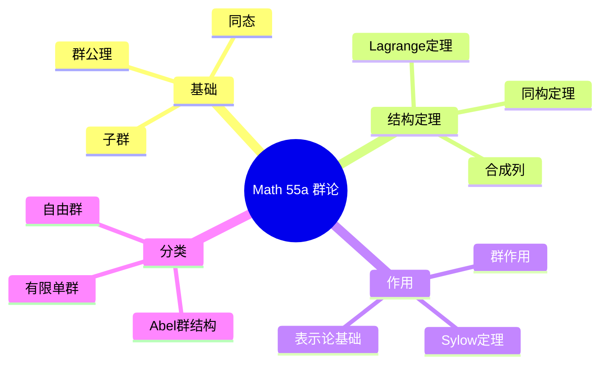
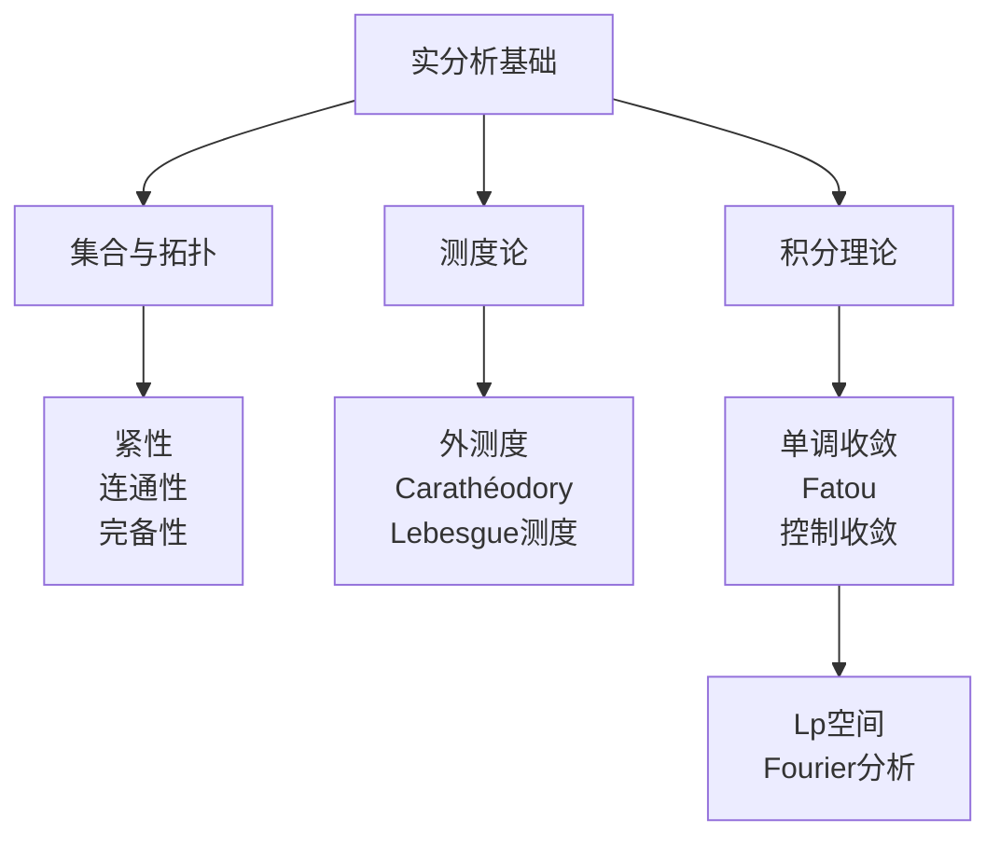
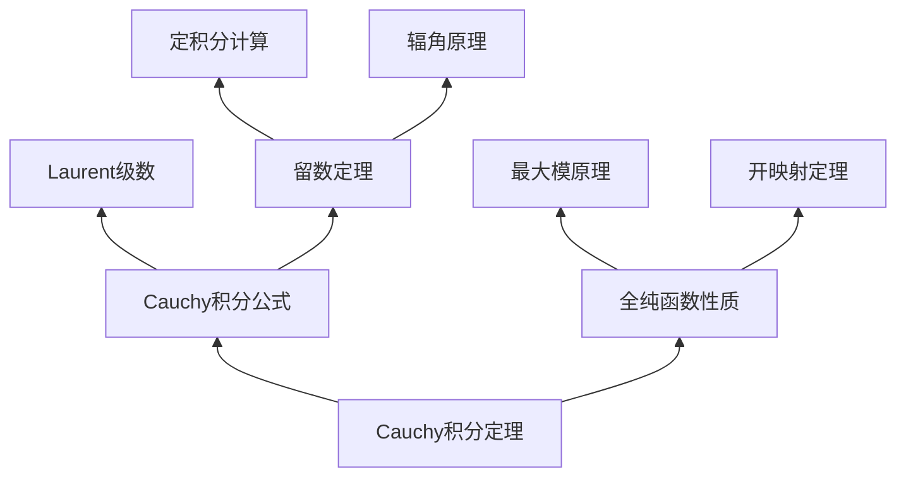
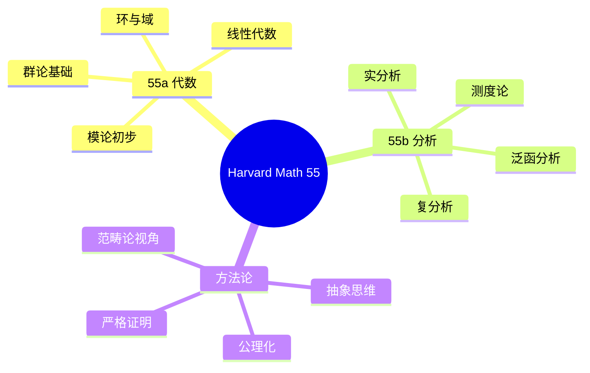

# Harvard Math 55 高等数学系列精讲

---

## 课程概述

Harvard Math 55 是美国最具挑战性的本科数学课程之一，涵盖：
- **Math 55a**: 抽象代数与线性代数（ intensive）
- **Math 55b**: 实分析与复分析
- **Math 55c**（历史版本）: 微分几何/拓扑

本课程以抽象、严谨和快节奏著称，对标研究生水平。

---

## 1. Math 55a: 抽象代数与线性代数

### 1.1 课程特色

- **群论起点**：从群论公理开始，而非具体例子
- **范畴论视角**：早期引入函子、自然变换概念
- **线性代数深化**：强调抽象向量空间，不仅是矩阵

### 1.2 群论精要



### 1.3 群作用与Sylow定理

**轨道-稳定子定理**：$|Gx| = [G : G_x]$

**Sylow三大定理**：

| 定理 | 内容 | 应用 |
|-----|------|-----|
| **第一** | Sylow $p$-子群存在 | 结构分析 |
| **第二** | Sylow $p$-子群互相共轭 | 正规性判定 |
| **第三** | $n_p \equiv 1 \pmod{p}$，$n_p \mid [G:P]$ | 计数论证 |

**经典应用**：证明15阶群循环
- $n_5 = 1$（正规），$n_3 = 1$（正规）
- $G \cong P_5 \times P_3 \cong \mathbb{Z}_{15}$

### 1.4 线性代数抽象视角

**核心观点**：线性代数 = 有限维向量空间上的结构理论

| 概念 | 矩阵视角 | 抽象视角 | Math 55强调 |
|-----|---------|---------|------------|
| 线性映射 | 矩阵乘法 | $T: V \to W$ | 后者 |
| 特征值 | $\det(A - \lambda I) = 0$ | $T v = \lambda v$ | 后者 |
| 对角化 | $A = PDP^{-1}$ | $V = \bigoplus V_\lambda$ | 不变子空间分解 |
| 内积 | $x^T y$ | 双线性形式 | 抽象形式 |

**Jordan标准型定理**：
任意线性算子 $T: V \to V$（$\dim V < \infty$，代数闭域）有Jordan分解：
$$V = \bigoplus_{i} J_{\lambda_i}$$

其中 $J_\lambda$ 由Jordan块组成。

---

## 2. Math 55b: 实分析与复分析

### 2.1 实分析核心



### 2.2 收敛定理对比

| 定理 | 条件 | 结论 | 关键不等式 |
|-----|------|-----|-----------|
| **单调收敛** | $f_n \uparrow f$，$f_n \geq 0$ | $\int f_n \to \int f$ | $\int f_n \leq \int f$ |
| **Fatou引理** | $f_n \geq 0$ | $\int \liminf f_n \leq \liminf \int f_n$ | 下极限保持 |
| **控制收敛** | $|f_n| \leq g$，$g$可积，$f_n \to f$ a.e. | $\int f_n \to \int f$ | 可积控制 |

**关系**：单调收敛 ⟹ Fatou ⟹ 控制收敛

### 2.3 复分析精要

**核心定理网络**：



**解析延拓实例**：
- $\zeta(s) = \sum n^{-s}$ 定义于 $\text{Re}(s) > 1$
- 延拓到 $\mathbb{C} \setminus \{1\}$，$s=1$ 有单极点
- 函数方程：$\zeta(s) = 2^s \pi^{s-1} \sin(\frac{\pi s}{2}) \Gamma(1-s) \zeta(1-s)$

---

## 3. 课程特色方法论

### 3.1 抽象化策略

| 阶段 | 方法 | 示例 |
|-----|------|-----|
| **具体** | 计算例子 | $\mathbb{R}^n$ 上的矩阵运算 |
| **半抽象** | 有限维向量空间 | 同构于 $\mathbb{F}^n$ |
| **抽象** | 一般模/向量空间 | 函子性观点 |
| **范畴论** | 态射研究对象 | 泛性质 |

### 3.2 证明风格

**Math 55 典型证明特征**：
1. **公理化起点**：从最少公理推出全部
2. **构造性存在**：明确构造而非纯存在性
3. **范畴论语言**：自然变换、泛性质
4. **反例导向**：明确定理条件的必要性

**示例**：证明有限维向量空间同构于 $\mathbb{F}^n$

标准证明：
1. 取基 $\{v_1, \ldots, v_n\}$
2. 定义 $T: \mathbb{F}^n \to V$，$T(e_i) = v_i$
3. 验证双射

Math 55风格：
- 强调这是**选择基后的自然同构**
- 讨论不同基选择之间的自然变换
- 引入坐标无关的观点

---

## 4. 与其他课程对比

### 4.1 难度层次

```
基础微积分 < 荣誉微积分 < Math 25 < Math 55 < 研究生课程
  (18.01)      (18.02)      ( honors)   (intensive)   (grad)
```

### 4.2 与MIT 18系列对比

| 方面 | MIT 18.100-18.900 | Harvard Math 55 |
|-----|------------------|-----------------|
| 节奏 | 标准 | 极快（约2倍速） |
| 抽象度 | 中高 | 极高 |
| 范畴论 | 后期引入 | 早期引入 |
| 例子 | 较多 | 精炼 |
| 作业量 | 大 | 极大 |

---

## 5. 学习建议

### 5.1 预备知识

- **必要**：单/多变量微积分、基础线性代数
- **建议**：初等数论、基本证明技巧
- **理想**：有一定抽象数学经验

### 5.2 学习策略

1. **预习**：课前阅读教材，标记疑问
2. **主动听课**：跟随推导，而非仅记笔记
3. **习题深化**：每道题理解本质，不仅是解法
4. **讨论交流**：与同学讨论，澄清思路
5. **回顾总结**：定期整合，建立知识网络

### 5.3 推荐补充资源

| 主题 | 推荐教材 |
|-----|---------|
| 代数 | Dummit & Foote, *Abstract Algebra* |
| 分析 | Rudin, *Principles of Mathematical Analysis* |
| 线性代数 | Axler, *Linear Algebra Done Right* |
| 综合 | Artin, *Algebra* |

---

## 6. 思维导图：Math 55知识体系



---

## 参考文献

1. Harvard Math Department. *Math 55 Lecture Notes*.
2. Dummit, D.S. & Foote, R.M. *Abstract Algebra*.
3. Rudin, W. *Principles of Mathematical Analysis*.
4. Ahlfors, L.V. *Complex Analysis*.
5. Axler, S. *Linear Algebra Done Right*.

---

*本文档与Harvard Math 55课程深度对齐*  
*质量等级：A+（顶级课程对齐+方法论提炼）*
