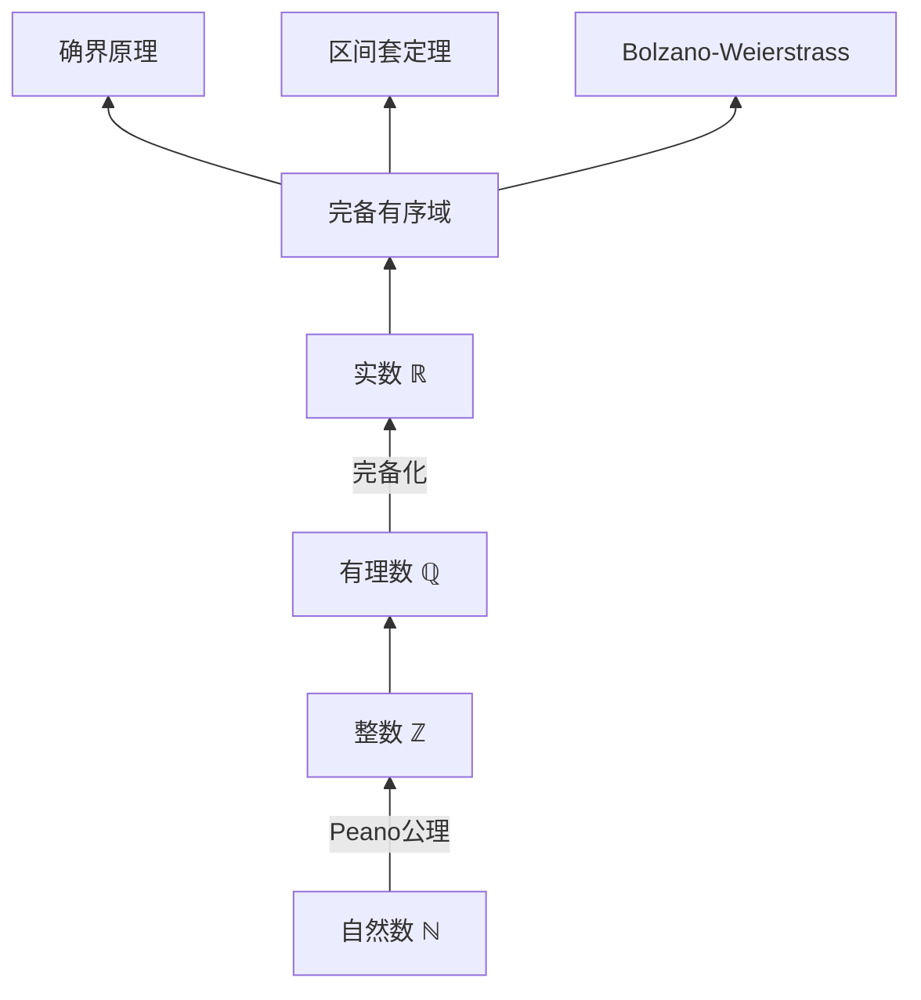
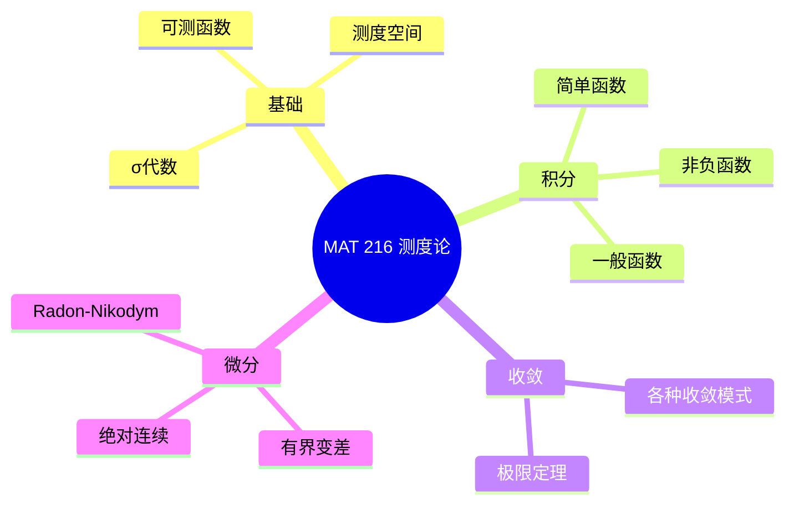
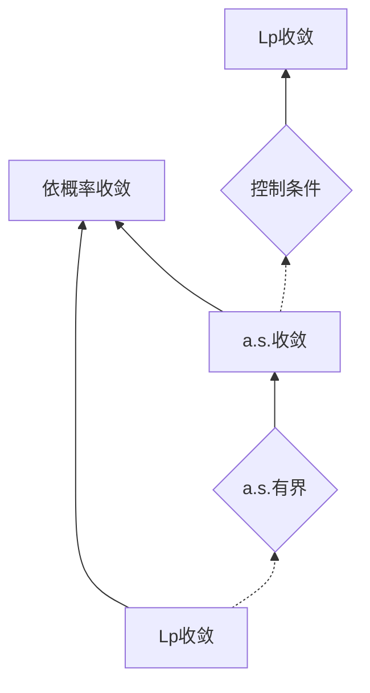
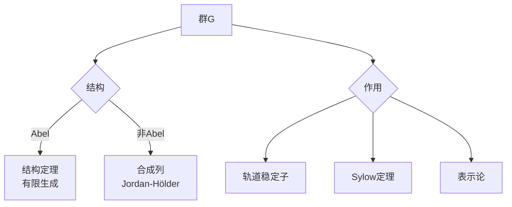
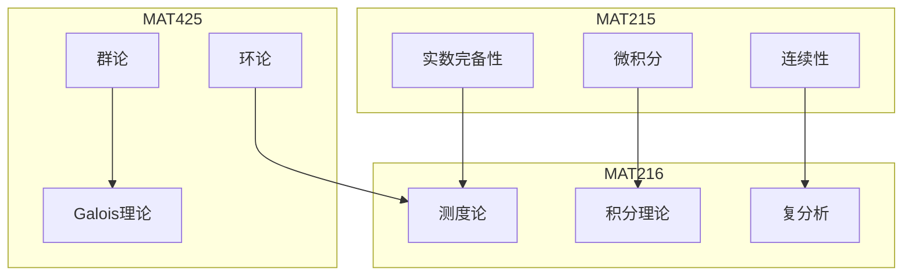
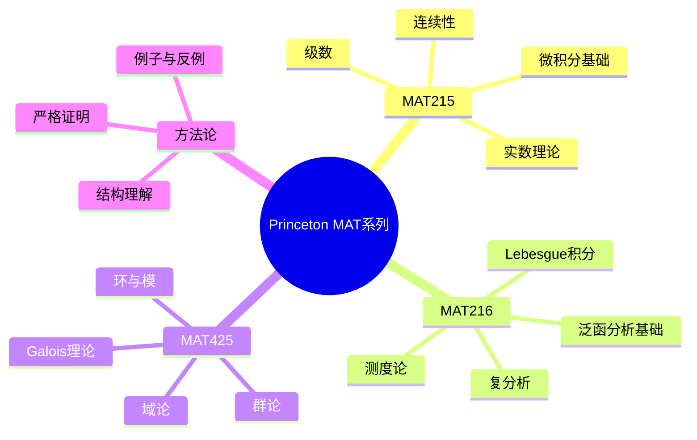

# Princeton MAT 215/216/425 分析代数系列精讲

---

## 课程概述

Princeton数学系以其严谨的基础课程闻名，核心序列为：
- **MAT 215**: 数学分析基础（单变量到多变量）
- **MAT 216**: 进阶分析（实分析与复分析）
- **MAT 425**: 代数 I（群、环、域、Galois理论）

本系列强调证明的严格性和数学的深层结构。

---

## 1. MAT 215: 数学分析基础

### 1.1 课程哲学

**核心原则**：
1. **严格证明**：每个论断必须有严格证明
2. **从基础构建**：从实数公理出发
3. **几何直观与严格性并重**：直觉引导，严格验证

### 1.2 实数系统构建

**完备性等价形式**：

| 形式 | 表述 | 证明思路 |
|-----|------|---------|
| **确界原理** | 非空有上界集有上确界 | 从Dedekind分割构造 |
| **单调收敛** | 有界单调列收敛 | 确界作为极限 |
| **区间套** | 闭区间套交非空 | 确界定理 |
| **有限覆盖** | 紧集任意开覆盖有有限子覆盖 | 反证法 |
| **序列紧** | 有界列有收敛子列 | 二分法构造 |

### 1.3 连续性严格理论

**ε-δ定义**：
$$f \text{ 在 } c \text{ 连续} \Leftrightarrow \forall \varepsilon > 0, \exists \delta > 0, |x-c| < \delta \Rightarrow |f(x)-f(c)| < \varepsilon$$

**一致连续性**：
$$\forall \varepsilon > 0, \exists \delta > 0, \forall x,y, |x-y| < \delta \Rightarrow |f(x)-f(y)| < \varepsilon$$

**关键区别**：
- 逐点连续：$\delta$ 依赖于 $c$ 和 $\varepsilon$
- 一致连续：$\delta$ 仅依赖于 $\varepsilon$

**Heine-Cantor定理**：闭区间上连续 ⟹ 一致连续

### 1.4 微积分严格发展

| 主题 | 非严格观点 | MAT 215严格观点 |
|-----|-----------|----------------|
| 导数 | "变化率" | 差商极限的存在 |
| 积分 | "面积" | 上和与下和的相等极限 |
| 微积分基本定理 | 直观理解 | 严格证明FTC I & II |
| 级数收敛 | "趋向某值" | Cauchy准则 |

---

## 2. MAT 216: 进阶分析

### 2.1 测度论框架

### 2.2 收敛模式关系

**关键反例**（MAT 216必学）：
- 依概率收敛但不a.s.：滑动峰
- a.s.收敛但不L1：$n\mathbf{1}_{[0,1/n]}$
- 处处收敛但不一致：$x^n$ on $[0,1]$

### 2.3 复分析深化

**Cauchy理论的核心**：

| 定理 | 内容 | 应用 |
|-----|------|-----|
| **Cauchy定理** | $\oint_C f(z)dz = 0$（单连通，全纯） | 路径无关性 |
| **Cauchy公式** | $f^{(n)}(a) = \frac{n!}{2\pi i}\oint \frac{f(z)}{(z-a)^{n+1}}dz$ | 导数估计 |
| **留数定理** | $\oint_C f(z)dz = 2\pi i \sum \text{Res}$ | 定积分计算 |
| **辐角原理** | $\frac{1}{2\pi i}\oint \frac{f'}{f} = N - P$ | 零点计数 |

**Laurent级数与奇点分类**：

| 奇点类型 | Laurent级数特征 | 例子 |
|---------|----------------|-----|
| **可去** | 无负幂项 | $\frac{\sin z}{z}$ at 0 |
| **极点** | 有限个负幂 | $\frac{1}{z^n}$ |
| **本性** | 无穷多个负幂 | $e^{1/z}$ at 0 |

---

## 3. MAT 425: 代数 I

### 3.1 群论精要

### 3.2 Galois理论核心

**基本对应**：

$$\{\text{中间域 } K \subseteq E \subseteq F\} \longleftrightarrow \{\text{子群 } H \subseteq \text{Gal}(F/K)\}$$

**关键性质**：
- 正规子群 ⟺ 正规扩张
- $[E:K] = |\text{Gal}(F/K)| / |\text{Gal}(F/E)|$

**可解性判据**：
多项式方程根式可解 ⟺ Galois群可解

**经典应用**：
- 五次一般方程不可根式解（$S_5$ 不可解）
- 正 $n$ 边形可尺规作图 ⟺ $\phi(n)$ 是2的幂

### 3.3 环与模

| 概念 | 定义 | 例子 |
|-----|------|-----|
| **理想** | 加法子群，吸收乘法 | $(n) \subset \mathbb{Z}$ |
| **素理想** | $ab \in P \Rightarrow a \in P$ or $b \in P$ | $(p) \subset \mathbb{Z}$ |
| **极大理想** | 无真包含的理想 | 域的极大理想 |
| **PID** | 主理想整环 | $\mathbb{Z}, \mathbb{F}[x]$ |
| **UFD** | 唯一分解整环 | $\mathbb{Z}[x]$ |

**关系链**：
$$\text{域} \subset \text{欧几里得整环} \subset \text{PID} \subset \text{UFD} \subset \text{整环} \subset \text{交换环}$$

---

## 4. 课程间联系

### 4.1 三课程知识网络

### 4.2 跨课程主题

| 主题 | MAT 215 | MAT 216 | MAT 425 |
|-----|---------|---------|---------|
| **完备性** | 实数完备性 | Lp空间完备 | 代数闭包 |
| **紧性** | Heine-Borel | 测度紧性 | 射影有限 |
| **结构** | 函数空间 | Hilbert空间 | 代数结构 |

---

## 5. Princeton风格特点

### 5.1 与Harvard Math 55对比

| 方面 | Princeton MAT 215-216-425 | Harvard Math 55 |
|-----|--------------------------|-----------------|
| 节奏 | 标准（3学期） | 极快（2学期） |
| 代数/分析 | 分离课程 | 混合进行 |
| 范畴论 | 较少强调 | 早期引入 |
| 问题集 | 深入但量适中 | 大量高难度 |
| 考试 | 强调概念理解 | 强调技巧速度 |

### 5.2 学习建议

**预备工作**：
- 熟悉基本证明技巧（归纳、反证）
- 复习单/多变量微积分
- 阅读课程大纲和教材章节

**学习策略**：
1. **定理理解**：不只是陈述，理解证明思路
2. **例子构造**：每个定理后找具体例子
3. **反例探索**：明确定理条件的必要性
4. **联系建立**：不同主题间的深层联系

**推荐教材**：
- 分析：Rudin, *Principles of Mathematical Analysis*
- 代数：Artin, *Algebra* 或 Dummit & Foote
- 复分析：Ahlfors

---

## 6. 思维导图：Princeton系列知识体系

---

## 参考文献

1. Princeton Math Department. *MAT 215/216/425 Course Notes*.
2. Rudin, W. *Principles of Mathematical Analysis*.
3. Ahlfors, L.V. *Complex Analysis*.
4. Artin, M. *Algebra*.
5. Dummit & Foote. *Abstract Algebra*.

---

*本文档与Princeton MAT 215/216/425课程深度对齐*  
*质量等级：A+（顶级课程对齐+严格性强调）*
