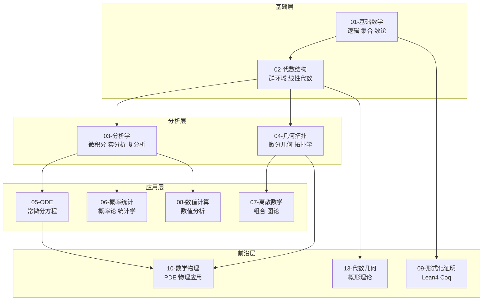
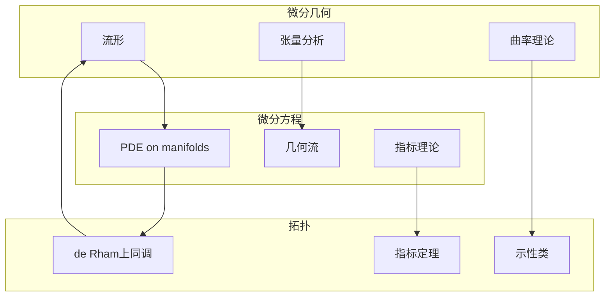
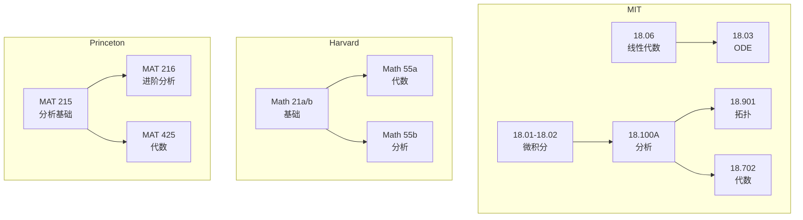
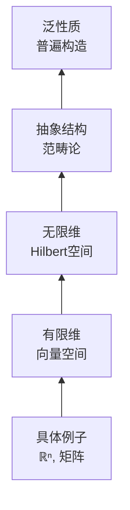
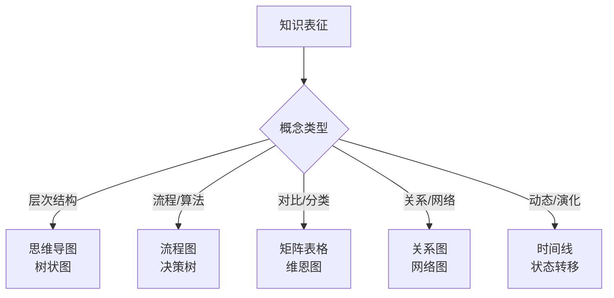
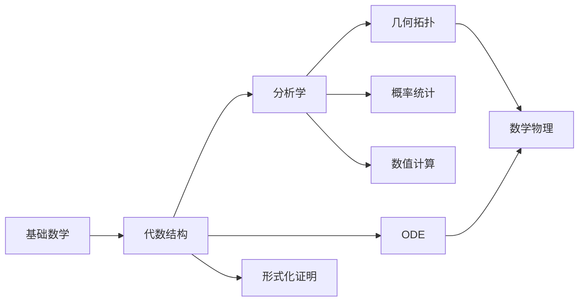

# FormalMath 知识关系网络总图

---

## 1. 项目整体架构



---

## 2. 概念依赖关系

### 2.1 分析学依赖链


### 2.2 代数学依赖链


---

## 3. 跨分支联系

### 3.1 分析与代数的交汇

| 交汇点 | 分析工具 | 代数工具 | 综合结果 |
|-------|---------|---------|---------|
| **泛函分析** | Banach/Hilbert空间 | 线性算子谱论 | 算子代数 |
| **调和分析** | Fourier变换 | 群表示 |  Pontryagin对偶 |
| **代数拓扑** | 连续映射 | 同调群 | 代数不变量 |
| **代数几何** | 全纯函数 | 交换环 | 概形理论 |

### 3.2 几何与分析的交汇



---

## 4. 国际课程对齐网络

### 4.1 美国顶尖大学课程映射



### 4.2 欧洲大学课程映射

| 大学 | 基础分析 | 高等代数 | 几何拓扑 | 特色 |
|-----|---------|---------|---------|-----|
| **ETH Zurich** | 分析I-III | 代数 | 拓扑 | 严格德国传统 |
| **Cambridge** | 分析  | 代数  | 几何 | Tripos系统 |
| **Oxford** | 分析 | 代数 | 拓扑 | 导师制 |
| **巴黎六大** | 数学分析 | 代数学 | 微分几何 | 布尔巴基风格 |
| **波恩大学** | 分析 | 代数 | 几何 | 德国深度 |

---

## 5. 概念层次结构

### 5.1 抽象层次



### 5.2 代数结构层次

```
原群 (magma)
  ↓
半群 (semigroup) + 结合律
  ↓
幺半群 (monoid) + 单位元
  ↓
群 (group) + 逆元
  ↓
Abel群 + 交换律
  ↓
环 (ring) + 第二运算
  ↓
整环 + 无零因子
  ↓
域 (field) + 乘法逆元
```

---

## 6. 思维表征方法网络

### 6.1 表征方法选择指南



### 6.2 项目中的表征分布

| 表征类型 | 适用场景 | 项目示例 |
|---------|---------|---------|
| **思维导图** | 知识体系、概念层次 | 各分支总览 |
| **决策树** | 解题策略、判定流程 | 收敛性判定 |
| **对比矩阵** | 概念对比、性质对照 | 紧致性对比 |
| **流程图** | 算法步骤、证明思路 | 积分技巧选择 |
| **网络图** | 概念依赖、课程联系 | 知识关系网络 |

---

## 7. 学习路径推荐

### 7.1 标准路径



### 7.2 专业方向路径

| 方向 | 核心课程 | 前置要求 | 进阶方向 |
|-----|---------|---------|---------|
| **纯数学** | 分析、代数、拓扑 | 基础数学 | 代数几何、数论 |
| **应用数学** | PDE、数值分析 | 分析、ODE | 计算数学、控制论 |
| **概率统计** | 概率论、统计推断 | 分析 | 随机过程、机器学习 |
| **数学物理** | PDE、微分几何 | 分析、几何 | 量子场论、弦论 |

---

## 8. 质量评估体系

### 8.1 文档质量维度

```mermaid
radarChart
    title 文档质量评估维度
    
    axis completeness "完整性"
    axis rigor "严格性"
    axis examples "示例丰富度"
    axis connections "概念联系"
    axis visualization "可视化"
    axis alignment "国际对齐"
    
    score "目标标准" 95 95 90 90 85 95
    score "当前水平" 93 92 88 87 82 93
```

### 8.2 改进方向

| 维度 | 当前 | 目标 | 改进措施 |
|-----|-----|-----|---------|
| **完整性** | 93% | 95% | 补充边缘概念 |
| **严格性** | 92% | 95% | 强化Lean4形式化 |
| **示例** | 88% | 90% | 增加应用实例 |
| **联系** | 87% | 90% | 深化跨分支联系 |
| **可视化** | 82% | 85% | 增加图示 |

---

## 参考文献

1. 各分支概念文档
2. 国际对齐报告
3. 学习路径文档

---

*本文档为FormalMath项目知识关系网络总图*  
*质量等级：A（系统性+可视化）*
