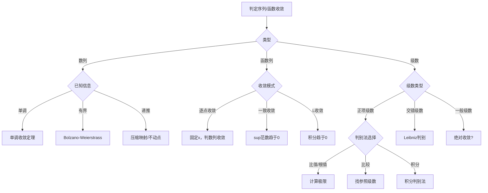
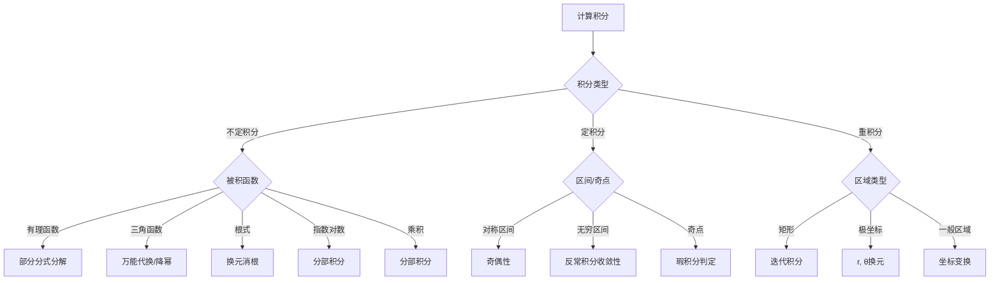
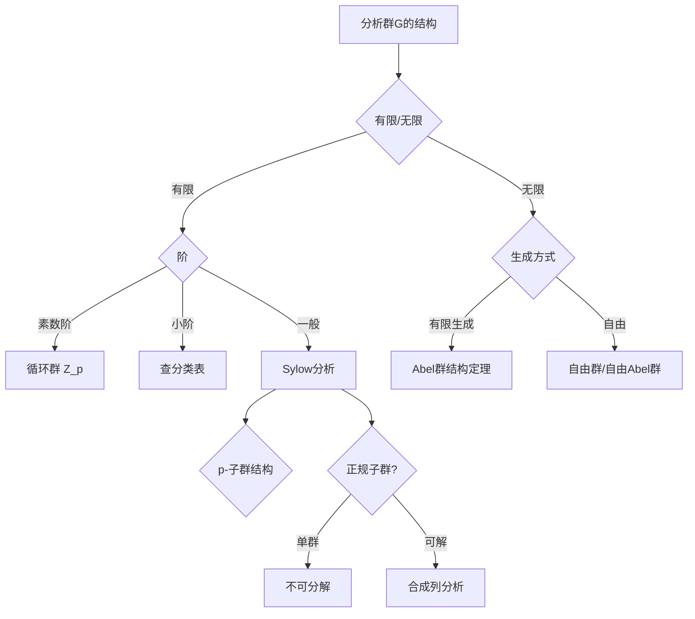
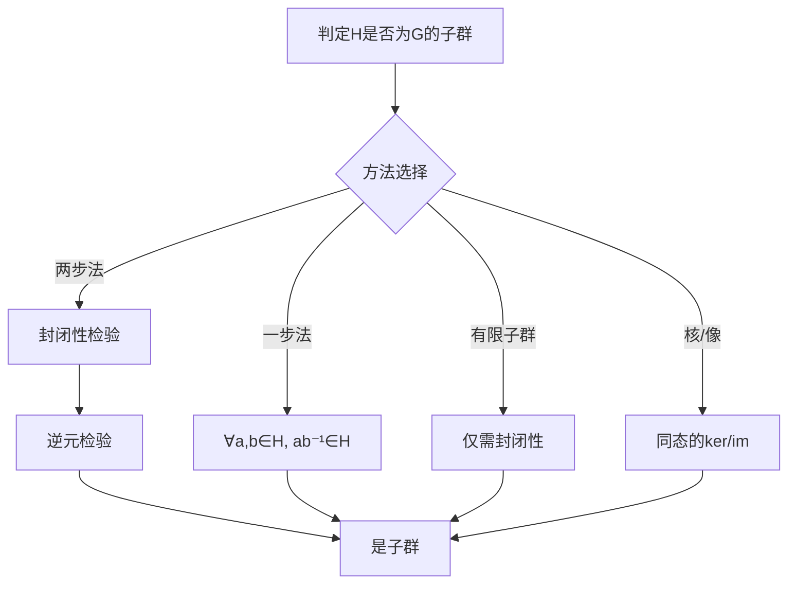
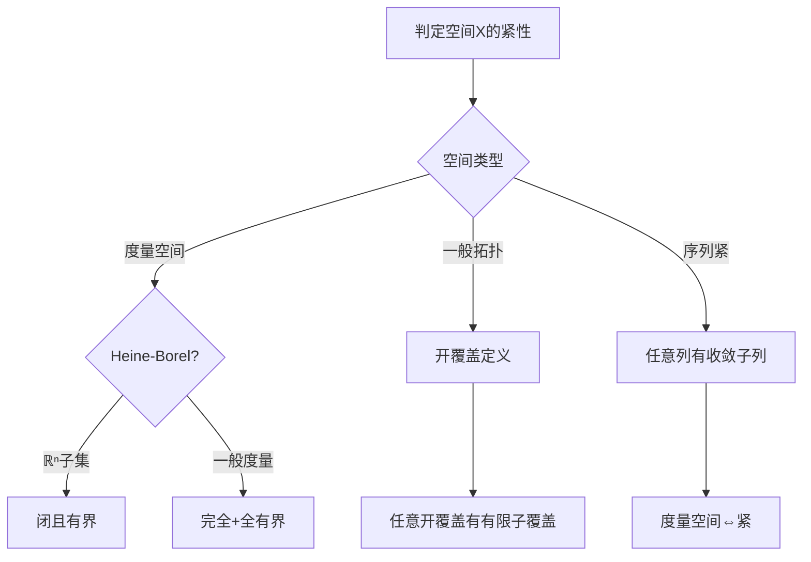
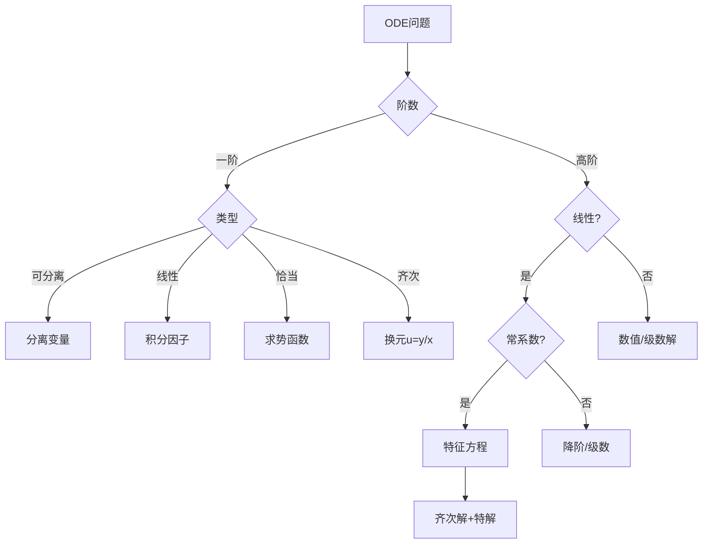
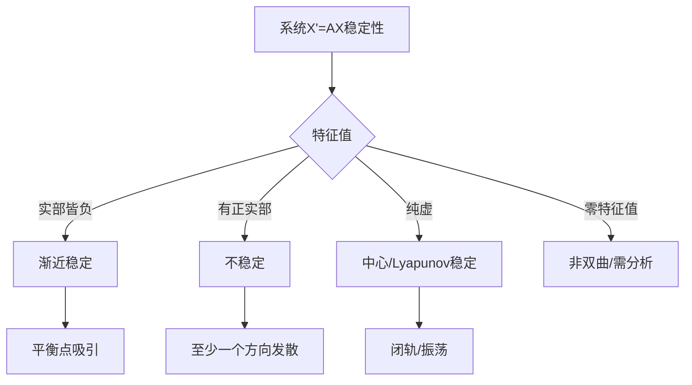
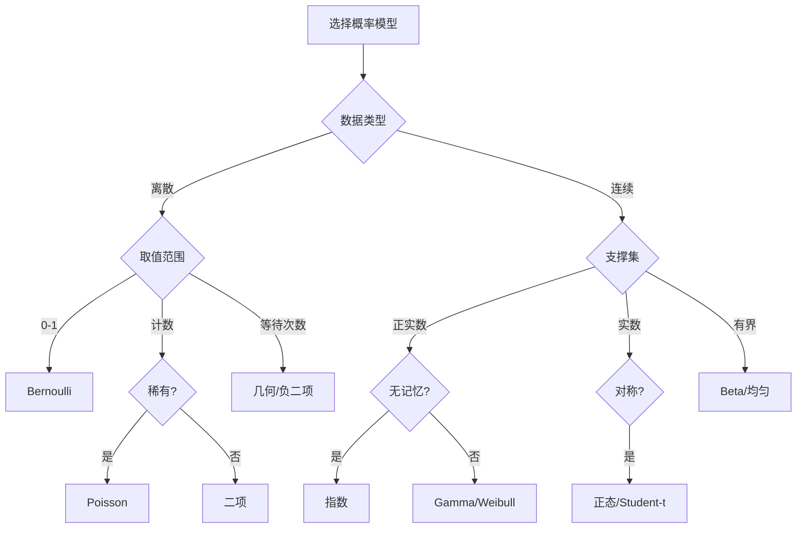
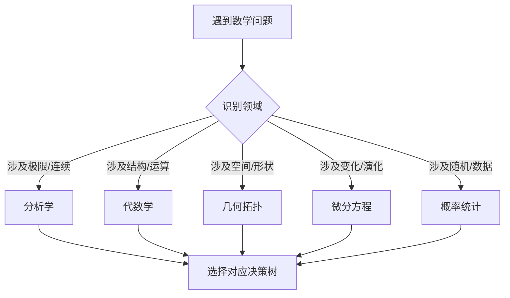
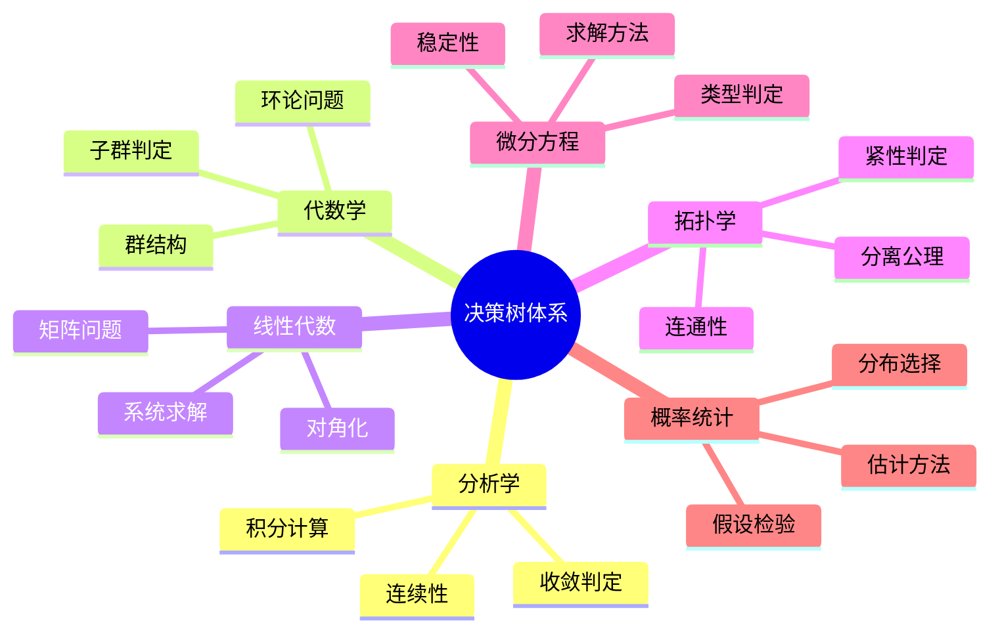

# 数学问题求解决策树大全

---

## 1. 分析学决策树

### 1.1 收敛性判定决策树



### 1.2 积分计算决策树



### 1.3 连续性判定决策树

| 判定条件 | 方法 | 关键检查点 |
|---------|------|-----------|
| **点连续** | ε-δ定义 | $\lim_{x \to a} f(x) = f(a)$ |
| **区间连续** | 每点连续 | 端点单侧连续 |
| **一致连续** | Cantor定理/直接估计 | $|\delta$ 不依赖点 |
| **绝对连续** | 定义/Lipschitz | 变差有限 |
| **Lipschitz** | 差商有界 | $|f(x)-f(y)| \leq L|x-y|$ |

---

## 2. 代数学决策树

### 2.1 群结构分析决策树



### 2.2 子群判定决策树



### 2.3 环论问题决策树

| 问题类型 | 判定步骤 | 关键定理 |
|---------|---------|---------|
| **整环** | 无零因子 | $ab=0 \Rightarrow a=0$ or $b=0$ |
| **PID** | 理想皆主 | 欧几里得算法 |
| **UFD** | 唯一分解 | 素元=不可约元 |
| **域** | 非零元可逆 | 无真理想 |
| **素理想** | $R/P$ 整环 | 吸收乘法 |
| **极大理想** | $R/M$ 域 | 无真包含理想 |

---

## 3. 线性代数决策树

### 3.1 矩阵问题决策树

```mermaid
flowchart TD
    A[矩阵问题] --> B{问题类型}
    
    B -->|可逆性| C{方法}
    B -->|对角化| D{判定}
    B -->|解方程| E{Ax=b}
    
    C -->|行列式| F[det≠0]
    C -->|秩| G[rank=n]
    C -->|方程| H[Ax=0只有零解]
    
    D -->|特征值| I[代数重数=几何重数]
    D -->|极小多项式| J[无重根]
    
    E -->|相容性| K[rank(A)=rank([A|b])]
    E -->|解结构| L[特解+零空间]
```

### 3.2 线性系统求解决策

| 情况 | 条件 | 解的结构 |
|-----|------|---------|
| **唯一解** | $\det A \neq 0$ | $x = A^{-1}b$ |
| **无穷解** | $\text{rank}(A) = \text{rank}([A|b]) < n$ | 特解+零空间基 |
| **无解** | $\text{rank}(A) < \text{rank}([A|b])$ | 最小二乘解 |

---

## 4. 拓扑学决策树

### 4.1 紧性判定决策树



### 4.2 连通性判定决策树

| 性质 | 判定方法 | 反例 |
|-----|---------|-----|
| **连通** | 不能分离为不交开集 | 单点集 |
| **道路连通** | 任意两点有道路 | 拓扑学家正弦曲线 |
| **单连通** | 道路连通+基本群平凡 | $S^1$ |
| **局部连通** | 每点有连通邻域基 | Topologist's sine closure |

---

## 5. 微分方程决策树

### 5.1 ODE类型判定与求解



### 5.2 稳定性分析决策树



---

## 6. 概率统计决策树

### 6.1 分布选择决策树



### 6.2 假设检验决策树

| 步骤 | 决策 | 方法 |
|-----|------|-----|
| **1. 建立假设** | $H_0$ vs $H_1$ | 明确原/备择 |
| **2. 选择统计量** | 参数/非参数 | Z, t, $\chi^2$, F |
| **3. 确定拒绝域** | 显著性水平 $\alpha$ | 单侧/双侧 |
| **4. 计算p值** | 与$\alpha$比较 | 统计软件/表 |
| **5. 决策** | 拒绝/不拒绝$H_0$ | 结论表述 |

---

## 7. 综合决策框架

### 7.1 问题识别流程



### 7.2 证明策略选择

| 证明目标 | 推荐策略 | 典型案例 |
|---------|---------|---------|
| **存在性** | 构造法/介值定理 | 零点存在 |
| **唯一性** | 反证法/单调性 | 不动点唯一 |
| **对所有成立** | 直接证明/归纳法 | 恒等式 |
| **不存在** | 反证法 | 无理数证明 |
| **等价性** | 双向证明 | 充要条件 |

---

## 8. 思维导图：决策树体系



---

## 参考文献

1. 各分支概念文档
2. Polya, G. *How to Solve It*.
3. Engel, A. *Problem-Solving Strategies*.

---

*本文档为数学问题求解决策树大全*  
*质量等级：A（实用性+系统性）*
