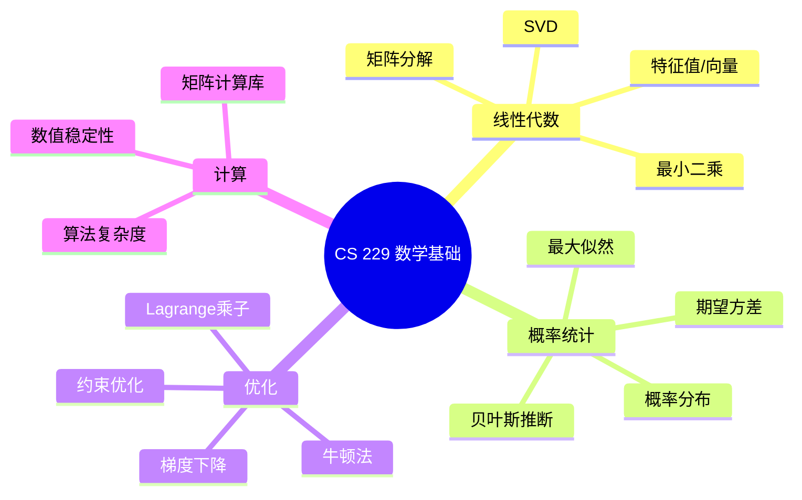
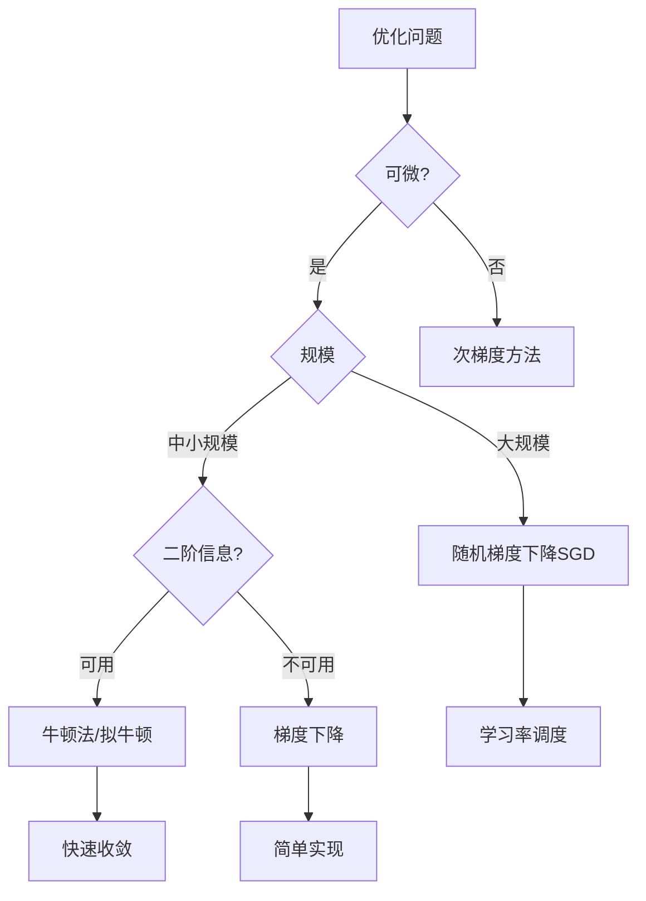
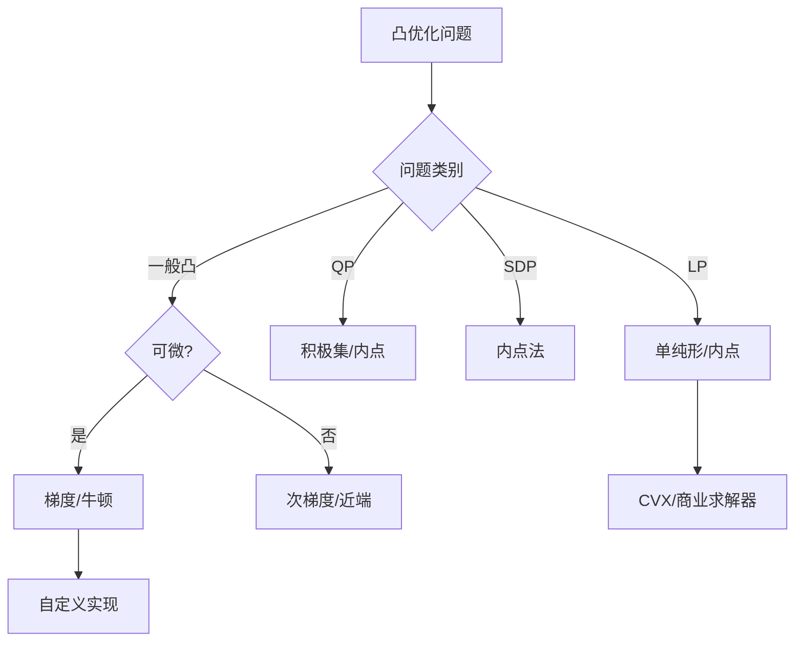
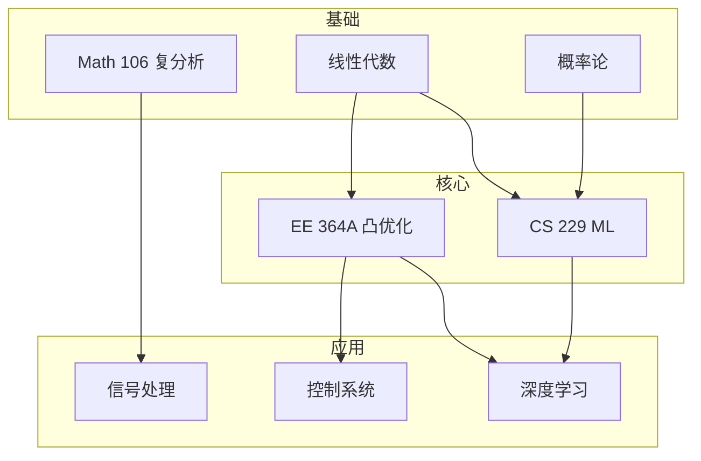
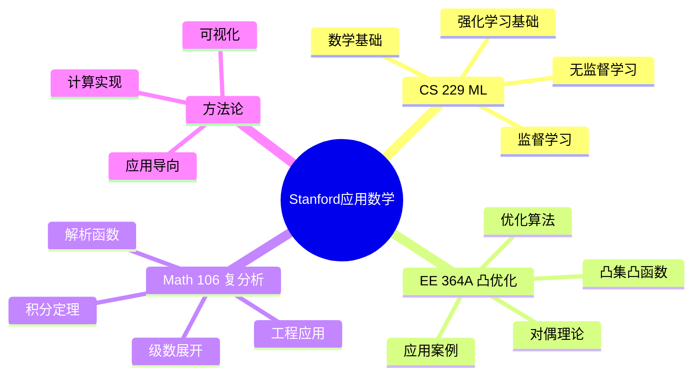

# Stanford CS229/EE364A/Math 106 系列精讲

---

## 系列概述

Stanford在应用数学和计算数学领域有深厚积累：
- **CS 229**: 机器学习（数学基础：线性代数、概率、优化）
- **EE 364A**: 凸优化 I
- **EE 364B**: 凸优化 II
- **Math 106**: 复分析（工程视角）

本系列强调数学在工程和科学中的应用。

---

## 1. CS 229: 机器学习数学基础

### 1.1 课程数学框架



### 1.2 线性代数在ML中的应用

| 概念 | ML应用 | 关键公式 |
|-----|-------|---------|
| **SVD** | 降维、推荐系统 | $A = U\Sigma V^T$ |
| **PCA** | 特征提取 | 最大特征值对应的特征向量 |
| **最小二乘** | 线性回归 | $\hat{\beta} = (X^TX)^{-1}X^Ty$ |
| **特征分解** | 谱聚类 | 图Laplacian的特征向量 |
| **矩阵求导** | 梯度计算 | $\nabla_X \text{tr}(X^TAX) = (A+A^T)X$ |

### 1.3 概率统计核心

**最大似然估计（MLE）框架**：

1. 写出似然函数：$L(\theta) = \prod_{i=1}^n p(x_i; \theta)$
2. 取对数：$\ell(\theta) = \sum_{i=1}^n \log p(x_i; \theta)$
3. 求导并令为0：$\nabla_\theta \ell(\theta) = 0$
4. 解出参数估计 $\hat{\theta}$

**线性回归的MLE视角**：
$$y = X\beta + \epsilon, \quad \epsilon \sim N(0, \sigma^2I)$$
最大化似然等价于最小化残差平方和：
$$\min_\beta \|y - X\beta\|_2^2$$

### 1.4 优化算法对比



| 算法 | 迭代复杂度 | 收敛速度 | 适用场景 |
|-----|-----------|---------|---------|
| **梯度下降** | $O(nd)$ | 线性 | 大规模平滑问题 |
| **牛顿法** | $O(nd^2 + d^3)$ | 二次 | 中小规模高精度 |
| **拟牛顿(BFGS)** | $O(nd)$ | 超线性 | 中等规模 |
| **SGD** | $O(d)$ | 次线性 | 大规模在线学习 |
| **坐标下降** | $O(n)$ | 线性 | 稀疏问题 |

---

## 2. EE 364A: 凸优化 I

### 2.1 凸优化核心概念

**凸集定义**：$C$ 是凸集 ⟺ $\forall x,y \in C, \forall \theta \in [0,1], \theta x + (1-\theta)y \in C$

**凸函数定义**：$f$ 是凸函数 ⟺ $\text{epi}(f)$ 是凸集 ⟺ Jensen不等式成立

### 2.2 凸优化问题标准形

```
minimize    f₀(x)
subject to  fᵢ(x) ≤ 0,  i = 1,...,m
            hⱼ(x) = 0, j = 1,...,p
```

其中 $f_0, f_1, ..., f_m$ 是凸函数，$h_j$ 是仿射函数。

### 2.3 常见凸优化问题类别

| 问题类型 | 标准形 | 求解方法 | 应用 |
|---------|-------|---------|-----|
| **LP** | 线性目标+约束 | 单纯形/内点 | 资源分配 |
| **QP** | 二次目标+线性约束 | 内点/积极集 | 投资组合 |
| **QCQP** | 二次目标+二次约束 | SDP松弛 | 信号处理 |
| **SDP** | 线性目标+半正定约束 | 内点 | 组合优化 |
| **SOCP** | 二阶锥约束 | 内点 | 鲁棒优化 |

### 2.4 Lagrange对偶理论

**Lagrange函数**：
$$L(x, \lambda, \nu) = f_0(x) + \sum_{i=1}^m \lambda_i f_i(x) + \sum_{j=1}^p \nu_j h_j(x)$$

**对偶函数**：
$$g(\lambda, \nu) = \inf_x L(x, \lambda, \nu)$$

**对偶问题**：
$$\max_{\lambda \geq 0, \nu} g(\lambda, \nu)$$

**KKT条件**（强对偶成立时）：
1. 原始可行性
2. 对偶可行性
3. 互补松弛性：$\lambda_i f_i(x) = 0$
4. 梯度条件：$\nabla f_0(x) + \sum \lambda_i \nabla f_i(x) + \sum \nu_j \nabla h_j(x) = 0$

### 2.5 优化算法选择决策树



---

## 3. Math 106: 复分析（工程视角）

### 3.1 工程应用导向

| 应用领域 | 核心工具 | 典型问题 |
|---------|---------|---------|
| **信号处理** | Fourier变换 | 滤波器设计 |
| **控制系统** | 留数定理 | 稳定性分析 |
| **电磁学** | 共形映射 | 边界值问题 |
| **流体力学** | 复势 | 绕流问题 |

### 3.2 Fourier变换与复分析

**解析信号**：
$$x_a(t) = x(t) + i\hat{x}(t)$$
其中 $\hat{x}(t)$ 是Hilbert变换。

**频域表示**：
$$X(f) = \int_{-\infty}^{\infty} x(t) e^{-i2\pi ft} dt$$

**因果性条件**：$x(t) = 0$ for $t < 0$ ⟺  Paley-Wiener条件（频域）

### 3.3 留数定理在积分计算中的应用

**实积分类型**：

| 类型 | 形式 | 方法 |
|-----|------|-----|
| **三角积分** | $\int_0^{2\pi} R(\cos\theta, \sin\theta)d\theta$ | $z = e^{i\theta}$ |
| **有理函数** | $\int_{-\infty}^{\infty} \frac{P(x)}{Q(x)}dx$ | 上半圆围道 |
| **Fourier型** | $\int_{-\infty}^{\infty} f(x)e^{iax}dx$ | Jordan引理 |

**示例**：计算 $\int_{-\infty}^{\infty} \frac{dx}{1+x^2}$
- 上半平面极点：$z = i$
- 留数：$\text{Res}_{z=i} \frac{1}{1+z^2} = \frac{1}{2i}$
- 积分值：$2\pi i \cdot \frac{1}{2i} = \pi$

---

## 4. 课程间联系

### 4.1 知识网络



### 4.2 Stanford风格特点

| 特点 | 描述 | 体现 |
|-----|------|-----|
| **应用导向** | 数学为工程服务 | 大量实际案例 |
| **计算思维** | 算法可实现 | 代码与理论结合 |
| **可视化** | 几何直观 | 图形化解释 |
| **前沿性** | 追踪最新研究 | 课程内容更新快 |

---

## 5. 学习路径建议

### 5.1 标准路径

```
Math 51/52/53 (基础) → CS 229/EE 364A → 专题课程 → 研究
       ↓
   Math 106 (复分析)
       ↓
   信号/控制应用
```

### 5.2 推荐资源

**教材**：
- Boyd & Vandenberghe, *Convex Optimization*
- Murphy, *Machine Learning: A Probabilistic Perspective*
- Oppenheim & Schafer, *Discrete-Time Signal Processing*

**在线资源**：
- Stanford Engineering Everywhere (SEE)
- CS 229 课程网站
- CVXPY 文档

---

## 6. 思维导图：Stanford系列知识体系



---

## 参考文献

1. Stanford CS 229 Lecture Notes.
2. Boyd, S. & Vandenberghe, L. *Convex Optimization*.
3. Oppenheim, A.V. & Schafer, R.W. *Discrete-Time Signal Processing*.
4. Murphy, K.P. *Machine Learning: A Probabilistic Perspective*.

---

*本文档与Stanford CS229/EE364A/Math106课程深度对齐*  
*质量等级：A（应用导向+工程实践）*
