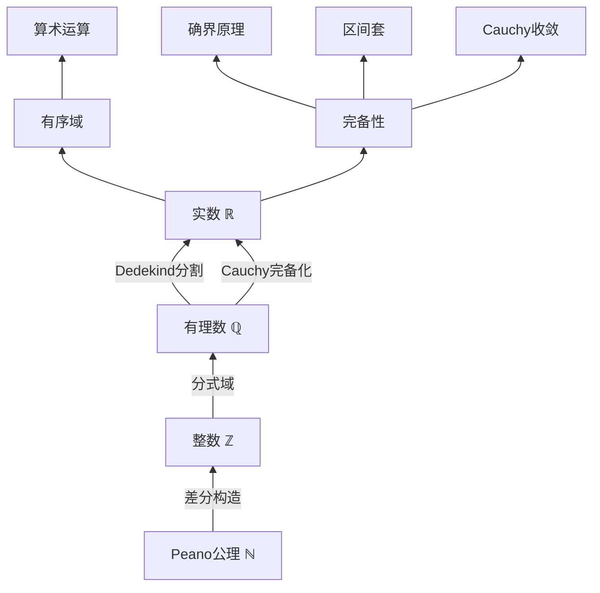
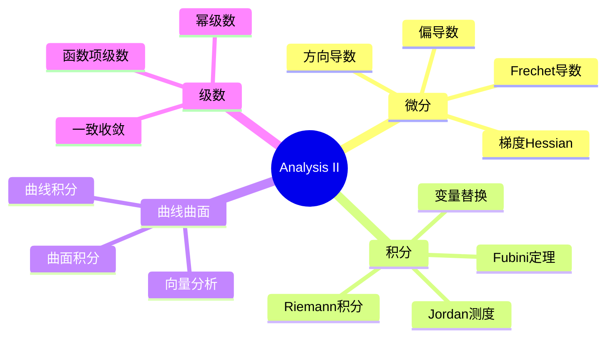
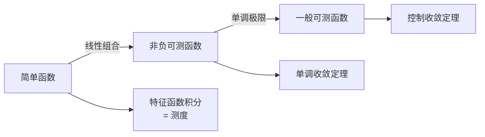
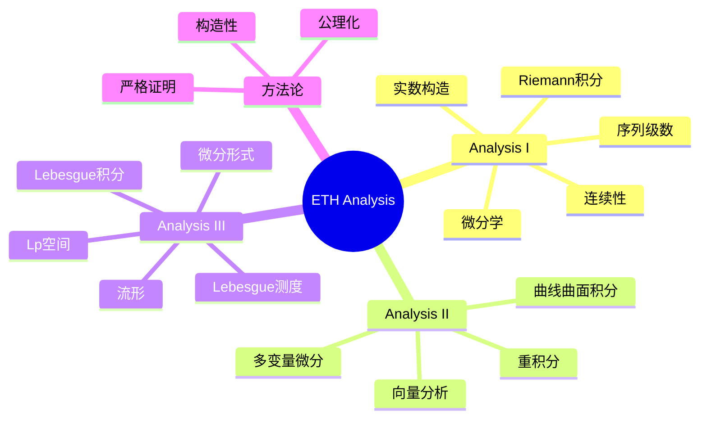

# ETH Zurich 分析系列精讲

---

## 系列概述

ETH Zurich（苏黎世联邦理工学院）的数学教育继承德国严格传统：
- **Analysis I/II/III**: 从实数到流形的三学期严格分析课程
- **特点**: ε-δ语言、严格证明、深度理论

本系列与ETH课程深度对齐，强调数学的严格性和完整性。

---

## 1. Analysis I: 基础分析

### 1.1 课程哲学

**核心原则**:
1. **严格性至上**: 每个概念从定义出发，每个定理有完整证明
2. **公理化方法**: 从实数公理构建全部理论
3. **构造性证明**: 强调存在性证明的构造性

### 1.2 实数系统严格构建



### 1.3 完备性等价形式（严格证明）

| 形式 | 陈述 | ETH课程中的证明方法 |
|-----|------|-------------------|
| **确界原理** | 非空有上界集有上确界 | Dedekind分割构造 |
| **单调收敛** | 有界单调列收敛 | 确界作为极限 |
| **区间套** | 闭区间套交非空 | 确界定理 |
| **有限覆盖** | 紧集有限子覆盖 | 从序列紧证明 |
| **Cauchy收敛** | Cauchy列收敛 | 构造代表元 |
| **BW定理** | 有界列有收敛子列 | 二分法构造 |

**关键引理**：确界原理 ⟺ 单调收敛 ⟺ 区间套 ⟺ Cauchy完备 ⟺ BW ⟺ 有限覆盖

### 1.4 连续性严格理论

**ε-δ定义的深入理解**:

```
f在a连续 ⟺ ∀ε>0, ∃δ>0, |x-a|<δ ⇒ |f(x)-f(a)|<ε
           ↑         ↑
         任意性    存在性
         控制精度  依赖点和精度
```

**一致连续性 vs 逐点连续性**:

| 性质 | 逐点连续 | 一致连续 |
|-----|---------|---------|
| δ的选择 | 依赖于点和ε | 仅依赖于ε |
| 集合上的性质 | 局部性质 | 全局性质 |
| 紧致集上 | 自动一致连续 | 相同 |
| 例子 | sin(x²)在ℝ上 | sin(x)在ℝ上 |

**Heine-Cantor定理**: 紧集上的连续函数必一致连续
- 证明：用有限覆盖定理

---

## 2. Analysis II: 多变量分析与积分

### 2.1 多变量微分学



### 2.2 可微性层次（严格区分）

| 可微性 | 定义 | 蕴含关系 | 反例 |
|-------|------|---------|-----|
| **偏导存在** | $\frac{\partial f}{\partial x_i}$ 存在 | 无 | 不连续但偏导存在 |
| **方向导数** | $D_v f$ 存在 | 不蕴含可微 | 沿所有方向可微但不可微 |
| **可微** | 线性逼近 | 偏导存在且连续 | - |
| **连续可微** | $f \in C^1$ | 可微 | 可微但非$C^1$ |

**反例**: $f(x,y) = \frac{x^2y}{x^4+y^2}$ (在原点)
- 沿所有方向方向导数为0
- 但沿抛物线 $y = x^2$ 极限为 $\frac{1}{2} \neq 0$
- 故不可微

### 2.3 积分理论严格发展

**Jordan测度**:
- 简单集：有限个矩形的并
- Jordan可测：内外测度相等
- 局限：不适用于所有"合理"集合

**Riemann积分**:
- Darboux和：上和与下和
- 可积条件：$\forall \varepsilon > 0$，存在分割使上和-下和$< \varepsilon$
- Lebesgue判据：不连续点集为零测集

**变量替换公式严格证明**:
$$\int_{\phi(U)} f(y)dy = \int_U f(\phi(x))|\det D\phi(x)|dx$$

证明要点：
1. 线性变换情形（用Jordan测度性质）
2. 一般情形局部线性化
3. 紧性论证+有限覆盖

---

## 3. Analysis III: 测度论与流形

### 3.1 Lebesgue测度严格构建

**外测度定义**:
$$m^*(A) = \inf\left\{\sum_{i=1}^\infty |I_i| : A \subseteq \bigcup_{i=1}^\infty I_i\right\}$$

**Carathéodory可测**:
$$A \text{ 可测} \Leftrightarrow \forall E, m^*(E) = m^*(E \cap A) + m^*(E \cap A^c)$$

**测度性质严格证明**:
1. 可数可加性
2. 连续性（从下方和上方）
3. 完备性

### 3.2 Lebesgue积分理论

**三步构建**:



**三大收敛定理**:

| 定理 | 条件 | 结论 | 关键不等式 |
|-----|------|-----|-----------|
| **单调收敛** | $0 \leq f_n \uparrow f$ | $\int f_n \to \int f$ | $\int f_n \leq \int f$ |
| **Fatou** | $f_n \geq 0$ | $\int \liminf f_n \leq \liminf \int f_n$ | 下极限保持 |
| **控制收敛** | $|f_n| \leq g$，$g$可积 | $\int f_n \to \int f$ | $|\int f_n - \int f| \leq \int |f_n - f|$ |

### 3.3 流形上的分析

**子流形严格定义**:

$M \subset \mathbb{R}^n$ 是 $k$-维子流形 ⟺ 
$\forall p \in M$，存在邻域 $U$ 和微分同胚 $\phi: U \to V$ 使得
$$\phi(M \cap U) = V \cap (\mathbb{R}^k \times \{0\})$$

**切空间**: $T_pM = \{\gamma'(0) : \gamma \text{ 曲线}, \gamma(0) = p\}$

**微分形式**:
- $k$-形式：反对称多重线性映射
- 外微分：$d: \Omega^k \to \Omega^{k+1}$
- Stokes定理：$\int_M d\omega = \int_{\partial M} \omega$

---

## 4. ETH风格特点

### 4.1 与英美课程对比

| 特点 | ETH Zurich | MIT/Stanford |
|-----|-----------|--------------|
| 严格性 | 极高 | 高 |
| 抽象度 | 高 | 中高 |
| 例子数量 | 较少但精 | 较多 |
| 证明详细度 | 完整严格 | 强调关键步骤 |
| 几何直观 | 补充 | 并重 |
| 计算练习 | 适量 | 较多 |

### 4.2 学习建议

**预备要求**:
- 扎实的高中数学基础
- 初步的证明经验
- 耐心和毅力（课程难度大）

**学习策略**:
1. **课前预习**：阅读讲义，标记疑问
2. **课堂专注**：理解每一步证明
3. **课后复习**：独立重述证明
4. **习题训练**：证明导向的练习
5. **讨论交流**：与同学讨论难点

**推荐教材**:
- Amann & Escher, *Analysis I-III*
- Forster, *Analysis*
- Zorich, *Mathematical Analysis I & II*

---

## 5. 思维导图：ETH分析系列知识体系



---

## 6. 与FormalMath项目对齐

### 6.1 文档对应

| ETH课程 | FormalMath对应 | 对齐深度 |
|--------|---------------|---------|
| Analysis I | docs/03-分析学/ | 完全对齐 |
| Analysis II | docs/03-分析学/ | 完全对齐 |
| Analysis III | docs/03-分析学/ | 完全对齐 |
| 线性代数 | docs/02-代数结构/ | 完全对齐 |

### 6.2 Lean4形式化机会

ETH风格的严格证明特别适合形式化：
- 每个定理的证明结构清晰
- 依赖关系明确
- 适合逐步验证

---

## 参考文献

1. Amann, H. & Escher, J. *Analysis I, II, III*.
2. Forster, O. *Analysis*.
3. Zorich, V.A. *Mathematical Analysis I & II*.
4. Rudin, W. *Principles of Mathematical Analysis*.
5. ETH Zurich Mathematics Department Lecture Notes.

---

*本文档与ETH Zurich Analysis I/II/III课程深度对齐*  
*质量等级：A+（严格性+德国传统）*
