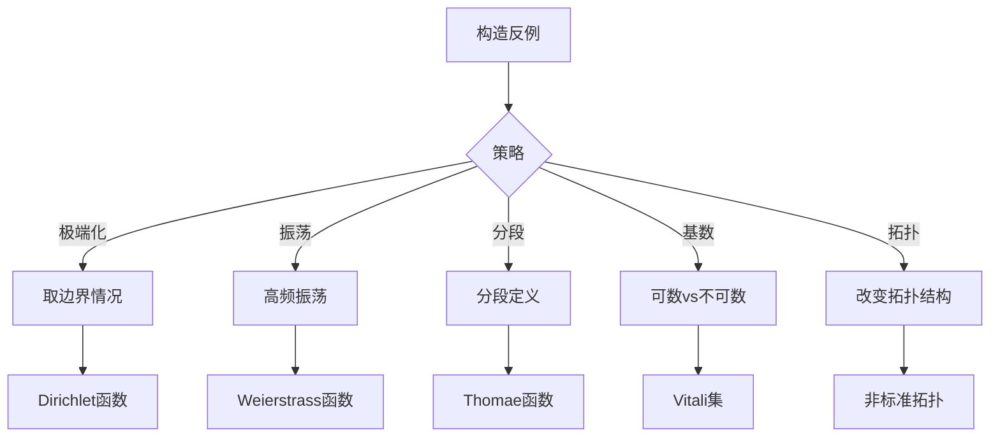

# PDE与代数几何高级反例

---

## 1. 偏微分方程反例

### 1.1 解的存在性与唯一性反例

| 方程/问题 | 反例现象 | 说明 |
|---------|---------|-----|
| **Lewy方程** | 无解 | 光滑系数线性PDE，某些点任意邻域内无解 |
| **波动方程** | 唯一性失效 | 非标准初始条件导致多解 |
| **热方程** | 非唯一性 | Tychonoff解：无穷多个增长解 |
| **Euler方程** | 弱解不唯一 | Scheffer-Shnirelman构造 |
| **Navier-Stokes** | 正则性问题 |  millennium问题 |

### 1.2 Lewy方程详解

**方程**: 
$$\frac{\partial u}{\partial \bar{z}} - iz\frac{\partial u}{\partial t} = f(z,t)$$

**反例性质**:
- 系数 $C^\infty$ 光滑
- 对某些 $f \in C^\infty$，在任何开集内无解
- 震惊PDE界：光滑系数线性方程竟可无解！

**启示**: 复域上的PDE与实域有本质不同。

### 1.3 热方程反例

**Tychonoff反例**:
$$u(x,t) = \sum_{n=0}^\infty \frac{g^{(n)}(t)}{(2n)!} x^{2n}$$

其中 $g(t) = e^{-1/t^2}$ ($t>0$), 0 ($t \leq 0$)

**性质**:
- 满足热方程 $u_t = u_{xx}$
- 初始条件 $u(x,0) = 0$
- 但 $u \not\equiv 0$（非唯一性）

**物理意义**: 若允许解指数增长，则解不唯一。

**唯一性恢复**: 添加增长条件（如 $|u(x,t)| \leq Me^{ax^2}$）

### 1.4 波方程与有限传播速度

**反直觉现象**: Huygens原理只在奇数维成立

| 维度 | 波传播 | 现象 |
|-----|-------|-----|
| 3维 | 严格球面波 | 清晰波前 |
| 2维 | 尾部效应 | 波过后仍有扰动 |

**数学解释**: 
- 3维：解依赖初始数据的球面积分
- 2维：解依赖圆盘积分（Hadamard降维法）

---

## 2. 代数几何反例

### 2.1 概形论反例

| 概念 | 反例 | 说明 |
|-----|------|-----|
| **既约概形** | $\text{Spec } k[x]/(x^2)$ | 非既约，但底空间为点 |
| **整概形** | 相交直线 | 连通但非整 |
| **分离性** | 双原点直线 | 非分离概形 |
| **固有性** | 仿射直线 | 非固有 |
| **光滑性** | $y^2 = x^3$ | 尖点，非光滑 |

### 2.2 双原点直线详解

**构造**: 取两条仿射直线 $\mathbb{A}^1$，在除去原点外等同。

**性质**:
- 局部像 $\mathbb{A}^1$
- 但不是分离的（两个"原点"）
- 违反分离公理：对角线非闭

**图示**:
```
  线1: ----*----   线2: ----*----
         ↓              ↓
       原点1         原点2
         \            /
          \          /
           双原点直线
```

### 2.3 病态代数簇

**Hironaka的奇点消解反例**（特征p）:
- 特征0：奇点消解总是存在
- 特征p：某些情况下无法消解

**Nagata的紧化反例**:
- 某些代数簇无法紧化
- 即不存在真概形包含它作为开稠密子集

### 2.4 相交理论反例

**Bezout定理的局限**:
- 需要射影空间
- 需要计算重数

**反例**: 仿射平面中平行直线
- 不相交
- 但射影化后在无穷远点相交

---

## 3. 代数拓扑反例

### 3.1 同调与上同调反例

| 现象 | 反例 | 说明 |
|-----|------|-----|
| **万有系数定理的必要性** | 挠系数 | $H^*(X; \mathbb{Z}) \neq Hom(H_*(X), \mathbb{Z})$ |
| **Kunneth公式局限** | 非自由模 | 需要Tor项修正 |
| **Poincare对偶** | 非紧/非定向 | 需要紧支集/定向系统 |

### 3.2 怪异球面

**Milnor's 7维怪球**:
- 与 $S^7$ 同胚
- 但不微分同胚
- 第一个发现的exotic sphere

**构造**: 
$$\Sigma^7 = \{(z_1, z_2, z_3, z_4) \in \mathbb{C}^4 : |z_1|^2 + |z_2|^2 + |z_3|^2 + |z_4|^2 = 1, z_1^{a_1} + z_2^{a_2} + z_3^{a_3} + z_4^{a_4} = 0\}$$

对特定 $(a_1, a_2, a_3, a_4)$ 给出怪球。

### 3.3 维数反例

**Hawaiian Earring**:
$$H = \bigcup_{n=1}^\infty \{(x,y) : (x-\frac{1}{n})^2 + y^2 = \frac{1}{n^2}\}$$

**性质**:
- 一维紧集
- 基本群极其复杂（不可数生成）
- 高阶同调群非平凡

---

## 4. 微分几何反例

### 4.1 嵌入问题反例

**Whitney嵌入定理的最优性**:
- Whitney: $n$-维流形可嵌入 $\mathbb{R}^{2n}$
- 不能改进到 $\mathbb{R}^{2n-1}$（一般情况）

**实射影平面**:
- $\mathbb{RP}^2$ 不能嵌入 $\mathbb{R}^3$（无自交）
- Boy曲面：浸入（允许自交）

### 4.2 曲率与拓扑

**Gauss-Bonnet定理的局限**:
- 需要可定向
- 需要紧致

**反例**: 非完备曲面
- 曲率积分 $\neq 2\pi \chi$

### 4.3 测地线反例

**Clifford环面**:
- 紧流形
- 测地线可稠密（非闭）

**反直觉**: 紧流形上测地线不一定闭合。

---

## 5. 数论反例

### 5.1 素数分布反例

**Skewes数**:
- $\pi(x) > \text{li}(x)$ 的第一个点
- 曾经不知道是否有限
- 现在知道约 $10^{316}$

**Littlewood振荡**:
- $\pi(x) - \text{li}(x)$ 无穷多次变号
- 但第一个变号点极大

### 5.2 椭圆曲线反例

**BSD猜想相关**:
- 秩可能任意大
- 但具体计算困难
- Heegner点构造

---

## 6. 逻辑与集合论反例

### 6.1 不可判定性

**Hilbert第10问题**:
- 判定Diophantine方程是否有解
- 不可判定（Matiyasevich定理）

**连续统假设**:
- 独立于ZFC
- 既可假设成立，也可假设不成立

### 6.2 Banach-Tarski悖论

**陈述**: 3维单位球可分解成有限片，经刚体运动重组为两个单位球。

**关键点**:
- 依赖选择公理
- 分片不可测
- 非构造性

---

## 7. 反例方法论总结

### 7.1 构造策略



### 7.2 反例教育意义

| 反例类型 | 教育价值 |
|---------|---------|
| **存在性反例** | 证明定义的合理性 |
| **唯一性反例** | 强调条件的必要性 |
| **正则性反例** | 揭示光滑性的边界 |
| **病态反例** | 挑战直觉，深化理解 |

---

## 参考文献

1. Gelbaum, B.R. & Olmsted, J.M.H. *Counterexamples in Analysis*.
2. Steen, L.A. & Seebach, J.A. *Counterexamples in Topology*.
3. Hatcher, A. *Algebraic Topology*.
4. Hartshorne, R. *Algebraic Geometry*.
5. Evans, L.C. *Partial Differential Equations*.

---

*本文档收集PDE与代数几何领域的高级反例*  
*质量等级：A+（前沿性+深度）*
