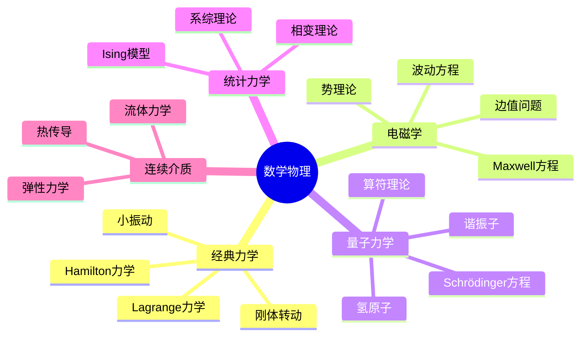

# 数学物理与工程实例精讲

---

## 1. 经典力学中的数学

### 1.1 Lagrange力学框架

**原理**: 在约束条件下，真实运动使作用量取极值

$$\delta S = \delta \int_{t_1}^{t_2} L(q, \dot{q}, t) dt = 0$$

**Euler-Lagrange方程**:
$$\frac{d}{dt}\frac{\partial L}{\partial \dot{q}_i} - \frac{\partial L}{\partial q_i} = 0$$

### 1.2 经典系统实例

| 系统 | Lagrangian | 运动方程 | 守恒量 |
|-----|-----------|---------|-------|
| **自由粒子** | $L = \frac{1}{2}m\dot{x}^2$ | $\ddot{x} = 0$ | 动量 $p = m\dot{x}$ |
| **谐振子** | $L = \frac{1}{2}m\dot{x}^2 - \frac{1}{2}kx^2$ | $m\ddot{x} + kx = 0$ | 能量 $E = \frac{p^2}{2m} + \frac{1}{2}kx^2$ |
| **单摆** | $L = \frac{1}{2}ml^2\dot{\theta}^2 + mgl\cos\theta$ | $\ddot{\theta} + \frac{g}{l}\sin\theta = 0$ | 能量 |
| **中心力场** | $L = \frac{1}{2}m(\dot{r}^2 + r^2\dot{\theta}^2) - V(r)$ | 径向+角向方程 | 能量、角动量 |

### 1.3 小振动与简正模

**多自由度系统**: 
$$L = \frac{1}{2}\dot{\vec{q}}^T M \dot{\vec{q}} - \frac{1}{2}\vec{q}^T K \vec{q}$$

**简正模方程**:
$$\det(K - \omega^2 M) = 0$$

**实例：双摆**
- 2个自由度
- 2个简正模频率
- 一般运动为简正模的叠加

---

## 2. 电磁学中的数学

### 2.1 Maxwell方程组

**微分形式**:
$$\begin{cases}
\nabla \cdot \mathbf{E} = \frac{\rho}{\varepsilon_0} & \text{(Gauss定律)} \\
\nabla \times \mathbf{E} = -\frac{\partial \mathbf{B}}{\partial t} & \text{(Faraday定律)} \\
\nabla \cdot \mathbf{B} = 0 & \text{(无磁单极)} \\
\nabla \times \mathbf{B} = \mu_0 \mathbf{J} + \mu_0\varepsilon_0 \frac{\partial \mathbf{E}}{\partial t} & \text{(Ampère-Maxwell)}
\end{cases}$$

### 2.2 势函数表述

**标量势与矢量势**:
$$\mathbf{B} = \nabla \times \mathbf{A}, \quad \mathbf{E} = -\nabla \phi - \frac{\partial \mathbf{A}}{\partial t}$$

**Lorentz规范**:
$$\nabla \cdot \mathbf{A} + \frac{1}{c^2}\frac{\partial \phi}{\partial t} = 0$$

**波动方程**:
$$\Box \phi = -\frac{\rho}{\varepsilon_0}, \quad \Box \mathbf{A} = -\mu_0 \mathbf{J}$$

其中 d'Alembertian: $\Box = \frac{1}{c^2}\frac{\partial^2}{\partial t^2} - \nabla^2$

### 2.3 边值问题实例

**平行板电容器**:
- 区域：两无限大平行板之间
- 方程：$\nabla^2 \phi = 0$
- 边界条件：板上电势给定
- 解：线性电势 $\phi = \phi_0 + Ez$

**点电荷镜像法**:
- 导体球外点电荷
- 用镜像电荷代替导体
- 边界条件自动满足

---

## 3. 量子力学中的数学

### 3.1 基本框架

**Schrödinger方程**:
$$i\hbar \frac{\partial \psi}{\partial t} = \hat{H}\psi$$

**定态方程**:
$$\hat{H}\psi_n = E_n \psi_n$$

### 3.2 典型势阱

| 势场 | 方程 | 能谱 | 波函数特征 |
|-----|------|-----|-----------|
| **无限深方势阱** | $-\frac{\hbar^2}{2m}\psi'' = E\psi$ | 离散 $E_n \propto n^2$ | 正弦函数 |
| **谐振子** | $-\frac{\hbar^2}{2m}\psi'' + \frac{1}{2}m\omega^2x^2\psi = E\psi$ | 等间距 $E_n = (n+\frac{1}{2})\hbar\omega$ | Hermite函数 |
| **氢原子** | 球坐标分离 | $E_n \propto -1/n^2$ | 球谐函数×Laguerre |
| **势垒贯穿** | 散射问题 | 连续谱 | 反射+透射波 |

### 3.3 谐振子详解

**升降算符**:
$$\hat{a} = \sqrt{\frac{m\omega}{2\hbar}}(\hat{x} + \frac{i\hat{p}}{m\omega}), \quad \hat{a}^\dagger = \sqrt{\frac{m\omega}{2\hbar}}(\hat{x} - \frac{i\hat{p}}{m\omega})$$

**代数解法**:
$$\hat{H} = \hbar\omega(\hat{a}^\dagger\hat{a} + \frac{1}{2})$$

**能谱**:
- 基态：$\hat{a}|0\rangle = 0$
- 激发态：$|n\rangle = \frac{1}{\sqrt{n!}}(\hat{a}^\dagger)^n|0\rangle$

---

## 4. 统计力学中的数学

### 4.1 系综理论

| 系综 | 约束 | 配分函数 | 热力学势 |
|-----|------|---------|---------|
| **微正则** | $E, V, N$ 固定 | $\Omega(E)$ | $S = k_B \ln \Omega$ |
| **正则** | $T, V, N$ 固定 | $Z = \sum e^{-\beta E_i}$ | $F = -k_B T \ln Z$ |
| **巨正则** | $T, V, \mu$ 固定 | $\Xi = \sum e^{\beta\mu N - \beta E}$ | $\Omega = -k_B T \ln \Xi$ |

### 4.2 Ising模型

**Hamiltonian**:
$$H = -J \sum_{\langle i,j \rangle} s_i s_j - h \sum_i s_i$$

其中 $s_i = \pm 1$

**一维精确解**:
- 无相变（任何 $T > 0$）
- 转移矩阵法

**二维Onsager解**:
- 存在相变
- 临界温度 $k_B T_c = \frac{2J}{\ln(1+\sqrt{2})}$

---

## 5. 工程应用实例

### 5.1 结构力学

**Euler-Bernoulli梁方程**:
$$EI \frac{d^4 w}{dx^4} = q(x)$$

边界条件类型：
| 支撑类型 | 边界条件 |
|---------|---------|
| **固支** | $w = 0, \frac{dw}{dx} = 0$ |
| **简支** | $w = 0, M = 0$ (即 $w'' = 0$) |
| **自由端** | $M = 0, V = 0$ (即 $w'' = 0, w''' = 0$) |

### 5.2 热传导

**Fourier定律**:
$$\mathbf{q} = -k \nabla T$$

**热方程**:
$$\frac{\partial T}{\partial t} = \alpha \nabla^2 T$$

**稳态问题**: $\nabla^2 T = 0$（Laplace方程）

### 5.3 流体力学

**Navier-Stokes方程**:
$$\rho \left(\frac{\partial \mathbf{u}}{\partial t} + \mathbf{u} \cdot \nabla \mathbf{u}\right) = -\nabla p + \mu \nabla^2 \mathbf{u} + \mathbf{f}$$

**不可压缩条件**: $\nabla \cdot \mathbf{u} = 0$

**典型流动**:
| 流动类型 | 简化 | 解的特征 |
|---------|-----|---------|
| **Couette流** | 两平板间 | 线性速度分布 |
| **Poiseuille流** | 圆管流动 | 抛物线速度分布 |
| **边界层** | 大Re数 | 薄层近似 |
| **势流** | 无旋 | 复变函数方法 |

---

## 6. 计算实例

### 6.1 有限元方法实例

**一维泊松方程**:
$$-u'' = f, \quad u(0) = u(1) = 0$$

**弱形式**:
$$\int_0^1 u'v' dx = \int_0^1 fv dx, \quad \forall v \in H_0^1$$

**离散化**:
- 网格：$x_i = ih, h = 1/N$
- 基函数：分段线性帽函数
- 刚度矩阵：三对角

### 6.2 谱方法实例

**Fourier谱方法**:
- 展开：$u(x) = \sum_{k=-N}^N \hat{u}_k e^{ikx}$
- 微分：$\partial_x u = \sum ik \hat{u}_k e^{ikx}$
- 优势：指数收敛（光滑解）

---

## 7. 思维导图：数学物理知识体系

---

## 参考文献

1. Arnold, V.I. *Mathematical Methods of Classical Mechanics*.
2. Jackson, J.D. *Classical Electrodynamics*.
3. Griffiths, D.J. *Introduction to Quantum Mechanics*.
4. Pathria, R.K. *Statistical Mechanics*.
5. Landau & Lifshitz. *Course of Theoretical Physics*.

---

*本文档收集数学物理与工程领域的经典实例*  
*质量等级：A（应用性+物理直观）*
