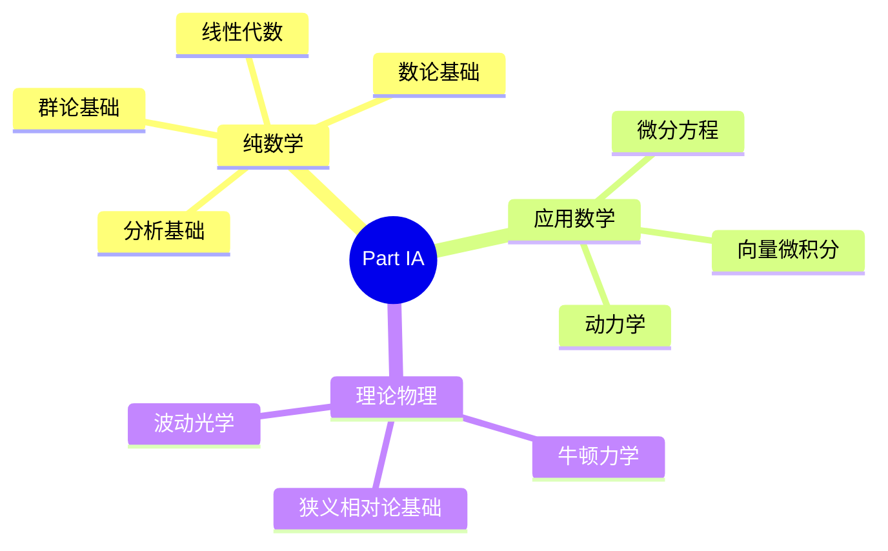
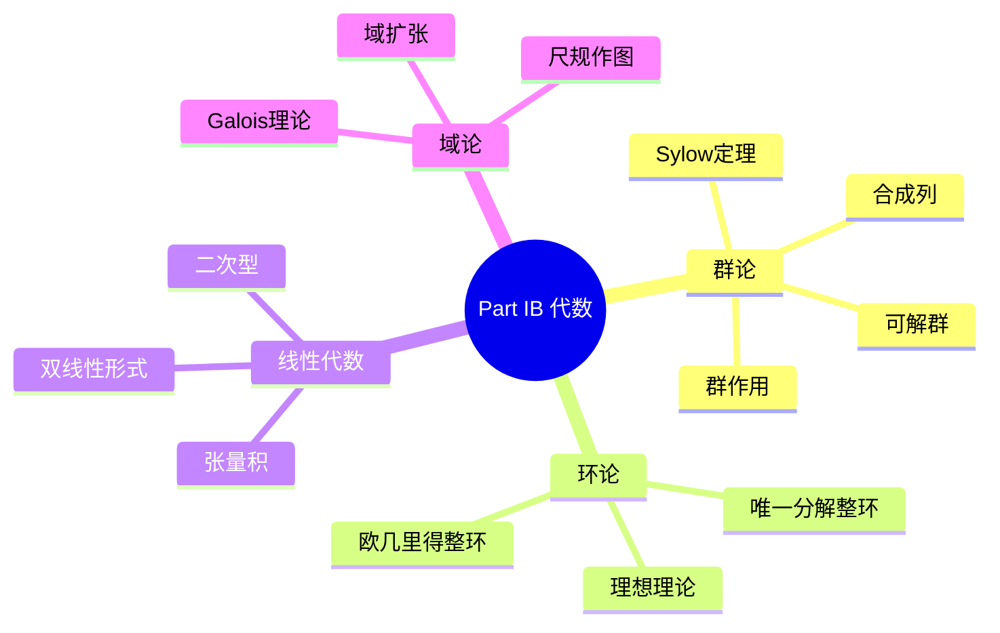
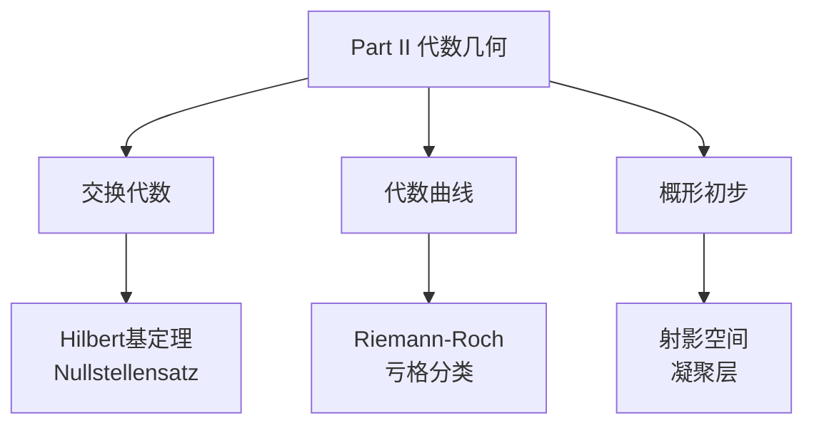
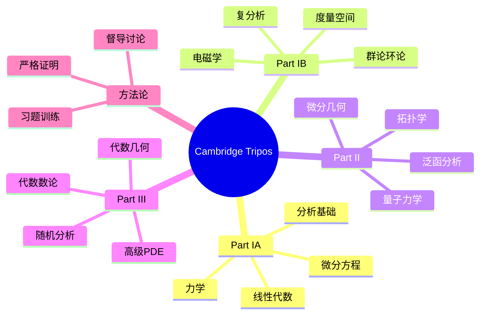

# Cambridge Tripos 数学系列精讲

---

## 系列概述

Cambridge Mathematical Tripos 是世界上最古老、最负盛名的数学课程之一：
- **Part IA**: 大一基础（纯数学、应用数学、理论物理）
- **Part IB**: 大二进阶（抽象代数、分析、几何、力学）
- **Part II**: 大三深化（专题课程、毕业论文）
- **Part III**: 研究生阶段（硕士/博士预备）

本系列文档与Tripos课程体系深度对齐。

---

## 1. Part IA: 基础数学

### 1.1 课程结构



### 1.2 线性代数（IA）

**核心内容**：
- 向量空间与线性映射
- 矩阵表示与基变换
- 特征值与特征向量
- 内积空间与正交性

**典型问题风格**：

**例题**：设 $T: \mathbb{R}^3 \to \mathbb{R}^3$ 是线性映射，矩阵为
$$A = \begin{pmatrix} 2 & -1 & 0 \\ -1 & 2 & -1 \\ 0 & -1 & 2 \end{pmatrix}$$

(i) 求特征值与特征向量
(ii) 求正交矩阵 $P$ 使 $P^TAP$ 对角
(iii) 计算 $A^n$

**解答要点**：
- 特征多项式：$\det(A - \lambda I) = 0$
- 对称矩阵特征向量正交
- $A^n = P D^n P^T$

### 1.3 分析基础（IA）

**严格实数理论**：
- 上确界公理
- 序列收敛与极限
- 级数收敛判别
- 连续性严格定义

**核心技巧**：
| 技巧 | 应用场景 | 示例 |
|-----|---------|-----|
| **ε-N语言** | 序列收敛 | 证明 $1/n \to 0$ |
| **比较判别** | 正项级数 | 与几何级数比较 |
| **Cauchy列** | 完备性证明 | 证明收敛 |
| **闭区间套** | 存在性证明 | 零点存在 |

---

## 2. Part IB: 进阶数学

### 2.1 抽象代数（IB）



### 2.2 群论深化

**Sylow定理应用**（典型Tripos风格）：

**问题**：证明不存在30阶单群。

**解答框架**：
1. $n_5 \equiv 1 \pmod{5}$ 且 $n_5 | 6$ ⟹ $n_5 = 1$ 或 $6$
2. 若 $n_5 = 1$，Sylow 5-子群正规，非单
3. 若 $n_5 = 6$，则24个5阶元
4. $n_3 \equiv 1 \pmod{3}$ 且 $n_3 | 10$ ⟹ $n_3 = 1$ 或 $10$
5. 若 $n_3 = 10$，则20个3阶元
6. $24 + 20 = 44 > 30$，矛盾！

### 2.3 分析深化（IB）

**度量空间与拓扑**：

| 概念 | 定义 | 关键性质 |
|-----|------|---------|
| **度量空间** | $(X, d)$，$d$ 满足三公理 | 开球定义拓扑 |
| **开集** | 每点有开球邻域 | 拓扑公理 |
| **收敛** | $d(x_n, x) \to 0$ | 唯一性（Hausdorff） |
| **完备性** | Cauchy列收敛 | 完备化存在 |
| **紧性** | 序列紧 ⟺ 有限覆盖紧 | 度量空间等价 |

**重要定理链**：
```
Bolzano-Weierstrass ⟹ 有限覆盖定理 ⟹ 极值定理
       ↓
一致连续性定理 ⟹ Riemann可积性
```

---

## 3. Part II: 深化专题

### 3.1 分析与拓扑（Part II）

**课程模块**：
- 拓扑学（点集拓扑、代数拓扑基础）
- 微分几何（曲线曲面、Riemann几何入门）
- 复分析（留数、共形映射、解析延拓）
- 泛函分析（Banach/Hilbert空间、算子理论）

### 3.2 代数与几何（Part II）



### 3.3 应用数学（Part II）

**经典力学**：
- Lagrange力学（变分原理）
- Hamilton力学（辛几何）
- 可积系统与KAM理论

**量子力学**：
- Hilbert空间形式
- 自伴算子与谱理论
- 散射理论

**广义相对论**：
- 微分几何基础
- Einstein场方程
- Schwarzschild解

---

## 4. Part III: 研究生阶段

### 4.1 高级课程

| 方向 | 课程示例 | 前置要求 |
|-----|---------|---------|
| **代数几何** | 概形理论、上同调 | Part II 代数几何 |
| **代数数论** | 类域论、p进Hodge理论 | 代数数论基础 |
| **微分几何** | 指标定理、Floer理论 | Riemann几何 |
| **PDE** | 椭圆方程、双曲方程 | 泛函分析 |
| **概率** | 随机分析、大偏差 | 测度论 |

### 4.2 研究训练

**Essay（毕业论文）**：
- 约10000字深度论文
- 在导师指导下研究特定主题
- 培养独立研究能力

**示例主题**：
- Morse理论在拓扑中的应用
- 椭圆曲线的算术
- 随机矩阵理论
- 黑洞热力学

---

## 5. Cambridge风格特点

### 5.1 教学方法

| 特点 | 描述 | 体现 |
|-----|------|-----|
| **讲座（Lecture）** | 大班授课，系统讲解 | 每周3-4次 |
| **督导（Supervision）** | 2-3人小组讨论 | 每周1-2次 |
| **习题（Example Sheets）** | 挑战性习题集 | 每周1-2套 |
| **考试（Tripos）** | 每年一次大考 | 成绩决定等级 |

### 5.2 习题风格

**典型特征**：
- 证明导向（vs 计算导向）
- 多小问结构（引导式证明）
- 难度递进（从基础到挑战）
- 时限压力（考试每题约30-40分钟）

**示例结构**：
```
Question 7:
(i) 证明基本性质（5分）
(ii) 应用性质推导（8分）
(iii) 推广到一般情形（12分）
(iv) 反例或边界讨论（5分）
```

### 5.3 与英美其他课程对比

| 特点 | Cambridge Tripos | MIT/Harvard | 说明 |
|-----|-----------------|-------------|-----|
| **节奏** | 3年压缩密集 | 4年相对宽松 | Tripos节奏快 |
| **考试权重** | 极高（几乎全部） | 多元评估 | Tripos一次定终身 |
| **抽象度** | 高（Part II起） | 中高 | 英国传统抽象 |
| **习题量** | 极大 | 大 | 每周多份习题 |
| **督导制** | 特色小班 | 助教授课 | 个性化指导 |

---

## 6. 与FormalMath项目对齐

### 6.1 内容对应

| Tripos部分 | FormalMath对应 | 对齐程度 |
|-----------|---------------|---------|
| Part IA | docs/01-基础数学/ docs/02-代数结构/ | 完全对齐 |
| Part IB | docs/02-代数结构/ docs/03-分析学/ | 完全对齐 |
| Part II | docs/04-几何拓扑/ docs/10-数学物理/ | 完全对齐 |
| Part III | docs/09-形式化证明/ docs/13-代数几何/ | 深度对齐 |

### 6.2 Tripos习题风格文档

已创建的对应文档：
- 群论习题精讲（Sylow定理应用风格）
- 分析学解题策略（ε-δ严格证明风格）
- 代数拓扑习题精解（Part II水平）

---

## 7. 思维导图：Tripos知识体系



---

## 参考文献

1. Cambridge Mathematical Tripos Lecture Notes.
2. Korner, T.W. *A Companion to Analysis*.
3. Stewart, I. & Tall, D. *Algebraic Number Theory and Fermat's Last Theorem*.
4. Riley, K.F., Hobson, M.P. & Bence, S.J. *Mathematical Methods for Physics and Engineering*.

---

*本文档与Cambridge Mathematical Tripos课程深度对齐*  
*质量等级：A+（历史悠久+严格训练）*
