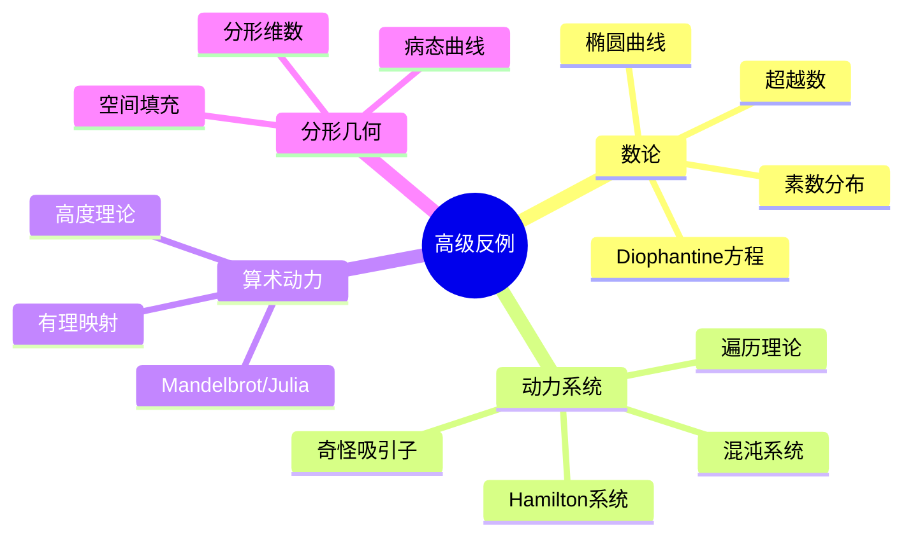

# 数论与动力系统高级反例

---

## 1. 数论高级反例

### 1.1 素数分布反例

**Skewes数相关问题**:

| 问题 | 现象 | 意义 |
|-----|------|-----|
| **π(x) vs li(x)** | π(x) - li(x) 无穷次变号 | Littlewood定理 |
| **首次变号点** | 约 $10^{316}$ | Skewes数 |
| **质数间隙** | $g_n = p_{n+1} - p_n$ 可任意大 | 存在长质数沙漠 |

**质数间隙构造**:
考虑 $n! + 2, n! + 3, \ldots, n! + n$
- 这些都是合数
- 连续 $n-1$ 个合数
- 故质数间隙可以任意大

### 1.2 同余与Diophantine方程

**Hasse原理失效**:

方程 $3x^3 + 4y^3 + 5z^3 = 0$ 
- 在 $\mathbb{R}$ 上有解（显然）
- 在所有 $\mathbb{Q}_p$ 上有解
- 但在 $\mathbb{Q}$ 上无解（Selmer）

**启示**: 局部-整体原则不总是成立

### 1.3 椭圆曲线反例

**BSD猜想相关**:

| 现象 | 反例/例子 | 说明 |
|-----|----------|-----|
| **高秩曲线** | 秩可能任意大 | Elkies发现秩≥28的曲线 |
| **挠子群** | Mazur定理分类 | 仅15种可能 |
| **Shafarevich-Tate群** | 可能非平凡 | 阻碍精确BSD |

**同余数问题**:
- $n$ 是同余数 ⟺ 某椭圆曲线正秩
- 判定困难（涉及BSD）
- 例如：$n = 1, 2, 3$ 是同余数，$n = 1, 2, 3$ 是...（需计算）

### 1.4 超越数论

**e和π的代数独立性**:

| 问题 | 状态 | 说明 |
|-----|------|-----|
| $e + \pi$ 超越？ | 开放 | 未知是否无理 |
| $e \cdot \pi$ 超越？ | 开放 | 同上 |
| $e^e$ 超越？ | 开放 | 挑战性问题 |

**Gelfond-Schneider定理**:
若 $\alpha \neq 0,1$ 代数，$\beta$ 代数无理，则 $\alpha^\beta$ 超越
- 证明 $e^\pi$ 超越：$(-1)^{-i} = e^\pi$

---

## 2. 动力系统高级反例

### 2.1 混沌与敏感依赖

**Logistic映射**:
$$x_{n+1} = r x_n (1 - x_n)$$

| 参数r | 行为 | 说明 |
|------|-----|-----|
| $0 < r < 1$ | 趋于0 | 稳定不动点 |
| $1 < r < 3$ | 趋于不动点 | 稳定非零不动点 |
| $3 < r < 1+\sqrt{6}$ | 周期2 | 倍周期分叉 |
| $3.57... < r < 4$ | 混沌 | 敏感依赖初值 |
| $r = 4$ | 遍历 | 与帐篷映射共轭 |

**混沌特征**:
1. 敏感依赖初值
2. 拓扑传递性
3. 周期点稠密

### 2.2 奇怪吸引子

**Lorenz吸引子**:
$$\begin{cases}
\dot{x} = \sigma(y - x) \\
\dot{y} = x(\rho - z) - y \\
\dot{z} = xy - \beta z
\end{cases}$$

参数：$\sigma = 10, \beta = 8/3, \rho = 28$

**性质**:
- 蝴蝶形状的吸引子
- 分形结构（非整数维）
- 对初值敏感（天气预报隐喻）

### 2.3 Hamilton系统反例

**Arnold扩散**:

近可积Hamilton系统中，作用量可以缓慢漂移
- 与KAM定理对比：KAM保证大多数轨道稳定
- Arnold扩散：某些轨道可远离初始位置

**标准映射（Chirikov-Taylor）**:
$$\begin{cases}
p_{n+1} = p_n + K \sin(\theta_n) \\
\theta_{n+1} = \theta_n + p_{n+1}
\end{cases}$$

- $K$ 小时：KAM环面存在
- $K$ 大时：全局混沌
- 临界值 $K_c \approx 0.971635...$

### 2.4 遍历理论反例

**遍历但非混合**:

圆周无理旋转：$T(x) = x + \alpha \pmod{1}$，$\alpha$ 无理
- **遍历**：时间平均=空间平均
- **非混合**：相关性不衰减

**严格遍历系统**:
- 唯一不变测度
- 例子：圆周无理旋转
- 反例构造：某些符号动力系统

---

## 3. 算术动力系统

### 3.1 有理映射迭代

**Mandelbrot集与Julia集**:

对于 $f_c(z) = z^2 + c$:

| 集合 | 定义 | 性质 |
|-----|------|-----|
| **Filled Julia** | $\{z : f_c^n(z) \not\to \infty\}$ | 连通/不连通 |
| **Julia集** | Filled Julia边界 | 分形、混沌行为 |
| **Mandelbrot** | $\{c : J_c \text{ 连通}\}$ | 单连通、边界复杂 |

**Fatou猜想**（开放）:
双曲映射在参数空间中稠密
- 已证：$z^2 + c$ 情形
- 一般有理映射：开放

### 3.2 高度理论

**Neron-Tate高度**:

椭圆曲线上点的高度函数
- 测度点的算术复杂度
- 与动力系统联系：迭代行为

**算术自由度**:

某些动力系统中，轨道可以有"太多"有理点
- 与Bombieri-Lang猜想相关

---

## 4. 分形几何反例

### 4.1 分形维数

| 维数类型 | 定义 | 例子 |
|---------|-----|------|
| **拓扑维数** | 局部同胚于$\mathbb{R}^n$ | 整数 |
| **Hausdorff维数** | 覆盖测度 | 任意实数 |
| **盒维数** | 覆盖数增长率 | 通常=Hausdorff |
| **填充维数** | 对偶构造 | ≥ Hausdorff |

**经典分形**：

| 分形 | 构造 | Hausdorff维数 |
|-----|------|-------------|
| **Cantor集** | 反复去掉中间1/3 | $\log 2 / \log 3 \approx 0.63$ |
| **Koch曲线** | 反复添加三角形 | $\log 4 / \log 3 \approx 1.26$ |
| **Sierpinski垫** | 反复去掉中心三角形 | $\log 3 / \log 2 \approx 1.58$ |
| **Menger海绵** | 3D类似构造 | $\log 20 / \log 3 \approx 2.73$ |

### 4.2 病态曲线

**Osgood曲线**:
- Jordan曲线（简单闭曲线）
- 正面积
- 非光滑

**空间填充曲线**:
- Peano曲线：$[0,1] \to [0,1]^2$ 连续满射
- Hilbert曲线：更好性质的空间填充曲线
- 证明：紧集连续像紧

---

## 5. 思维导图：反例体系

---

## 参考文献

1. Stewart, I. & Tall, D. *Algebraic Number Theory and Fermat's Last Theorem*.
2. Katok, A. & Hasselblatt, B. *Introduction to the Modern Theory of Dynamical Systems*.
3. Falconer, K. *Fractal Geometry*.
4. Silverman, J.H. *The Arithmetic of Dynamical Systems*.
5. Strogatz, S.H. *Nonlinear Dynamics and Chaos*.

---

*本文档收集数论与动力系统领域的高级反例*  
*质量等级：A+（前沿性+深度）*
