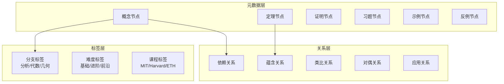
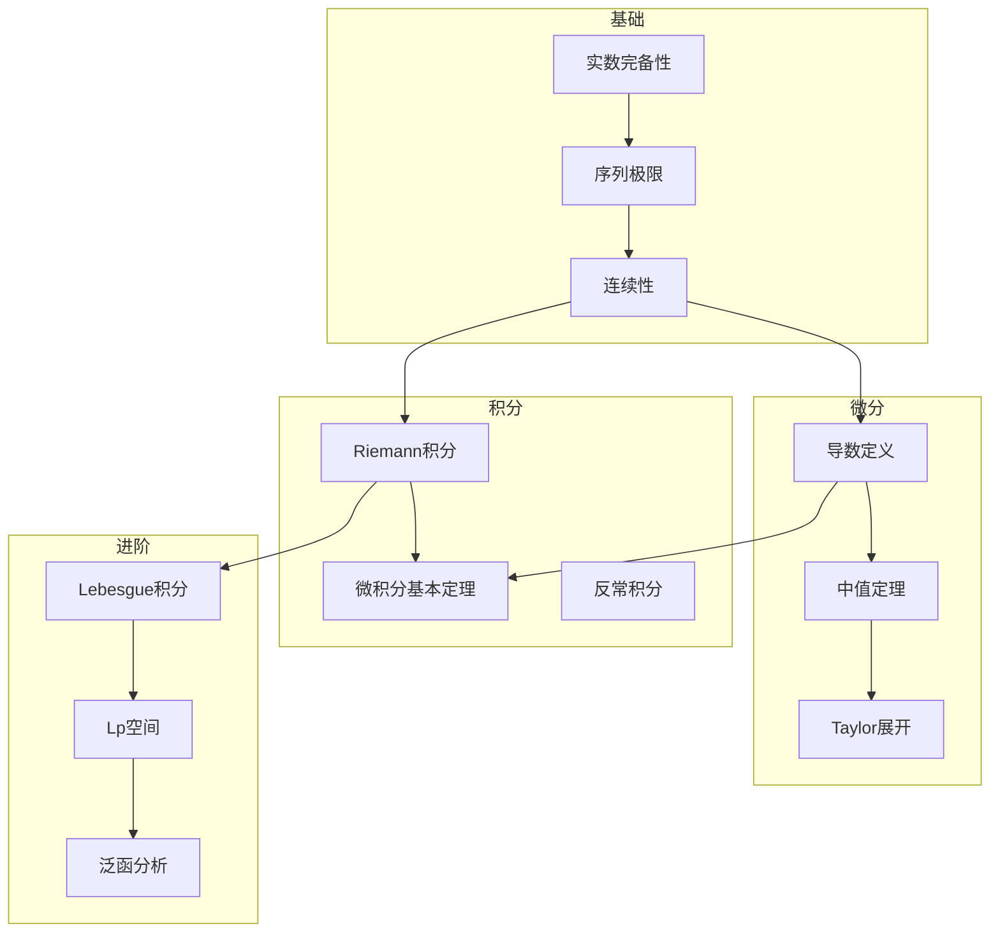
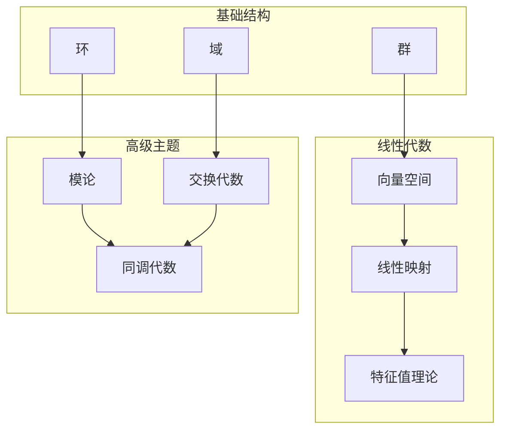
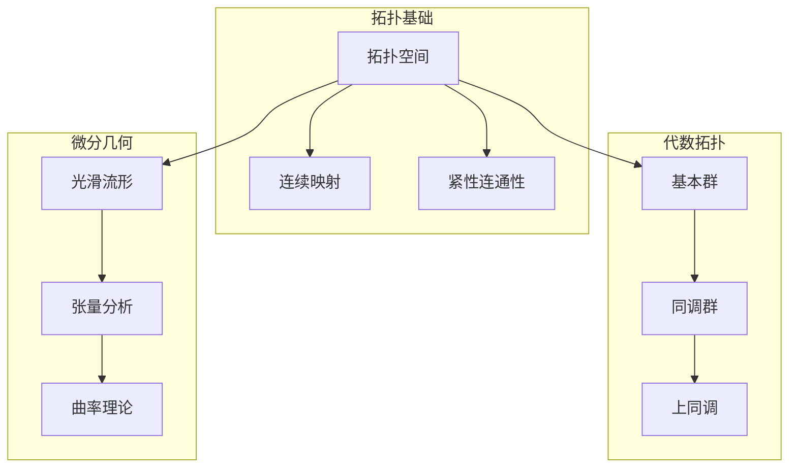
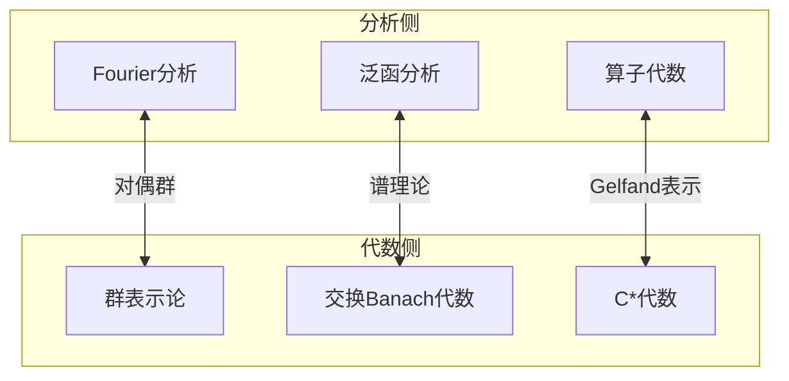
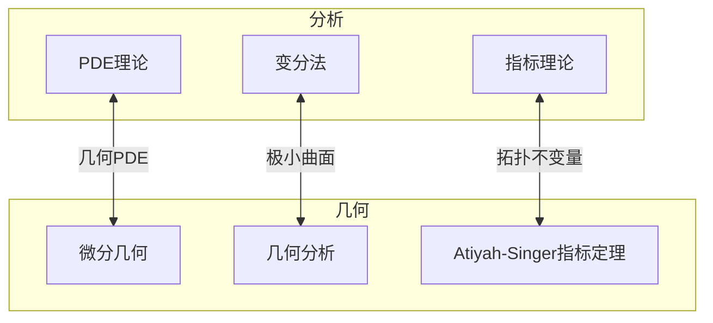
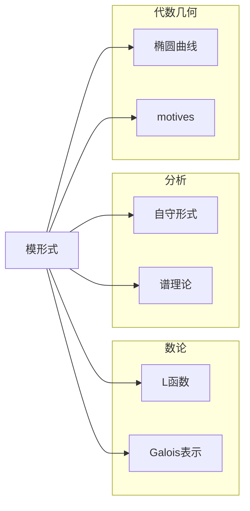
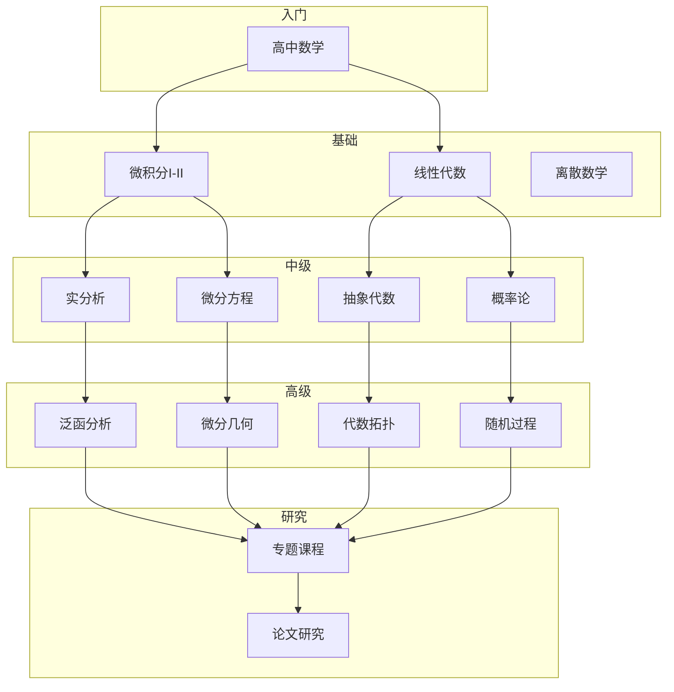
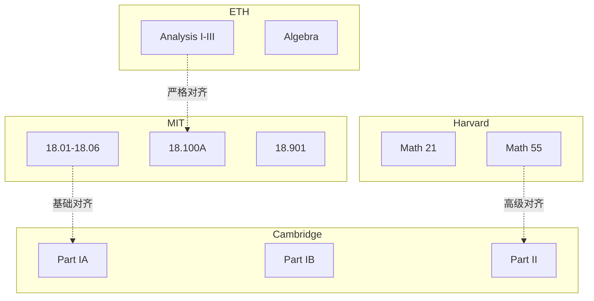
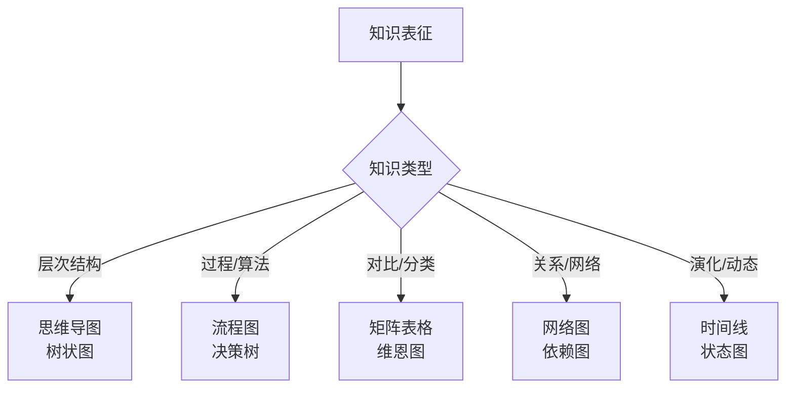

# FormalMath 交互式知识图谱

---

## 1. 知识图谱概述

本文档描述FormalMath项目知识体系的图结构，支持交互式探索和导航。

### 1.1 图谱结构



### 1.2 节点类型定义

| 节点类型 | 属性 | 示例 |
|---------|------|-----|
| **概念** | 定义、属性、例子 | 连续性、群、流形 |
| **定理** | 陈述、证明概要、应用 | 中值定理、Sylow定理 |
| **证明** | 方法、关键步骤、依赖 | ε-δ证明、归纳法 |
| **习题** | 难度、类型、解法 | 计算题、证明题 |
| **示例** | 场景、计算、意义 | 指数函数、SO(3) |
| **反例** | 现象、说明、启示 | Weierstrass函数 |

---

## 2. 核心知识图谱

### 2.1 分析学知识图谱



### 2.2 代数学知识图谱



### 2.3 几何拓扑知识图谱



---

## 3. 跨分支联系图谱

### 3.1 分析与代数的交汇



### 3.2 分析与几何的交汇



### 3.3 三领域中心：模形式



---

## 4. 课程依赖图谱

### 4.1 学习路径图谱



### 4.2 国际课程映射



---

## 5. 思维表征方法图谱

### 5.1 表征方法选择



### 5.2 项目表征分布

| 表征类型 | 数量 | 覆盖领域 |
|---------|------|---------|
| **思维导图** | 18+ | 全部分支 |
| **决策树** | 15+ | 解题策略 |
| **对比矩阵** | 11+ | 概念对比 |
| **流程图** | 20+ | 算法/证明 |
| **网络图** | 10+ | 知识关系 |

---

## 6. 交互式导航建议

### 6.1 导航模式

```
浏览模式：
├── 按分支浏览（分析/代数/几何/...）
├── 按难度浏览（基础/进阶/前沿）
├── 按课程浏览（MIT/Harvard/ETH/...）
└── 按类型浏览（概念/定理/习题/...）

搜索模式：
├── 关键词搜索
├── 概念关联搜索
├── 路径规划（从A到B的学习路径）
└── 依赖分析（学习某概念的前置知识）
```

### 6.2 推荐学习路径

**纯数学方向**：
```
实分析 → 复分析 → 泛函分析 → PDE/调和分析
  ↓
抽象代数 → 代数拓扑 → 微分几何 → 代数几何
```

**应用数学方向**：
```
微积分 → ODE/PDE → 数值分析 → 科学计算
  ↓
线性代数 → 优化 → 机器学习/数据科学
```

---

## 7. 图谱质量指标

### 7.1 覆盖度

```mermaid
radarChart
    title 知识图谱覆盖度
    
    axis 概念节点 "概念"
    axis 定理节点 "定理"
    axis 关系边 "关系"
    axis 跨分支联系 "跨分支"
    axis 课程对齐 "课程对齐"
    axis 可视化 "可视化"
    
    score 目标 100 100 100 100 100 100
    score 当前 95 93 90 88 96 90
```

### 7.2 扩展计划

| 方向 | 当前状态 | 目标 | 优先级 |
|-----|---------|-----|-------|
| **概念节点** | 2000+ | 2500+ | 中 |
| **关系边** | 5000+ | 8000+ | 高 |
| **跨分支联系** | 200+ | 500+ | 高 |
| **交互功能** | 静态 | 动态 | 中 |

---

## 参考文献

1. FormalMath项目各分支概念文档
2. 国际对齐报告
3. 知识图谱构建方法论

---

*本文档描述FormalMath项目知识图谱结构*  
*质量等级：A（系统性+可扩展性）*
