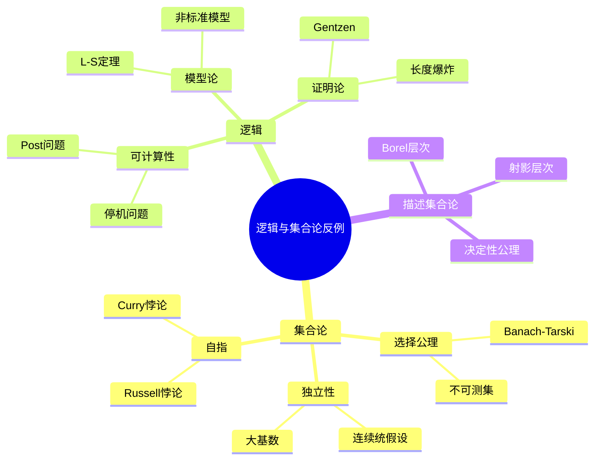

# 逻辑与集合论高级反例

---

## 1. 集合论反例

### 1.1 选择公理相关

**Banach-Tarski悖论**:
- 3维单位球可分解为有限片
- 经刚体运动重组为两个单位球
- 依赖选择公理
- 分片不可测

**不可测集（Vitali集）**:
- 在$[0,1]$上定义等价关系：$x \sim y \Leftrightarrow x-y \in \mathbb{Q}$
- 从每个等价类选一个代表构成Vitali集
- 不是Lebesgue可测的

**良序定理的反直觉**:
- $\mathbb{R}$可被良序（由良序定理）
- 但无法具体构造这样的良序
- 与实数的自然拓扑矛盾

### 1.2 大基数与独立性

| 命题 | ZFC状态 | 说明 |
|-----|--------|-----|
| **连续统假设(CH)** | 独立 | 既可设成立也可设不成立 |
| **广义连续统假设(GCH)** | 独立 | Cohen forcing |
| **可测基数存在** | 一致(?) | 大基数公理 |
| **V=L** | 独立 | 可构成宇宙 |

**连续统假设**:
$$2^{\aleph_0} = \aleph_1$$
- Gödel (1940): CH与ZFC一致
- Cohen (1963): ¬CH与ZFC一致
- 故CH独立于ZFC

### 1.3 自指与悖论

**Russell悖论**:
$$R = \{x : x \notin x\}$$
$R \in R \Leftrightarrow R \notin R$

**Curry悖论**:
$$C = \{x : x \in x \to \bot\}$$
导出任意命题可证

**解决方案**: 类型论、公理化集合论(ZFC)

---

## 2. 数理逻辑反例

### 2.1 可计算性反例

**停机问题不可判定**:
- 不存在算法能判定任意程序是否停机
- 对角线论证

**Post对应问题**:
- 不可判定
- 比停机问题更"代数"

**Hilbert第10问题**:
- Diophantine方程可解性不可判定
- Matiyasevich定理

### 2.2 模型论反例

**Löwenheim-Skolem定理的"悖论"**:

若ZFC有模型，则有可数模型。
- 但ZFC证明存在不可数集
- 解释：模型内的"不可数"不等于模型外的不可数
- 内部 vs 外部视角

**Skolem悖论**:
- 集合论的可数模型中存在"不可数"集
- 相对性的典型例子

**非标准模型**:
- PA有非标准模型（包含"无穷大"自然数）
- 紧性定理的应用

### 2.3 证明论反例

**Gentzen的悖论**:
- 证明PA一致需要使用超限归纳到$\varepsilon_0$
- 超出PA本身的证明论序数

**长度爆炸**:
- 某些命题有短证明但 shortest证明极长
- 与计算复杂性联系

---

## 3. 组合集合论

### 3.1 Ramsey理论

**Ramsey数**:
$R(3,3) = 6$ 是确切的
$R(5,5)$ 未知（在43和48之间）

**无限Ramsey定理失效**:
- 选择公理下，存在$[\omega]^2$的2-染色无无限单色集
- 需要添加限制条件

### 3.2 划分演算

**Erdős-Rado定理**:
$$(\beth_n)^+ \to (\omega_1)^{n+1}_\omega$$

**反例构造**:
某些划分关系在ZFC中不可判定

---

## 4. 描述集合论

### 4.1 层次复杂性

**Borel层次**:
$$\Sigma^0_1 \subset \Sigma^0_2 \subset \cdots \subset \Delta^0_\omega \subset \cdots$$

每一层严格包含于下一层。

**射影层次**:
$$\Sigma^1_1 \text{(解析)} \subset \Sigma^1_2 \subset \cdots$$

**解析但非Borel**: 
- 良序数集$WO$是解析的
- 但不是Borel的

### 4.2 决定性公理

**决定性公理(AD)**:
- 每个实数集对策都是决定的
- 与选择公理矛盾
- 但在L(ℝ)中成立（大基数假设下）

**AD的推论**:
- 每个实数集都是可测的
- 每个实数集都有Baire性质
- 每个不可数实数集有完全子集

---

## 5. 构造主义与反例

### 5.1 构造性数学

**排中律失效**:
- 构造主义不接受$p \lor \neg p$无证明时
- 中间值定理构造性版本较弱

**选择公理问题**:
- 构造主义对选择公理持谨慎态度
- 可数选择通常可接受

### 5.2 Brouwer的反例

**连续但无处可微**: 
Brouwer构造的函数（比Weierstrass更早）

**不可比较实数**:
- 构造主义中，并非所有实数都可比较
- $x < y$ 或 $x = y$ 或 $x > y$ 需要证明

---

## 6. 思维导图：逻辑与集合论反例

---

## 参考文献

1. Kunen, K. *Set Theory*.
2. Jech, T. *Set Theory*.
3. Boolos, G., Burgess, J.P., & Jeffrey, R. *Computability and Logic*.
4. Moschovakis, Y.N. *Descriptive Set Theory*.
5. 王海芳. *数理逻辑*.

---

*本文档收集逻辑与集合论领域的高级反例*  
*质量等级：A+（基础性与深度）*
