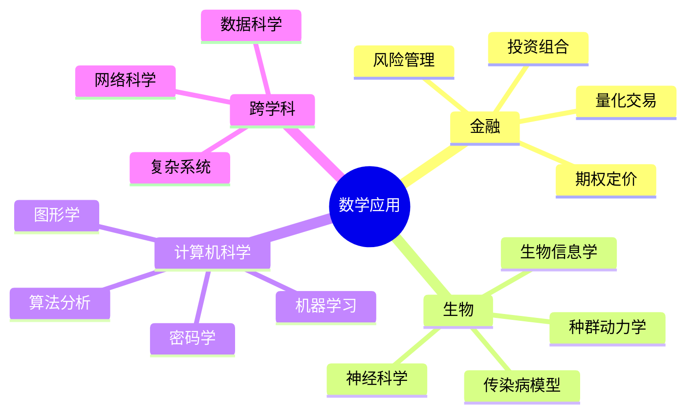

# 数学在金融、生物、计算机科学中的应用

---

## 1. 金融数学

### 1.1 Black-Scholes期权定价模型

**模型假设**:
- 标的资产价格服从几何布朗运动
- 无套利机会
- 可以连续对冲

**Black-Scholes方程**:
$$\frac{\partial V}{\partial t} + \frac{1}{2}\sigma^2 S^2 \frac{\partial^2 V}{\partial S^2} + rS\frac{\partial V}{\partial S} - rV = 0$$

**欧式看涨期权定价公式**:
$$C = S_0 N(d_1) - Ke^{-rT} N(d_2)$$

其中
$$d_1 = \frac{\ln(S_0/K) + (r + \sigma^2/2)T}{\sigma\sqrt{T}}$$
$$d_2 = d_1 - \sigma\sqrt{T}$$

### 1.2 投资组合理论

**Markowitz均值-方差优化**:

$$\min_w \frac{1}{2} w^T \Sigma w$$
$$\text{s.t. } w^T \mu = R_{target}, \quad w^T \mathbf{1} = 1$$

其中：
- $w$: 资产权重向量
- $\Sigma$: 协方差矩阵
- $\mu$: 预期收益向量

**有效前沿**:
```mermaid
xyChart
    title 有效前沿
    x-axis 风险 (标准差)
    y-axis 预期收益
    
    line "有效前沿" [0.05 0.08 0.12 0.15 0.20] [0.03 0.05 0.07 0.08 0.09]
    scatter "可行组合" [0.10 0.15 0.18 0.22] [0.04 0.06 0.05 0.07]
```

### 1.3 风险度量

| 风险度量 | 定义 | 特点 |
|---------|------|-----|
| **VaR** | $P(L > VaR) = \alpha$ | 简单但不满足次可加性 |
| **CVaR** | $E[L | L > VaR]$ | 凸优化友好 |
| **标准差** | $\sqrt{\text{Var}(R)}$ | Markowitz理论 |
| **最大回撤** | $\max_t (Peak_t - Valley_t)$ | 实际交易关注 |

---

## 2. 生物数学

### 2.1 种群动力学

**Logistic增长模型**:
$$\frac{dN}{dt} = rN\left(1 - \frac{N}{K}\right)$$

- $r$: 内禀增长率
- $K$: 环境容纳量

**捕食者-猎物模型 (Lotka-Volterra)**:
$$\begin{cases}
\frac{dx}{dt} = \alpha x - \beta xy \\
\frac{dy}{dt} = -\gamma y + \delta xy
\end{cases}$$

**相图分析**:
```
捕食者 y
    ↑
    |    ↗
    |  ↗   ↘
    |↗       ↘
    +------------→ 猎物 x
```

### 2.2 传染病模型

**SIR模型**:
$$\begin{cases}
\frac{dS}{dt} = -\beta SI \\
\frac{dI}{dt} = \beta SI - \gamma I \\
\frac{dR}{dt} = \gamma I
\end{cases}$$

**基本再生数**:
$$R_0 = \frac{\beta S_0}{\gamma}$$

- $R_0 > 1$: 疫情爆发
- $R_0 < 1$: 疫情消退

### 2.3 生物信息学

**序列比对 (Smith-Waterman)**:
- 动态规划算法
- 局部最优比对
- 打分矩阵（BLOSUM, PAM）

**系统发育树**:
- 最大似然法
- 贝叶斯推断
- 距离矩阵方法（Neighbor-Joining）

---

## 3. 计算机科学中的应用

### 3.1 算法分析

**复杂度分析**:
| 算法 | 时间复杂度 | 空间复杂度 |
|-----|-----------|-----------|
| **快速排序** | $O(n \log n)$ 平均 | $O(\log n)$ |
| **Dijkstra** | $O((V+E)\log V)$ | $O(V)$ |
| **FFT** | $O(n \log n)$ | $O(n)$ |
| **矩阵乘法** | $O(n^{2.373})$ | $O(n^2)$ |

**主定理**:
$$T(n) = aT(n/b) + f(n)$$

### 3.2 机器学习中的数学

**梯度下降**:
$$\theta_{t+1} = \theta_t - \eta \nabla_\theta L(\theta_t)$$

**反向传播**:
- 链式法则的应用
- 计算图遍历

**支持向量机**:
$$\min_{w,b} \frac{1}{2}\|w\|^2 + C\sum_{i=1}^n \max(0, 1 - y_i(w^T x_i + b))$$

**核技巧**:
$$K(x, x') = \phi(x)^T \phi(x')$$

### 3.3 密码学

**RSA算法**:
- 基于大整数分解困难性
- 欧拉定理: $a^{\phi(n)} \equiv 1 \pmod{n}$

**椭圆曲线密码 (ECC)**:
- 椭圆曲线离散对数问题
- 相同安全级别下密钥更短

**格密码**:
- 基于最短向量问题(SVP)
- 抗量子计算攻击

### 3.4 图形学

**光线追踪**:
- 光线与三角形相交
- Barycentric坐标

**变形与动画**:
- 矩阵插值
- 四元数旋转

---

## 4. 跨学科应用实例

### 4.1 网络科学

**PageRank算法**:
$$PR(u) = \frac{1-d}{N} + d\sum_{v \in B(u)} \frac{PR(v)}{L(v)}$$

- 随机游走模型
- 特征向量计算

**小世界网络**:
- 六度分隔理论
- Watts-Strogatz模型

### 4.2 数据科学

**主成分分析 (PCA)**:
- 特征值分解: $X^TX = V\Lambda V^T$
- 降维与去噪

**推荐系统**:
- 矩阵分解: $R \approx PQ^T$
- 协同过滤

---

## 5. 思维导图：应用数学体系



---

## 参考文献

1. Hull, J.C. *Options, Futures, and Other Derivatives*.
2. Murray, J.D. *Mathematical Biology*.
3. Cormen, T.H. et al. *Introduction to Algorithms*.
4. Bishop, C.M. *Pattern Recognition and Machine Learning*.
5. Newman, M. *Networks*.

---

*本文档收集数学在金融、生物、CS中的应用*  
*质量等级：A（应用性+跨学科）*
