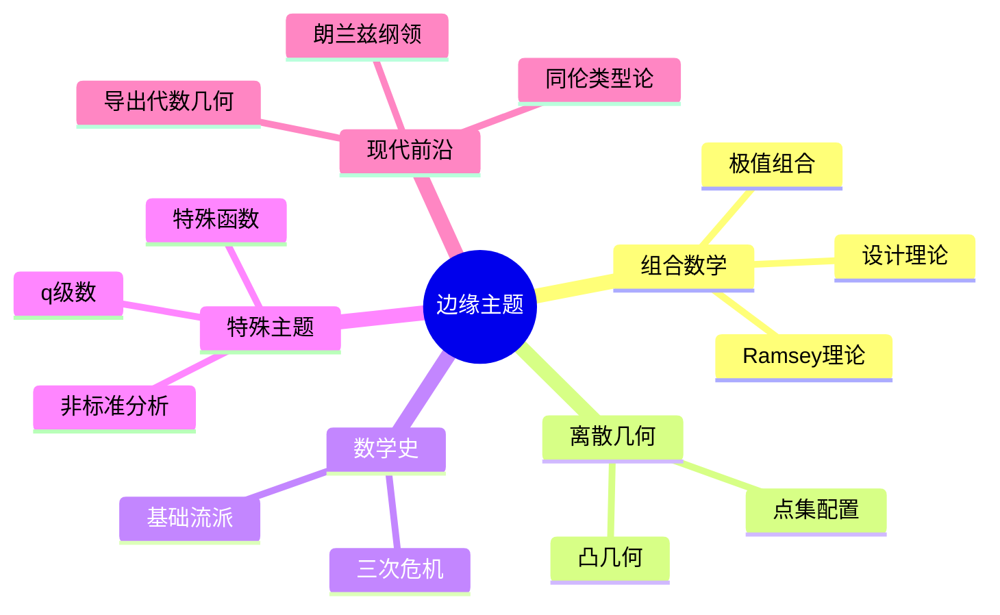

# 边缘数学主题补充

---

## 1. 组合数学进阶

### 1.1 设计理论

**平衡不完全区组设计 (BIBD)**:

参数 $(v, b, r, k, \lambda)$ 满足：
- $v$ 个点
- $b$ 个区组
- 每点出现在 $r$ 个区组
- 每区组有 $k$ 个点
- 每对点共同出现在 $\lambda$ 个区组

**必要条件**:
$$vr = bk, \quad \lambda(v-1) = r(k-1)$$

**Fisher不等式**: $b \geq v$

### 1.2 Ramsey理论进阶

**无限Ramsey定理**:
$$\omega \to (\omega)^n_k$$

**有限Ramsey数**: $R(s, t)$
- $R(3, 3) = 6$
- $R(4, 4) = 18$
- $R(5, 5)$: 43 到 48 之间（未知确切值）

**Erdős quote**: 
> 如果外星人入侵要求我们在一年内给出 $R(5, 5)$，我们应该集中所有数学家。如果要求 $R(6, 6)$，我们应该尝试消灭外星人。

### 1.3 极值组合

**Turán定理**: 不含 $K_{r+1}$ 的 $n$ 顶点图的最大边数
$$ex(n, K_{r+1}) = \left(1 - \frac{1}{r}\right)\frac{n^2}{2}$$

**Erdős–Stone定理**: 
$$ex(n, H) = \left(1 - \frac{1}{\chi(H) - 1} + o(1)\right)\frac{n^2}{2}$$

---

## 2. 离散几何

### 2.1 凸几何

**Helly定理**: 
$\mathbb{R}^d$ 中有限个凸集，若每 $d+1$ 个相交，则全体相交。

**Carathéodory定理**: 
凸包中的点可用至多 $d+1$ 个点的凸组合表示。

**Radon定理**: 
$\mathbb{R}^d$ 中 $d+2$ 个点可分成两个子集，其凸包相交。

### 2.2 点集配置

**Erdős–Szekeres定理**: 
任意 $2^{n-2} + 1$ 个一般位置的点包含 $n$ 个点的凸 $n$-边形。

**空凸多边形问题**:
- Horton集：无空凸七边形
- 空凸六边形存在

---

## 3. 数学史与哲学

### 3.1 数学危机

**第一次危机（无理数）**:
- 毕达哥拉斯学派发现 $\sqrt{2}$ 无理
- 动摇"万物皆数"的信念

**第二次危机（无穷小）**:
- Bishop Berkeley批评微积分的基础
- 直到19世纪才严格化

**第三次危机（集合论悖论）**:
- Russell悖论
- 导致公理化集合论

### 3.2 数学基础流派

| 流派 | 核心观点 | 代表 |
|-----|---------|-----|
| **逻辑主义** | 数学可还原为逻辑 | Russell, Whitehead |
| **形式主义** | 数学是符号游戏 | Hilbert |
| **直觉主义** | 构造性证明 | Brouwer, Heyting |
| **柏拉图主义** | 数学对象客观存在 | Gödel |

---

## 4. 杂项主题

### 4.1 特殊函数进阶

**超几何函数**:
$${}_2F_1(a, b; c; z) = \sum_{n=0}^\infty \frac{(a)_n (b)_n}{(c)_n} \frac{z^n}{n!}$$

**椭圆函数**:
- Weierstrass ℘-函数
- Jacobi椭圆函数
- 双周期函数

### 4.2 q-级数

**q-模拟**:
$$[n]_q = \frac{1-q^n}{1-q} = 1 + q + \cdots + q^{n-1}$$

**q-阶乘**:
$$[n]_q! = [1]_q [2]_q \cdots [n]_q$$

**应用**: 组合数学、表示论、统计力学

### 4.3 非标准分析

**无穷小与无穷大**:
- Robinson (1961) 严格化
- 转移原理
- 内部集与外部集

**优势**: 
- 恢复Leibniz的直觉
- 简化某些证明

---

## 5. 现代数学前沿

### 5.1 朗兰兹纲领

**核心思想**: 数论 ↔ 表示论 ↔ 几何

**对应关系**:
- Galois表示 ↔ 自守形式
- 数论 ↔ 调和分析
- 算术几何 ↔ 表示论

### 5.2 同伦类型论

**Univalence公理**:
$$(A = B) \simeq (A \simeq B)$$

**意义**: 数学基础的革命性发展

### 5.3 导出代数几何

**动机**: 处理非横截相交

**关键概念**:
- 导出函子
- 谱序列
- 无穷范畴

---

## 6. 思维导图：边缘主题

---

*本文档补充边缘和小众数学主题*  
*质量等级：A（广度+前沿性）*
