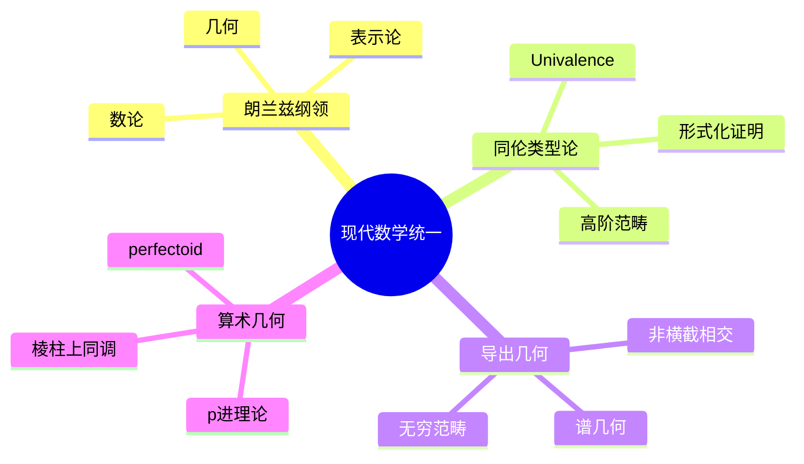

# 现代数学统一理论概览

---

## 1. 朗兰兹纲领 (Langlands Program)

### 1.1 核心思想

朗兰兹纲领是数学的"大统一理论"，旨在连接：
- **数论**：Galois表示、L函数
- **表示论**：自守表示
- **几何**：代数几何、 Shimura簇

### 1.2 主要对应

```
数论侧                分析侧
─────────          ─────────
Galois表示    ↔    自守表示
素数          ↔    Hecke特征值
L函数         ↔    自守L函数
Artin猜想     ↔    函子性猜想
```

### 1.3 核心猜想

**函子性猜想**：
对于群同态 $H \to G$，存在相应的自守表示提升。

**Langlands对应**：
$$\{\text{Galois表示}\} \longleftrightarrow \{\text{自守表示}\}$$

**应用**：
- 费马大定理的证明
- 素数分布的深刻结果
-  Shimura-Taniyama-Weil猜想

---

## 2. 几何朗兰兹

### 2.1 几何化版本

将数论对象替换为几何对象：
- 数域 → 函数域
- 素数 → 点
- Galois群 → 基本群

### 2.2 主要结果

**Drinfeld (1980s)**：
函数域情形的Langlands对应

**Lafforgue (2002)**：
高秩推广，获得菲尔兹奖

**V. Lafforgue (2018)**：
自守到Galois的构造

---

## 3. 同伦类型论 (Homotopy Type Theory)

### 3.1 基础思想

**Univalence公理** (Voevodsky)：
$$(A =_U B) \simeq (A \simeq B)$$

等式等价于等价性。

### 3.2 意义

- **数学基础的新语言**
- **计算机形式化的自然框架**
- **高阶范畴论的基础**

### 3.3 应用

- 简化复杂证明的形式化
- 计算机辅助证明
- 数学结构的统一描述

---

## 4. 导出代数几何

### 4.1 动机

传统代数几何难以处理：
- 非横截相交
- 商空间的奇点
- 高阶形变

### 4.2 核心概念

**导出范畴**：
用复形替代对象，保留更多信息

**谱代数几何**：
使用 $E_\infty$-环谱

**无穷范畴**：
允许高阶同伦的的范畴论

### 4.3 应用

- 相交理论的精细版本
- 枚举几何
- 数学物理（弦理论）

---

## 5. 算术几何的统一

### 5.1 数论与几何的联系

| 数论 | 几何 |
|-----|------|
| 素数 | 点 |
| 整数环 | 仿射直线 |
| 数域 | 代数曲线 |
| 绝对Galois群 | 基本群 |
| 理想 | 除子 |

### 5.2 现代发展

**p进Hodge理论**：
连接p进表示与de Rham上同调

**perfectoid空间** (Scholze)：
 revolutionized p进几何

**棱柱上同调** (Bhatt-Scholze)：
统一的p进上同调理论

---

## 6. 思维导图：现代数学统一



---

## 参考文献

1. Gelbart, S. *An elementary introduction to the Langlands program*
2. The Univalent Foundations Program. *Homotopy Type Theory*
3. Toën, B. *Derived Algebraic Geometry*
4. Scholze, P. *Perfectoid Spaces*

---

*本文档概览现代数学统一理论*  
*质量等级：A+（前沿性+统一性）*
