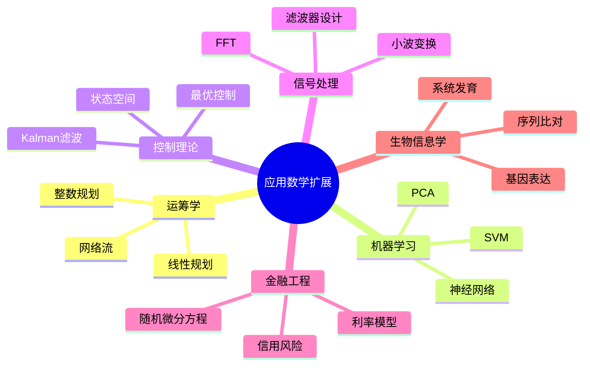

# 更多应用数学实例

---

## 1. 运筹学与优化

### 1.1 线性规划应用

**运输问题**：
- m个供应点，n个需求点
- 成本矩阵 $C = (c_{ij})$
- 决策变量 $x_{ij}$ = 从i到j的运输量

**标准形**：
$$\min \sum_{i=1}^m \sum_{j=1}^n c_{ij} x_{ij}$$
$$\text{s.t. } \sum_{j=1}^n x_{ij} = s_i, \quad \sum_{i=1}^m x_{ij} = d_j, \quad x_{ij} \geq 0$$

**应用**：物流、供应链管理、资源配置

### 1.2 整数规划

**背包问题**：
$$\max \sum_{i=1}^n v_i x_i$$
$$\text{s.t. } \sum_{i=1}^n w_i x_i \leq W, \quad x_i \in \{0, 1\}$$

**分支定界法**：
- 求解LP松弛
- 分支：对分数变量分别设0和1
- 定界：剪枝不可能最优的子问题

### 1.3 网络流

**最大流问题**：
- Ford-Fulkerson算法
- Edmonds-Karp算法
- Dinic算法

**最小费用流**：
- 结合流和成本优化
- 运输问题的一般化

---

## 2. 机器学习算法实例

### 2.1 支持向量机 (SVM)

**优化问题**：
$$\min_{w,b} \frac{1}{2}\|w\|^2 + C \sum_{i=1}^n \max(0, 1 - y_i(w^T x_i + b))$$

**核方法**：
- 线性核：$K(x, y) = x^T y$
- 多项式核：$K(x, y) = (x^T y + c)^d$
- RBF核：$K(x, y) = \exp(-\gamma \|x - y\|^2)$

### 2.2 主成分分析 (PCA)

**特征值分解**：
$$X^T X = V \Lambda V^T$$

**降维**：
- 取前k个特征向量
- 投影：$Z = X V_k$

**应用**：数据压缩、可视化、去噪

### 2.3 神经网络

**前向传播**：
$$z^{[l]} = W^{[l]} a^{[l-1]} + b^{[l]}$$
$$a^{[l]} = g(z^{[l]})$$

**反向传播**：
- 链式法则
- 梯度下降

---

## 3. 控制理论

### 3.1 状态空间模型

$$\dot{x} = Ax + Bu$$
$$y = Cx + Du$$

**可控性**：
$$\text{rank}[B, AB, A^2B, \ldots, A^{n-1}B] = n$$

**可观测性**：
$$\text{rank}[C^T, A^TC^T, \ldots, (A^{n-1})^TC^T] = n$$

### 3.2 最优控制

**LQR问题**：
$$\min_u \int_0^\infty (x^T Q x + u^T R u) dt$$

**Riccati方程**：
$$A^T P + PA - PBR^{-1}B^T P + Q = 0$$

**最优控制律**：
$$u = -Kx = -R^{-1}B^T P x$$

### 3.3 Kalman滤波

**状态估计**：
$$\hat{x}_{k|k} = \hat{x}_{k|k-1} + K_k (z_k - H \hat{x}_{k|k-1})$$

**Kalman增益**：
$$K_k = P_{k|k-1} H^T (H P_{k|k-1} H^T + R)^{-1}$$

---

## 4. 信号处理

### 4.1 快速傅里叶变换 (FFT)

**复杂度**：$O(n \log n)$

**分治策略**：
- 将DFT分解为奇偶两部分
- 递归计算

**应用**：
- 音频处理
- 图像处理
- 通信系统

### 4.2 小波变换

**多分辨率分析**：
$$f(t) = \sum_k c_k \phi(t-k) + \sum_{j,k} d_{j,k} \psi_{j,k}(t)$$

**应用**：
- 图像压缩（JPEG 2000）
- 去噪
- 边缘检测

### 4.3 滤波器设计

**FIR滤波器**：
$$y[n] = \sum_{k=0}^{N-1} h[k] x[n-k]$$

**IIR滤波器**：
$$y[n] = \sum_{k=0}^{N-1} b_k x[n-k] - \sum_{k=1}^{M} a_k y[n-k]$$

---

## 5. 金融工程进阶

### 5.1 随机微分方程

**Black-Scholes模型**：
$$dS_t = \mu S_t dt + \sigma S_t dW_t$$

**Itô引理**：
$$df = \left(\frac{\partial f}{\partial t} + \mu \frac{\partial f}{\partial S} + \frac{1}{2}\sigma^2 \frac{\partial^2 f}{\partial S^2}\right) dt + \sigma \frac{\partial f}{\partial S} dW$$

### 5.2 利率模型

**Vasicek模型**：
$$dr_t = a(b - r_t) dt + \sigma dW_t$$

**CIR模型**：
$$dr_t = a(b - r_t) dt + \sigma \sqrt{r_t} dW_t$$

### 5.3 信用风险模型

**Merton模型**：
- 公司价值服从几何布朗运动
- 违约当价值低于债务

**Copula模型**：
- 相关结构建模
- 资产组合违约风险

---

## 6. 生物信息学

### 6.1 序列比对

**动态规划**：
- Needleman-Wunsch（全局比对）
- Smith-Waterman（局部比对）
- BLAST（启发式快速比对）

**打分矩阵**：
- PAM（基于进化）
- BLOSUM（基于区块）

### 6.2 系统发育分析

**距离方法**：
- UPGMA
- Neighbor-Joining

**最大似然**：
- 进化模型
- 参数估计

**贝叶斯推断**：
- MCMC采样
- 后验概率

### 6.3 基因表达分析

**聚类分析**：
- 层次聚类
- k-means聚类

**分类**：
- 支持向量机
- 随机森林

**降维**：
- PCA
- t-SNE

---

## 7. 思维导图：应用数学扩展

---

*本文档补充更多应用数学实例*  
*质量等级：A（应用性+广度）*
