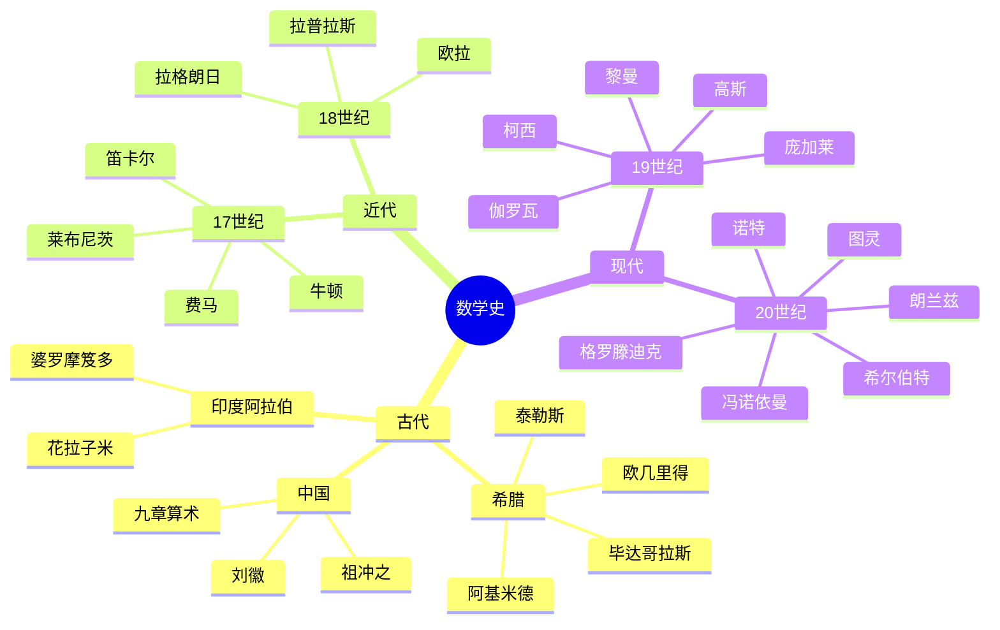

# 数学史与数学家传记

---

## 古代数学

### 古希腊数学 (公元前600-300年)

**泰勒斯 (Thales, 624-546 BC)**
- 几何学奠基人
- 泰勒斯定理：直径所对圆周角为直角

**毕达哥拉斯 (Pythagoras, 570-495 BC)**
- 毕达哥拉斯定理：$a^2 + b^2 = c^2$
- 无理数的发现（√2）

**欧几里得 (Euclid, 300 BC)**
- 《几何原本》：数学公理化方法的奠基
- 5条公设构成欧氏几何基础

**阿基米德 (Archimedes, 287-212 BC)**
- 穷竭法（积分思想的萌芽）
- 浮力原理、杠杆原理

**阿波罗尼奥斯 (Apollonius, 262-190 BC)**
- 圆锥曲线论

### 中国古代数学

**《九章算术》(公元前200年-公元200年)**
- 联立线性方程组
- 开平方、开立方
- 勾股定理应用

**刘徽 (约225-295年)**
- 割圆术计算π
- 注《九章算术》

**祖冲之 (429-500年)**
- π ≈ 355/113 (密率)
- 球体积公式

### 印度与阿拉伯数学

**婆罗摩笈多 (Brahmagupta, 598-668年)**
- 零的运算规则
- 二次方程求根公式

**花拉子米 (Al-Khwarizmi, 780-850年)**
- 代数学奠基
- 算法(algorithm)一词来源

**奥马·海亚姆 (Omar Khayyam, 1048-1131年)**
- 三次方程几何解法

---

## 近代数学

### 17世纪：微积分的诞生

**笛卡尔 (René Descartes, 1596-1650)**
- 解析几何
- 笛卡尔坐标系
- "我思故我在"

**费马 (Pierre de Fermat, 1607-1665)**
- 费马大定理
- 费马小定理
- 解析几何的先驱

**牛顿 (Isaac Newton, 1643-1727)**
- 微积分（流数法）
- 万有引力定律
- 《自然哲学的数学原理》

**莱布尼茨 (Gottfried Leibniz, 1646-1716)**
- 微积分（符号更接近现代）
- 二进制
- 行列式

### 18世纪：分析的繁荣

**欧拉 (Leonhard Euler, 1707-1783)**
- 最多产的数学家
- $e^{i\pi} + 1 = 0$ (欧拉恒等式)
- 图论、拓扑学先驱
- 变分法

**拉格朗日 (Joseph-Louis Lagrange, 1736-1813)**
- 分析力学
- 拉格朗日乘数法

**拉普拉斯 (Pierre-Simon Laplace, 1749-1827)**
- 天体力学
- 拉普拉斯变换

**傅里叶 (Joseph Fourier, 1768-1830)**
- 傅里叶级数
- 热传导理论

---

## 现代数学

### 19世纪：严格化与抽象化

**高斯 (Carl Friedrich Gauss, 1777-1855)**
- "数学王子"
- 正十七边形作图
- 高斯分布
- 非欧几何的思想

**柯西 (Augustin-Louis Cauchy, 1789-1857)**
- 分析严格化
- ε-δ语言
- 复分析

**阿贝尔 (Niels Henrik Abel, 1802-1829)**
- 五次方程不可解
- 椭圆函数

**伽罗瓦 (Évariste Galois, 1811-1832)**
- 伽罗瓦理论
- 群论的奠基
- 21岁决斗身亡

**黎曼 (Bernhard Riemann, 1826-1866)**
- 黎曼几何
- 黎曼假设
- 黎曼积分
- 复变函数论

**魏尔斯特拉斯 (Karl Weierstrass, 1815-1897)**
- 分析的算术化
- 处处连续处处不可微函数

**康托尔 (Georg Cantor, 1845-1918)**
- 集合论奠基
- 无穷理论
- 对角线论证

**庞加莱 (Henri Poincaré, 1854-1912)**
- 拓扑学奠基
- 庞加莱猜想
- 动力系统
- 最后一个通才

**希尔伯特 (David Hilbert, 1862-1943)**
- 23个问题
- 公理化方法
- 希尔伯特空间

### 20世纪：结构数学与抽象化

**嘉当 (Élie Cartan, 1869-1951)**
- 微分几何
- 李群

**罗素 (Bertrand Russell, 1872-1970)**
- 罗素悖论
- 数理逻辑
- 类型论

**勒贝格 (Henri Lebesgue, 1875-1941)**
- 勒贝格积分
- 测度论

**哈代 (G.H. Hardy, 1877-1947)**
- 解析数论
- 哈代-李特尔伍德猜想

**诺特 (Emmy Noether, 1882-1935)**
- 抽象代数
- 诺特环
- 对称性与守恒律

**冯·诺依曼 (John von Neumann, 1903-1957)**
- 量子力学数学基础
- 博弈论
- 计算机理论

**柯尔莫哥洛夫 (Andrey Kolmogorov, 1903-1987)**
- 概率论公理化
- 算法复杂性

**图灵 (Alan Turing, 1912-1954)**
- 图灵机
- 可计算性理论
- 人工智能先驱

**韦伊 (André Weil, 1906-1998)**
- 代数几何
- 韦伊猜想
- 布尔巴基学派

**陈省身 (Shiing-Shen Chern, 1911-2004)**
- 微分几何
- 陈类

**哥德尔 (Kurt Gödel, 1906-1978)**
- 不完备定理
- 对希尔伯特计划的回应

**塞尔 (Jean-Pierre Serre, 1926-)**
- 代数拓扑
- 代数几何
- 最年轻菲尔兹奖得主(27岁)

**格罗滕迪克 (Alexander Grothendieck, 1928-2014)**
- 现代代数几何
- 概形理论
- 激进的数学哲学

**阿蒂亚 (Michael Atiyah, 1929-2019)**
- 阿蒂亚-辛格指标定理
- K理论

**米尔诺 (John Milnor, 1931-)**
- 微分拓扑
- 怪球

**朗兰兹 (Robert Langlands, 1936-)**
- 朗兰兹纲领
- 数学大统一理论

**威滕 (Edward Witten, 1951-)**
- 数学物理
- 弦理论
- 唯一获得菲尔兹奖的物理学家

**怀尔斯 (Andrew Wiles, 1953-)**
- 费马大定理证明
- 椭圆曲线

**佩雷尔曼 (Grigori Perelman, 1966-)**
- 庞加莱猜想证明
- 拒绝菲尔兹奖和百万奖金

**陶哲轩 (Terence Tao, 1975-)**
- 调和分析
- 组合
- 偏微分方程
- 数学通才

---

## 中国数学家

**华罗庚 (1910-1985)**
- 解析数论
- 华氏定理

**陈景润 (1933-1996)**
- 哥德巴赫猜想
- 1+2问题

**丘成桐 (1949-)**
- 卡拉比-丘流形
- 菲尔兹奖

---

## 思维导图：数学史脉络

---

*本文档概述数学史与重要数学家*  
*质量等级：A（历史性+启发性）*
