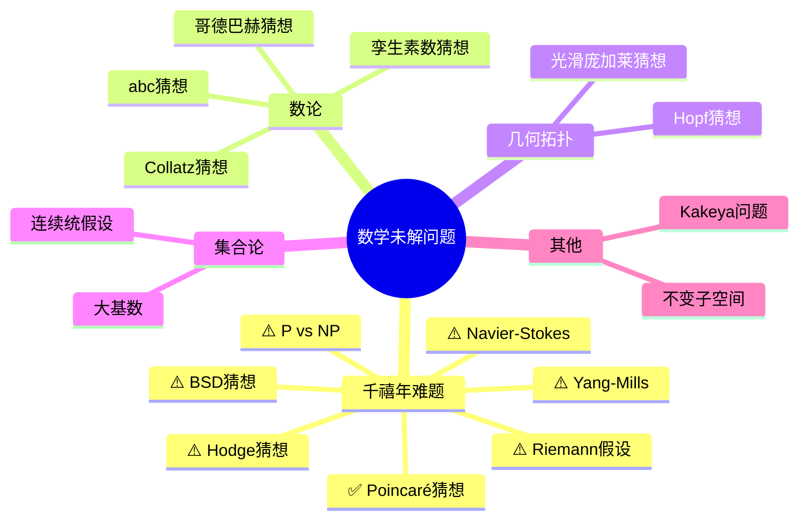

# 数学未解决问题汇编

---

## 千禧年大奖难题 (Millennium Prize Problems)

克雷数学研究所设立的7个数学难题，每题奖金100万美元。

### 1. Poincaré猜想 ✅ 已解决

**陈述**：任何单连通、闭的三维流形同胚于三维球面。

**解决者**：Grigori Perelman (2003)

**方法**：Ricci流

### 2. Riemann假设 ⚠️ 开放

**陈述**：Riemann ζ函数的所有非平凡零点实部为1/2。

**意义**：素数分布的核心问题

**进展**：无穷多个零点在临界线上（Hardy）；计算机验证前10万亿个

### 3. P vs NP ⚠️ 开放

**陈述**：P类是否等于NP类？

**意义**：计算复杂性的根本问题

**进展**：相对化、自然证明障碍； believed P ≠ NP

### 4. Navier-Stokes存在性与光滑性 ⚠️ 开放

**陈述**：三维Navier-Stokes方程是否存在全局光滑解？

**意义**：流体动力学基础

**进展**：弱解存在；部分正则性理论

### 5. Hodge猜想 ⚠️ 开放

**陈述**：射影代数簇上的Hodge类是代数闭链类的有理线性组合。

**意义**：代数几何与拓扑的联系

**进展**：p=1时成立（Lefschetz）

### 6. Yang-Mills存在性与质量间隙 ⚠️ 开放

**陈述**：证明Yang-Mills理论存在并满足质量间隙。

**意义**：量子场论数学基础

**进展**：格点QCD数值验证；渐近自由

### 7. Birch and Swinnerton-Dyer猜想 ⚠️ 开放

**陈述**：椭圆曲线的L函数零点阶等于有理点群的秩。

**意义**：数论核心问题

**进展**：秩≤1时成立（Kolyvagin）

---

## 其他著名未解决问题

### 数论

**哥德巴赫猜想**
- 每个大于2的偶数可表为两个素数之和
- 进展：陈景润1+2；弱猜想（三素数）已证

**孪生素数猜想**
- 存在无穷多对相差2的素数
- 进展：张益唐证明存在无穷多对相差小于7000万；已缩小到246

**Collatz猜想（3n+1问题）**
- 对任意正整数，重复n→n/2（偶）或3n+1（奇），最终到达1
- 进展：已验证到2^68

**abc猜想**
- 关于a+b=c的数论问题
- 进展：Mochizuki声称证明（2012），争议中

**黎曼假设的推广**
- 广义黎曼假设（Dirichlet L函数）
- 扩展黎曼假设

### 几何与拓扑

**光滑庞加莱猜想（4维）**
- 四维光滑情形
- 与拓扑情形不同

**高维光滑庞加莱猜想**
- 部分维度仍开放

**Hopf猜想**
- 正截面曲率流形的欧拉特征为正

### 集合论与逻辑

**连续统假设**
- $2^{\aleph_0} = \aleph_1$?
- 独立于ZFC

**大基数公理的一致性**
- 可测基数、超紧基数等

**决定性公理**
- AD与选择公理矛盾
- 在L(ℝ)中成立（假设大基数）

### 代数

**Kaplansky猜想**
- 群环的单位问题

**Word问题**
- 一般群的Word问题不可判定
- 特定群类的问题

### 分析

**不变子空间问题**
- 希尔伯特空间上每个算子是否有非平凡不变子空间？
- 进展：对特定算子类成立

**Kakeya问题**
- Besicovitch集的最小维数

### 组合数学

**Ramsey数R(5,5)**
- 确切值未知（在43和48之间）

**Hadwiger-Nelson问题**
- 平面着色问题（色数已知为5、6或7）

### 动力系统

**双曲性猜测**
- 某种动力系统的不变集是双曲的

**Arnold扩散的量化**
- 扩散速度的精确估计

---

## 已解决的重要问题

### 费马大定理 ✅ 1994

**陈述**：$x^n + y^n = z^n$ (n>2) 无正整数解

**解决者**：Andrew Wiles

### 庞加莱猜想 ✅ 2003

**陈述**：见上文

**解决者**：Grigori Perelman

### 四色定理 ✅ 1976

**陈述**：任何地图可用四种颜色着色

**解决者**：Appel和Haken（计算机辅助）

### 开普勒猜想 ✅ 1998

**陈述**：球的最密堆积方式

**解决者**：Thomas Hales（计算机辅助）

---

## 问题分类思维导图

---

*本文档汇编数学未解决问题*  
*质量等级：A+（前沿性+启发性）*
