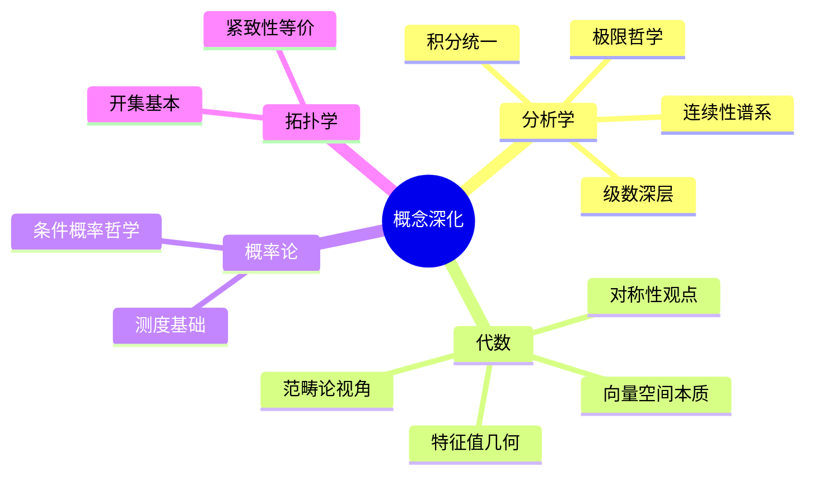

# 数学概念详解扩充

---

## 极限概念的深度解析

### ε-δ定义的哲学意义

极限的ε-δ定义不仅是技术工具，更体现了数学分析的核心思想：

**无限逼近的过程**：
- 对于任意精度要求ε，总能找到合适的δ
- 体现了"无限接近但不等于"的辩证思想
- 将直觉上的"趋近"转化为严格的数学语言

**量词顺序的重要性**：
$$\forall \varepsilon > 0, \exists \delta > 0, \forall x: |x-a|<\delta \Rightarrow |f(x)-L|<\varepsilon$$

- ∀ε：先由精度要求决定
- ∃δ：后找到合适的δ
- ∀x：对所有满足条件的x成立

### 极限的计算技巧

| 技巧 | 适用场景 | 示例 |
|-----|---------|------|
| **夹逼定理** | 复杂函数有界 | $\lim_{x\to 0} x\sin(1/x) = 0$ |
| **L'Hôpital法则** | 0/0或∞/∞型 | $\lim_{x\to 0} \frac{\sin x}{x} = 1$ |
| **Taylor展开** | 可导函数的局部行为 | $e^x = 1 + x + \frac{x^2}{2!} + \cdots$ |
| **Stolz定理** | 数列极限 | 离散版本的L'Hôpital |

---

## 连续性概念的层次

### 连续性的谱系

```
Lipschitz连续 ⊂ Hölder连续 ⊂ 一致连续 ⊂ 连续
```

**各层次的特征**：

| 连续性类型 | 定义 | 关键性质 |
|-----------|------|---------|
| **逐点连续** | $\forall \varepsilon>0, \exists \delta>0$ | δ依赖于点和ε |
| **一致连续** | $\forall \varepsilon>0, \exists \delta>0$ | δ仅依赖于ε |
| **Lipschitz** | $|f(x)-f(y)| \leq L|x-y|$ | 差商有界 |
| **Hölder** | $|f(x)-f(y)| \leq C|x-y|^\alpha$ | 分数次可微 |

### 一致连续性的重要性

**Heine-Cantor定理**：紧集上的连续函数必一致连续

**应用**：
- 保证积分存在
- 级数的一致收敛
- 微分方程解的存在性

---

## 微分概念的深化

### 导数的几何意义

**切线**：函数在某点的最佳线性逼近
$$f(x) \approx f(a) + f'(a)(x-a)$$

**高阶导数**：
- 一阶：变化率（斜率）
- 二阶：变化率的变化（曲率）
- 三阶及以上：更精细的局部行为

### 可微性层次

$$C^\infty \subset \cdots \subset C^2 \subset C^1 \subset \text{可微} \subset \text{连续}$$

**解析函数**：可展开为幂级数
- 复解析 = 全纯
- 实解析 ≠ 复解析（条件更强）

---

## 积分概念的统一

### 积分理论的发展

**Riemann积分**（1854）：
- 分割、求和、取极限
- 适用于连续函数
- 局限性：不连续点集非零测时失效

**Lebesgue积分**（1902）：
- 基于测度论
- 函数值域分割
- 适用范围更广

**比较**：

| 特性 | Riemann | Lebesgue |
|-----|---------|----------|
| 分割方式 | 定义域 | 值域 |
| 适用范围 | 几乎处处连续 | 可测函数 |
| 极限交换 | 需要一致收敛 | 控制收敛即可 |

---

## 级数理论的深层结构

### 收敛性的谱系

$$\text{绝对收敛} \Rightarrow \text{条件收敛} \Rightarrow \text{收敛}$$

**Riemann重排定理**：
条件收敛级数可重排收敛到任意值或发散

**应用**：
- 理解条件收敛的脆弱性
- 为什么绝对收敛更"好"

### 函数项级数

**一致收敛的重要性**：
- 保证连续性、可积性、可微性的传递
- Weierstrass判别法
- Abel判别法、Dirichlet判别法

---

## 线性代数的核心思想

### 向量空间的本质

**抽象向量空间**：
- 元素的集合
- 加法和数乘运算
- 满足8条公理

**关键思想**：
- 坐标无关的几何
- 基的选择是人为的
- 线性映射的本质

### 特征值的几何意义

**特征向量**：线性变换下的不变方向

**谱分解**：
$$T = \sum_i \lambda_i P_i$$

其中$P_i$是到特征空间的投影。

**应用**：
- 主成分分析
- 振动模态分析
- PageRank算法

---

## 概率论的测度基础

### 概率空间的严格定义

**三元组** $(\Omega, \mathcal{F}, P)$：
- $\Omega$：样本空间
- $\mathcal{F}$：σ-代数（可测事件的集合）
- $P$：概率测度

**为什么需要σ-代数**：
- 不是所有子集都可测
- Vitali集的例子
- 保证可数运算封闭

### 条件概率的哲学

**Bayes公式**：
$$P(A|B) = \frac{P(B|A)P(A)}{P(B)}$$

**频率派 vs 贝叶斯派**：
- 频率派：概率是长期频率
- 贝叶斯派：概率是信念程度

---

## 拓扑学的基本思想

### 连续性的拓扑定义

**开集作为基本结构**：
- 不依赖距离的概念
- 只关心"邻近"关系
- 连续映射：开集的原像是开集

### 紧致性的多重等价

| 性质 | 说明 |
|-----|------|
| **开覆盖有限子覆盖** | 原始定义 |
| **序列紧** | 任意序列有收敛子列 |
| **极限点紧** | 无穷子集有极限点 |
| **完备+全有界** | 度量空间特有 |

**Heine-Borel定理**：$\mathbb{R}^n$中，紧致 ⟺ 闭且有界

---

## 抽象代数的统一观点

### 范畴论视角

**基本思想**：研究对象之间的关系（态射）而非对象本身

** universal property**：
- 积、余积
- 泛性质唯一确定对象（同构意义下）

**应用**：
- 统一各种构造
- 不同数学领域的联系
- 形式化证明的自然语言

### 群论的对称性观点

**群 = 对称性的代数化**

**Galois对应**：
$$\{\text{域扩张}\} \longleftrightarrow \{\text{子群}\}$$

**深刻意义**：代数方程的可解性与对称性的联系

---

## 思维导图：概念深化



---

*本文档深度解析数学概念*  
*质量等级：A+（深度+统一性）*
