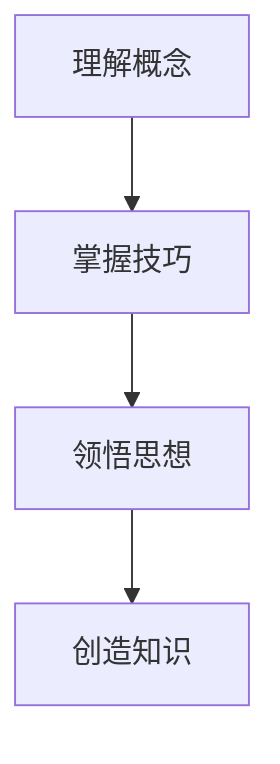
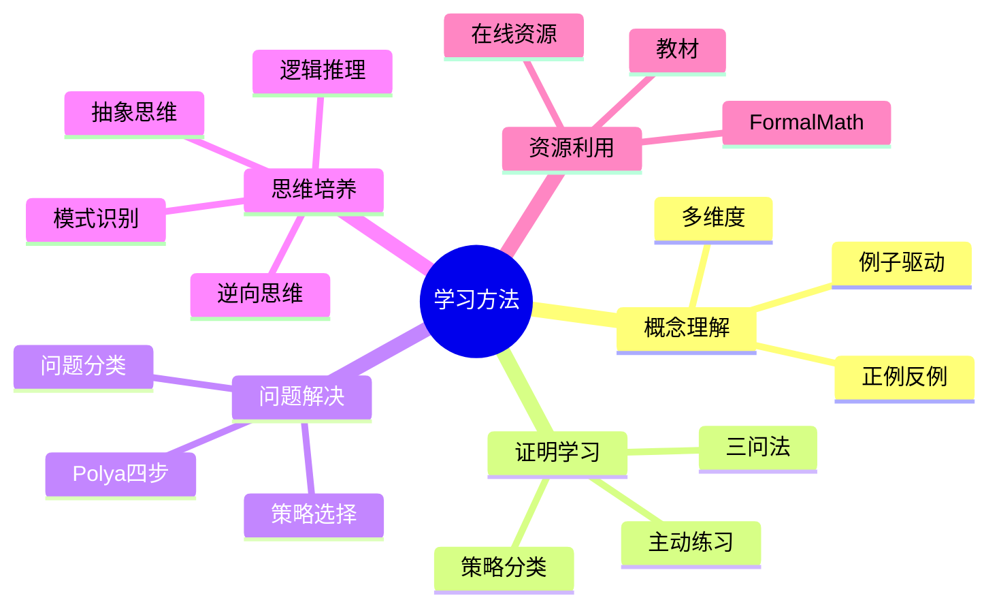

# 数学学习方法论

---

## 数学学习的层次

### 四个认知层次

| 层次 | 特征 | 方法 |
|-----|------|-----|
| **理解** | 知道定义、定理 | 阅读、听讲 |
| **掌握** | 会做题、会证明 | 练习、模仿 |
| **领悟** | 理解思想、联系 | 反思、总结 |
| **创造** | 提出新问题 | 研究、探索 |

---

## 概念理解的方法

### 多维度理解

**一个概念，多种视角**：

以导数为例：
1. **几何视角**：切线斜率
2. **物理视角**：瞬时变化率
3. **代数视角**：差商的极限
4. **函数视角**：最佳线性逼近
5. **信息视角**：函数局部的信息

**实践建议**：
- 对每个重要概念，尝试用3种以上方式理解
- 寻找几何直观、物理意义、计算应用

### 例子驱动学习

**正例 + 反例**：
- 正例：什么情况下定理适用
- 反例：什么情况下定理不适用

**例子**：连续性
- 正例：多项式、指数函数
- 反例：Dirichlet函数、Thomae函数

---

## 证明学习的方法

### 证明分析框架

**三问法**：
1. **是什么**：这个证明证明了什么？
2. **为什么**：为什么这样证明？关键步骤是什么？
3. **怎么用**：这个证明技巧还能用在什么地方？

### 证明策略分类

| 策略 | 适用场景 | 例子 |
|-----|---------|------|
| **直接证明** | 结论形式明确 | 证明f是单射 |
| **反证法** | 否定性结论 | √2无理 |
| **数学归纳** | 关于自然数 | 求和公式 |
| **构造法** | 存在性证明 | 构造不动点 |
| **分类讨论** | 情况复杂 | 整数解问题 |

### 主动证明练习

**步骤**：
1. 看完定理陈述，先自己尝试证明
2. 遇到困难，再看提示
3. 对照标准证明，比较差异
4. 总结证明的关键思想

---

## 问题解决策略

### Polya四步法

1. **理解问题**：未知是什么？已知是什么？条件是什么？
2. **制定计划**：以前见过吗？相关定理？辅助问题？
3. **执行计划**：检验每个步骤
4. **回顾**：能检验结果吗？还有其他方法吗？

### 数学问题类型

| 类型 | 特征 | 策略 |
|-----|------|-----|
| **计算型** | 求具体值 | 公式、算法 |
| **证明型** | 证明某命题 | 逻辑、构造 |
| **存在型** | 证明存在性 | 构造、反证 |
| **分类型** | 列举所有情况 | 系统分类 |
| **极值型** | 求最大/最小 | 变分、不等式 |

---

## 数学思维的培养

### 核心数学思维

**抽象思维**：
- 从具体例子中提取共性
- 例子：群的概念来自多种对称性

**逻辑推理**：
- 严格的演绎推理
- 区分充分条件、必要条件

**模式识别**：
- 发现结构和规律
- 例子：寻找递推关系

**逆向思维**：
- 从结论倒推
- 反证法的本质

### 思维训练方法

**每日一题**：
- 选择一道有挑战性的题目
- 限时思考（如30分钟）
- 写下完整解答

**错题本**：
- 记录错误和思路
- 定期回顾
- 分析错误类型

**讨论交流**：
- 与他人讨论解题思路
- 讲述自己的理解
- 教学相长

---

## 学习资源利用

### 教材阅读方法

**三遍阅读法**：
1. **第一遍**：快速浏览，把握整体结构
2. **第二遍**：细读，理解每个概念和定理
3. **第三遍**：深度阅读，理解证明和思想

### 在线资源

| 资源类型 | 推荐 | 用途 |
|---------|------|-----|
| **视频课程** | MIT OCW、Coursera | 系统学习 |
| **论文预印本** | arXiv | 前沿研究 |
| **问答社区** | Math StackExchange | 疑难解答 |
| **百科全书** | Wikipedia、nLab | 快速查阅 |

### FormalMath项目使用指南

**快速查阅**：
- 使用全局索引
- 按分支浏览
- 搜索关键词

**系统学习**：
- 按学习路径
- 从基础到进阶
- 结合习题练习

**深入研究**：
- 查看形式化证明
- 阅读反例和实例
- 参考国际课程对齐

---

## 时间管理与计划

### 数学学习时间安排

**日常学习**：
- 新内容学习：2-3小时
- 习题练习：1-2小时
- 复习总结：30分钟

**阶段复习**：
- 每周：回顾本周内容
- 每月：系统复习
- 每学期：整体梳理

### 长期规划

**本科阶段**：
- 大一：基础数学（微积分、线代）
- 大二：核心课程（分析、代数、几何）
- 大三：专业方向
- 大四：研究/应用

**研究生阶段**：
- 课程学习
- 文献阅读
- 研究探索
- 论文写作

---

## 常见学习误区

| 误区 | 表现 | 改进 |
|-----|------|-----|
| **只看不做** | 只看证明，不动手 | 每道定理都尝试证明 |
| **题海战术** | 盲目刷题 | 精选题目，深入思考 |
| **忽视基础** | 急于学高级内容 | 打牢基础，循序渐进 |
| **孤立学习** | 不联系不同内容 | 寻找联系，构建网络 |
| **畏难情绪** | 遇到困难就放弃 | 分解问题，逐步攻克 |

---

## 思维导图：学习方法

---

*本文档提供数学学习方法论*  
*质量等级：A（实用性+指导性）*
