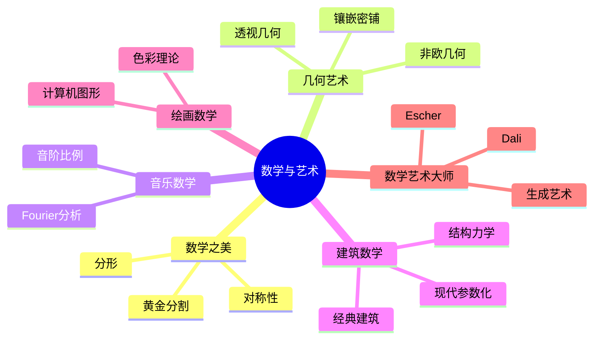

# 数学与艺术的联系

---

## 数学之美

### 数学的美学特征

**对称性**：
- 几何对称：雪花、晶体
- 代数对称：群论描述
- 艺术应用：伊斯兰几何图案

**比例与黄金分割**：
$$\phi = \frac{1+\sqrt{5}}{2} \approx 1.618$$

- 黄金矩形
- 斐波那契数列
- 自然界中的黄金比例

**分形艺术**：
- Mandelbrot集
- Julia集
- 自相似性

---

## 几何与艺术

### 透视几何

**单点透视**：
- 平行线交于消失点
- 文艺复兴艺术的基础
- Brunelleschi的贡献

**射影几何**：
- 无穷远点的概念
- 对偶原理
- 艺术与数学的交汇

### 镶嵌与密铺

**正多边形镶嵌**：
- 欧几里得平面：三角形、正方形、六边形
- 双曲平面：更多可能性
- Escher的艺术作品

**Penrose镶嵌**：
- 非周期密铺
- 五重对称
- 准晶体的数学基础

---

## 音乐与数学

### 音阶的数学

**频率比**：
- 八度：2:1
- 五度：3:2
- 四度：4:3

**十二平均律**：
$$f_n = f_0 \times 2^{n/12}$$

### Fourier分析与音乐

**音色分解**：
- 基频 + 谐波
- 不同乐器的频谱特征
- 合成器的数学基础

---

## 建筑中的数学

### 经典建筑

**帕特农神庙**：
- 黄金比例的应用
- 视觉矫正的数学

**哥特式教堂**：
- 尖拱的几何
- 玫瑰窗的对称

**现代建筑**：
- Gehry的流线型设计
- 参数化建筑
- 拓扑优化

### 结构力学

**拱的力学**：
- 压力线的概念
- 悬链线：$y = a \cosh(x/a)$

**穹顶结构**：
- 应力分布
- 最小曲面

---

## 绘画与数学

### 色彩理论

**RGB色彩空间**：
- 向量空间结构
- 线性变换

**色彩调和**：
- 色轮的几何
- 互补色、类似色

### 计算机图形学

**三维渲染**：
- 光线追踪
- 辐射度方法
- 蒙特卡洛积分

**纹理映射**：
- 参数化
- 保角映射

---

## 数学艺术大师

### M.C. Escher

**代表作品**：
- 《瀑布》：不可能的物体
- 《画手》：自指
- 《圆极限》：双曲几何

**数学概念**：
- 无穷
- 镶嵌
- 非欧几何

### 其他数学艺术家

**Dali**：
- 四维超立方体
- 非欧几何空间

**John Conway**：
- 生命游戏
- 数学与游戏的结合

**Roman Verostko**：
- 算法艺术
- 生成艺术先驱

---

## 数学艺术的形式

### 生成艺术

**算法生成**：
- 分形艺术
- 粒子系统
- L系统（植物形态）

**代码艺术**：
- Processing
- p5.js
- shader编程

### 数据可视化

**科学可视化**：
- 向量场
- 等高线
- 流形可视化

**信息可视化**：
- 统计图形
- 网络图
- 地图投影

---

## 数学教育中的美学

### 培养数学审美

**欣赏定理之美**：
- Euler恒等式：$e^{i\pi} + 1 = 0$
- 四平方和定理
- 素数定理的精确性

**视觉化学习**：
- 几何直观
- 函数图像
- 动态演示

### 艺术激发的数学问题

**Islamic几何**：
- 尺规作图问题
- 密铺理论

**编织与纽结**：
- 纽结理论
- 辫群

**折纸数学**：
- Huzita-Hatori公理
- 可展曲面

---

## 思维导图：数学与艺术

---

*本文档探索数学与艺术的联系*  
*质量等级：A（跨学科+美学）*
