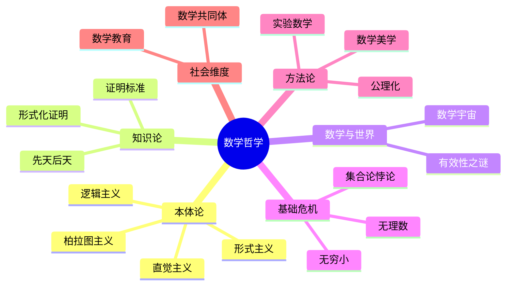

# 数学哲学基础

---

## 数学的本体论问题

### 数学对象是否存在？

**柏拉图主义 (Platonism)**
- 数学对象客观存在，独立于人类思维
- 数学家是发现者而非发明者
- 支持者：Gödel、Penrose

**形式主义 (Formalism)**
- 数学是符号游戏，无实质内容
- Hilbert的程序
- 关注一致性而非真理性

**直觉主义 (Intuitionism)**
- 数学是心智构造
- 拒绝排中律
- 强调构造性证明

**逻辑主义 (Logicism)**
- 数学可归约为逻辑
- Russell & Whitehead《数学原理》

---

## 数学知识的本质

### 先天 vs 后天

**康德的观点**：
- 数学是先天综合判断
- 空间和时间是直观形式

**经验主义的挑战**：
- 数学知识来自经验
- 逻辑实证主义

**现代观点**：
- 数学是约定与发现的结合
- 受物理世界启发但超越它

### 数学真理的标准

**证明的角色**：
- 证明给出确定性
- 但什么是有效的证明？

**计算机辅助证明**：
- 四色定理
- Kepler猜想
- 争议与接受

**形式化证明**：
- Lean、Coq、Isabelle
- 完全严格性
- 未来趋势

---

## 数学与物理世界

### 数学的有效性之谜

**Wigner的论文**：《数学在自然科学中不合理的有效性》

**为什么数学能描述物理？**
- 世界本身是数学结构？
- 人类选择可数学化的问题？
- 进化使我们适应数学规律？

### 数学物理的统一

**Tegmark的数学宇宙假说**：
- 物理实在就是数学结构
- Level IV 多元宇宙

**反对观点**：
- 数学只是工具
- 物理直觉不可替代

---

## 数学的基础危机

### 第一次危机：无理数

**发现**：√2 不是有理数

**影响**：
- 毕达哥拉斯学派的震动
- 几何优先于算术
- 欧多克索斯的比例理论

### 第二次危机：无穷小

**问题**：微积分的基础是什么？

** Berkeley的主教批评**：
- "消失的量的幽灵"

**解决**：
- 极限的严格定义
- ε-δ语言
- 非标准分析（Robinson）

### 第三次危机：集合论悖论

**Russell悖论**：
$$R = \{x : x \notin x\}$$

**影响**：
- 朴素集合论的崩溃
- 公理化集合论（ZFC）
- 类型论的发展

---

## 数学方法论

### 公理化方法

**欧几里得传统**：
- 公设 → 定理 → 证明
- 严格演绎

**现代公理化**：
- Hilbert的形式主义
- 结构数学（Bourbaki）
- 范畴论观点

### 发现与证明

**实验数学**：
- 计算机探索
- 模式识别
- 猜想形成

**证明的价值**：
- 解释性证明 vs 验证性证明
- 数学理解 > 形式正确

### 数学美学的哲学

**Hardy的观点**：
- 《一个数学家的辩白》
- 数学是永恒的
- 数学是美的

**数学美的标准**：
- 深刻性
- 意外性
- 统一性
- 简洁性

---

## 数学的社会维度

### 数学共同体

**同行评议**：
- 质量控制机制
- 社会建构的客观性

**数学传统**：
- 不同文化的数学
- 民族数学

### 数学教育哲学

**发现式学习**：
- 像数学家一样思考
- 建构主义

**严谨性与直觉的平衡**：
- 形式化 vs 理解
- 不同层次的严格性

---

## 未解决的哲学问题

| 问题 | 描述 |
|-----|------|
| **P vs NP的哲学意义** | 创造性 vs 机械性 |
| **连续统假设的地位** | 独立于ZFC，真理还是约定？ |
| **量子力学的数学基础** | 测量问题、概率解释 |
| **意识的数学理论** | 能否用数学描述意识？ |
| **数学的终极基础** | 范畴论、类型论、还是...？ |

---

## 思维导图：数学哲学

---

*本文档探讨数学哲学基础*  
*质量等级：A+（深度+思辨性）*
