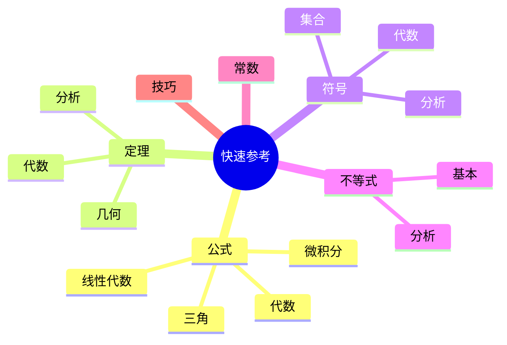

# 数学快速参考指南

---

## 常用公式速查

### 代数

**二次方程求根公式**：
$$x = \frac{-b \pm \sqrt{b^2 - 4ac}}{2a}$$

**二项式定理**：
$$(a + b)^n = \sum_{k=0}^n \binom{n}{k} a^{n-k} b^k$$

**等比数列求和**：
$$S_n = \frac{a(1 - r^n)}{1 - r}$$

### 三角函数

**基本恒等式**：
$$\sin^2 x + \cos^2 x = 1$$
$$1 + \tan^2 x = \sec^2 x$$

**和角公式**：
$$\sin(a + b) = \sin a \cos b + \cos a \sin b$$
$$\cos(a + b) = \cos a \cos b - \sin a \sin b$$

**Euler公式**：
$$e^{ix} = \cos x + i\sin x$$

### 微积分

**导数基本公式**：
$$\frac{d}{dx} x^n = nx^{n-1}$$
$$\frac{d}{dx} e^x = e^x$$
$$\frac{d}{dx} \ln x = \frac{1}{x}$$
$$\frac{d}{dx} \sin x = \cos x$$

**积分基本公式**：
$$\int x^n dx = \frac{x^{n+1}}{n+1} + C$$
$$\int e^x dx = e^x + C$$
$$\int \frac{1}{x} dx = \ln|x| + C$$

### 线性代数

**行列式（2×2）**：
$$\begin{vmatrix} a & b \\ c & d \end{vmatrix} = ad - bc$$

**逆矩阵（2×2）**：
$$\begin{pmatrix} a & b \\ c & d \end{pmatrix}^{-1} = \frac{1}{ad-bc} \begin{pmatrix} d & -b \\ -c & a \end{pmatrix}$$

**特征方程**：
$$\det(A - \lambda I) = 0$$

### 概率统计

**期望**：
$$E[X] = \sum x_i p_i$$

**方差**：
$$\text{Var}(X) = E[X^2] - (E[X])^2$$

**正态分布**：
$$f(x) = \frac{1}{\sigma\sqrt{2\pi}} e^{-\frac{(x-\mu)^2}{2\sigma^2}}$$

---

## 定理速查

### 分析学

| 定理 | 内容 | 应用 |
|-----|------|-----|
| **介值定理** | 连续函数取中间值 | 根的存在性 |
| **中值定理** | $f'(c) = \frac{f(b)-f(a)}{b-a}$ | 估计、不等式 |
| **Taylor定理** | 函数局部展开 | 近似计算 |
| **控制收敛定理** | 极限与积分交换 | Lebesgue积分 |

### 代数学

| 定理 | 内容 | 应用 |
|-----|------|-----|
| **Lagrange定理** | 子群阶整除群阶 | 群结构分析 |
| **Sylow定理** | p-子群存在性 | 有限群分类 |
| **Cayley定理** | 群同构于置换群 | 表示论 |
| **结构定理** | 有限生成Abel群结构 | 分类 |

### 几何拓扑

| 定理 | 内容 | 应用 |
|-----|------|-----|
| **Brouwer不动点** | 连续映射有不动点 | 经济学、博弈论 |
| **Borsuk-Ulam** | 对径点某性质相同 | 组合、图论 |
| **Jordan曲线** | 简单闭曲线分平面 | 计算几何 |
| **毛球定理** | 偶数维球面无处处非零向量场 | 拓扑学 |

---

## 符号速查

### 集合与逻辑

| 符号 | 含义 |
|-----|------|
| $\in$ | 属于 |
| $\subseteq$ | 子集 |
| $\cup$ | 并集 |
| $\cap$ | 交集 |
| $\forall$ | 对所有 |
| $\exists$ | 存在 |
| $\Rightarrow$ | 蕴含 |
| $\Leftrightarrow$ | 等价 |

### 分析

| 符号 | 含义 |
|-----|------|
| $\lim$ | 极限 |
| $\sum$ | 求和 |
| $\int$ | 积分 |
| $\partial$ | 偏导数 |
| $\nabla$ | 梯度 |
| $\Delta$ | Laplacian |

### 线性代数

| 符号 | 含义 |
|-----|------|
| $\dim$ | 维数 |
| $\ker$ | 核 |
| $\text{im}$ | 像 |
| $\text{tr}$ | 迹 |
| $\det$ | 行列式 |
| $\text{rank}$ | 秩 |

---

## 常用不等式

### 基本不等式

**三角不等式**：
$$|a + b| \leq |a| + |b|$$

**Cauchy-Schwarz**：
$$(\sum a_i b_i)^2 \leq (\sum a_i^2)(\sum b_i^2)$$

**AM-GM不等式**：
$$\frac{a_1 + \cdots + a_n}{n} \geq \sqrt[n]{a_1 \cdots a_n}$$

**Jensen不等式**（凸函数）：
$$f\left(\frac{\sum w_i x_i}{\sum w_i}\right) \leq \frac{\sum w_i f(x_i)}{\sum w_i}$$

### 分析不等式

**Markov不等式**：
$$P(|X| \geq a) \leq \frac{E[|X|]}{a}$$

**Chebyshev不等式**：
$$P(|X - \mu| \geq k\sigma) \leq \frac{1}{k^2}$$

**Hölder不等式**：
$$\sum |x_i y_i| \leq \left(\sum |x_i|^p\right)^{1/p} \left(\sum |y_i|^q\right)^{1/q}$$

其中 $\frac{1}{p} + \frac{1}{q} = 1$。

---

## 单位换算

### 角度

$$\pi \text{ rad} = 180°$$
$$1 \text{ rad} \approx 57.3°$$

### 对数

$$\log_a b = \frac{\ln b}{\ln a}$$
$$\log(ab) = \log a + \log b$$
$$\log(a^n) = n\log a$$

---

## 常用常数

| 常数 | 符号 | 近似值 |
|-----|------|-------|
| 圆周率 | $\pi$ | 3.14159... |
| 自然对数底 | $e$ | 2.71828... |
| 黄金比例 | $\phi$ | 1.61803... |
| Euler-Mascheroni | $\gamma$ | 0.57721... |

---

## 计算技巧

### 快速估算

**数量级估计**：
- 忽略小量
- 保留主导项
- 验证合理性

**维度分析**：
- 检查单位一致性
- 推断公式形式

### 数值计算

**牛顿迭代法**：
$$x_{n+1} = x_n - \frac{f(x_n)}{f'(x_n)}$$

**梯形法则**：
$$\int_a^b f(x)dx \approx \frac{b-a}{2}[f(a) + f(b)]$$

---

## 思维导图：快速参考

---

*本文档提供数学快速参考*  
*质量等级：A（实用性+便捷性）*
