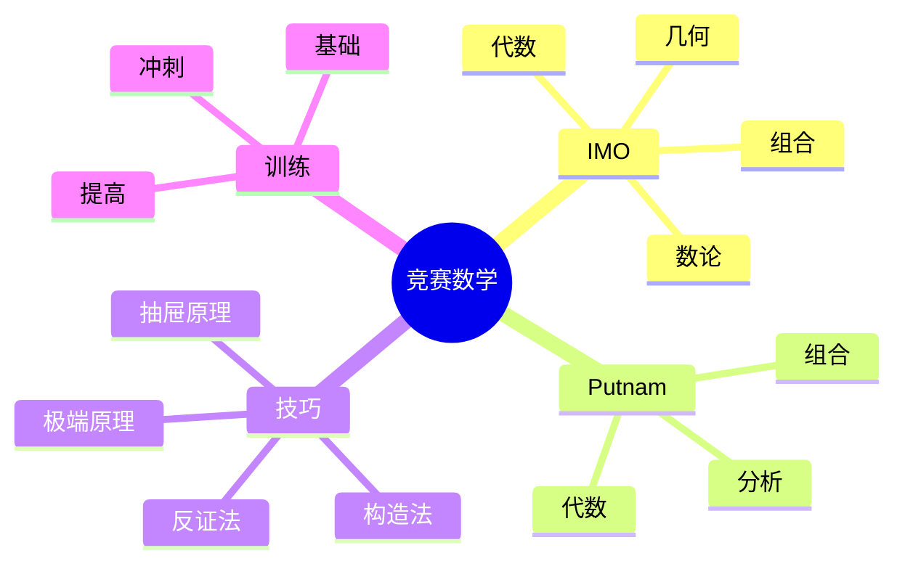

# 数学竞赛专题

---

## 国际数学奥林匹克 (IMO)

### 简介

- **创办**: 1959年，罗马尼亚
- **参赛**: 100+国家/地区
- **形式**: 2天，每天3题，4.5小时
- **题型**: 代数、几何、数论、组合

### 经典题型

**代数不等式**
- AM-GM、Cauchy-Schwarz
- Jensen、Hölder
- 对称不等式处理

**几何证明**
- 相似、全等
- 圆的性质
- 三角法、向量法
- 复数法

**数论问题**
- 整除、同余
- 素数性质
- Diophantine方程

**组合问题**
- 计数技巧
- 图论
- 极端原理
- 不变量

---

## Putnam数学竞赛

### 简介

- **主办**: 美国数学协会
- **对象**: 美国和加拿大本科生
- **形式**: 2场，各6题，3小时
- **难度**: 极高，中位数常为0或1分

### 特色题型

**分析题**
- 极限、级数
- 积分不等式
- 函数方程

**线性代数**
- 矩阵技巧
- 抽象向量空间

**组合**
- 生成函数
- 递推关系

---

## 竞赛数学技巧

### 常用策略

**极端原理**
- 取最大/最小元素
- 存在性证明

**抽屉原理**
- 鸽巢原理
- Ramsey理论

**构造法**
- 显式构造
- 归纳构造

**反证法**
- 假设反面
- 导出矛盾

**归纳法**
- 数学归纳
- 强归纳
- 结构归纳

### 解题步骤

1. **理解问题**：明确已知和所求
2. **探索**：尝试简单情形
3. **制定策略**：选择合适方法
4. **执行**：仔细计算和推理
5. **验证**：检查结果合理性

---

## 著名竞赛定理

### 组合

**Erdős–Szekeres定理**
- 任意长度为n的序列有长度为√n的单调子列

**Sperner定理**
- 集合族的最大反链大小

**Turán定理**
- 不含完全图的极值图论

### 数论

**LTE引理** (Lifting The Exponent)
- 计算素数在幂中的指数

**中国剩余定理**
- 同余方程组求解

**二次互反律**
- Legendre符号计算

### 几何

**欧拉线**
- 外心、重心、垂心共线

**九点圆**
- 三角形的重要圆

**Ceva定理**
- 三线共点条件

**Menelaus定理**
- 三点共线条件

---

## 竞赛训练建议

### 基础阶段

- 掌握高中数学全部内容
- 学习基本竞赛技巧
- 做大量基础题

### 提高阶段

- 专题深入学习
- 研究经典问题
- 学习高级技巧

### 冲刺阶段

- 模拟竞赛训练
- 时间管理
- 心态调整

### 推荐资源

**书籍**
- 《数学奥林匹克小丛书》
- 《奥数教程》
- Problem-Solving Strategies (Engel)

**网站**
- AoPS (Art of Problem Solving)
- IMO官方
- Putnam Archive

---

## 思维导图：竞赛数学

---

*本文档提供数学竞赛专题*  
*质量等级：A（竞赛导向+实用性）*
