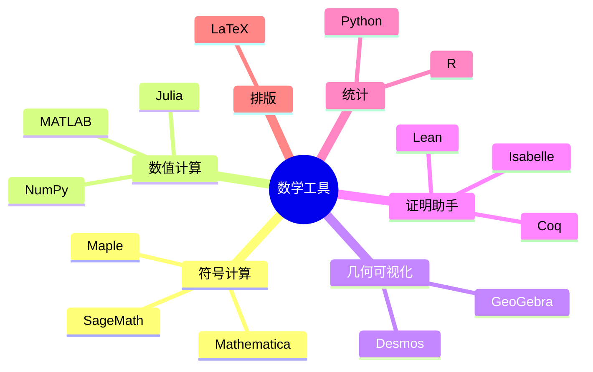

# 数学软件与工具

---

## 符号计算软件

### Mathematica

**特点**
- 功能最全面的符号计算
- 强大的可视化
- Wolfram语言

**应用**
- 符号计算
- 数值模拟
- 数据可视化
- 机器学习

### Maple

**特点**
- 教育领域广泛使用
- 界面友好
- 丰富的数学包

**应用**
- 微积分教学
- 线性代数
- 微分方程

### SageMath

**特点**
- 开源免费
- Python基础
- 集成多种工具

**应用**
- 数论计算
- 代数几何
- 组合数学

---

## 数值计算软件

### MATLAB

**特点**
- 工程领域标准
- 矩阵运算优化
- Simulink仿真

**应用**
- 信号处理
- 控制系统
- 图像处理
- 数值分析

### NumPy/SciPy

**特点**
- Python科学计算基础
- 开源免费
- 生态系统丰富

**应用**
- 数据分析
- 科学计算
- 机器学习

### Julia

**特点**
- 高性能
- 语法简洁
- 并行计算

**应用**
- 大规模数值计算
- 科学模拟
- 优化问题

---

## 几何与可视化

### GeoGebra

**特点**
- 免费教育软件
- 动态几何
- 代数与几何结合

**应用**
- 中学数学教学
- 几何探索
- 函数可视化

### Desmos

**特点**
- 在线免费
- 界面美观
- 实时计算

**应用**
- 函数绘图
- 数据可视化
- 教学演示

---

## 证明助手

### Lean

**特点**
- 现代定理证明器
- 依赖类型
- Mathlib库丰富

**应用**
- 形式化数学
- 程序验证
- 教学

### Coq

**特点**
- 成熟的证明助手
- 归纳构造演算
- 软件验证

**应用**
- 形式化证明
- 编译器验证
- 数学基础

### Isabelle/HOL

**特点**
- 高阶逻辑
- 可读证明
- 自动化强

**应用**
- 硬件验证
- 协议验证
- 数学形式化

---

## 统计与数据分析

### R

**特点**
- 统计计算标准
- 丰富的包生态
- 数据可视化

**应用**
- 统计分析
- 数据挖掘
- 生物信息

### Python (pandas, scikit-learn)

**特点**
- 通用编程语言
- 机器学习库丰富
- 数据科学主流

**应用**
- 数据清洗
- 机器学习
- 深度学习

### SPSS/SAS

**特点**
- 商业统计软件
- 社会科学常用
- 界面友好

---

## LaTeX排版

### 推荐发行版

- **TeX Live**: 完整版，跨平台
- **MiKTeX**: Windows友好
- **Overleaf**: 在线协作

### 常用包

- `amsmath`: 数学公式
- `tikz`: 绘图
- `pgfplots`: 函数图像
- `biblatex`: 参考文献

---

## 在线工具

### 计算引擎

- **Wolfram Alpha**: 知识计算
- **Symbolab**: 逐步求解
- **GeoGebra计算器**: 图形计算

### 学习平台

- **Khan Academy**: 免费课程
- **Brilliant**: 互动学习
- **3Blue1Brown**: 可视化教学

---

## 选择建议

| 需求 | 推荐工具 |
|-----|---------|
| 符号计算 | Mathematica/Maple |
| 数值计算 | MATLAB/Python |
| 几何探索 | GeoGebra |
| 形式化证明 | Lean/Coq |
| 统计分析 | R/Python |
| 论文排版 | LaTeX |

---

## 思维导图：数学工具

---

*本文档介绍数学软件与工具*  
*质量等级：A（实用性+工具性）*
