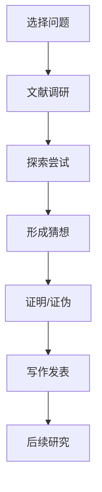
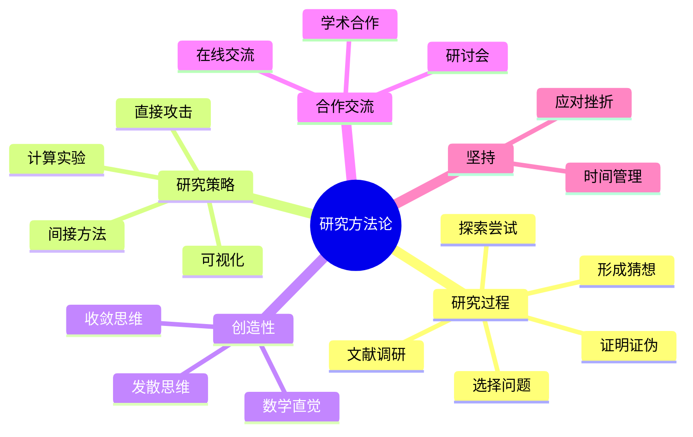

# 数学研究方法论

---

## 研究过程

### 典型流程

### 各阶段要点

| 阶段 | 关键活动 | 产出 |
|-----|---------|------|
| 选择问题 | 评估重要性、可行性 | 明确的研究问题 |
| 文献调研 | 了解前沿、寻找空白 | 文献综述 |
| 探索尝试 | 计算、特例、可视化 | 初步结果 |
| 形成猜想 | 归纳、类比、直觉 | 明确猜想 |
| 证明/证伪 | 严格推理、反例构造 | 定理/反例 |
| 写作发表 | 清晰表述、同行评议 | 论文 |

---

## 问题选择

### 好问题的标准

**重要性**
- 连接多个领域
- 解决长期开放问题
- 有广泛应用

**可行性**
- 有解决思路
- 资源可及
- 时间合理

**创新性**
- 新方法
- 新视角
- 意外联系

### 问题来源

| 来源 | 例子 |
|-----|------|
| 文献阅读 | 未解决问题、推广 |
| 讨论交流 | 合作者建议 |
| 计算实验 | 观察到的模式 |
| 教学反思 | 学生问题启发 |
| 跨学科 | 物理、计算机等 |

---

## 研究策略

### 证明策略

**直接攻击**
- 正面证明
- 适用于清晰路径

**间接方法**
- 反证法
- 对偶性
- 转化等价问题

**分而治之**
- 分解为子问题
- 逐个击破

**类比推理**
- 类似问题的解法
- 跨领域借鉴

### 探索工具

**计算实验**
- 大量例子验证
- 发现模式
- 形成猜想

**可视化**
- 几何直观
- 图形辅助
- 动态探索

**特殊情况**
- 低维情形
- 简化假设
- 极端情况

---

## 创造性与直觉

### 创造性思维

**发散思维**
- 多角度思考
- 跳出常规
- 联想连接

**收敛思维**
- 严格验证
- 精炼想法
- 完善证明

### 数学直觉

**培养方法**
- 大量例子积累
- 深入理解证明
- 反思成功与失败

**直觉与严格**
- 直觉指引方向
- 严格确保正确
- 两者相辅相成

---

## 合作与交流

### 学术合作

**合作形式**
- 双人合作
- 小组研究
- 大型项目

**合作技巧**
- 明确分工
- 定期讨论
- 尊重贡献

### 学术交流

**研讨会**
- 了解前沿
- 获得反馈
- 建立联系

**学术会议**
- 报告研究
- 听取报告
- 网络建设

**在线交流**
- MathOverflow
- 研究博客
- 社交媒体

---

## 时间管理与坚持

### 研究周期

| 阶段 | 时间 | 活动 |
|-----|------|-----|
| 早期 | 1-2年 | 学习、探索 |
| 中期 | 2-4年 | 深入、突破 |
| 后期 | 4-6年 | 完善、写作 |

### 应对挫折

**常见挫折**
- 证明失败
- 被人抢先
- 审稿拒绝

**应对策略**
- 休息调整
- 寻求帮助
- 改变方向
- 坚持不懈

---

## 研究伦理

### 学术诚信

- 诚实报告结果
- 适当引用
- 避免抄袭
- 数据真实

### 同行评议

- 公正审稿
- 建设性意见
- 保密原则

---

## 思维导图：研究方法论

---

*本文档探讨数学研究方法论*  
*质量等级：A+（深度+指导性）*
