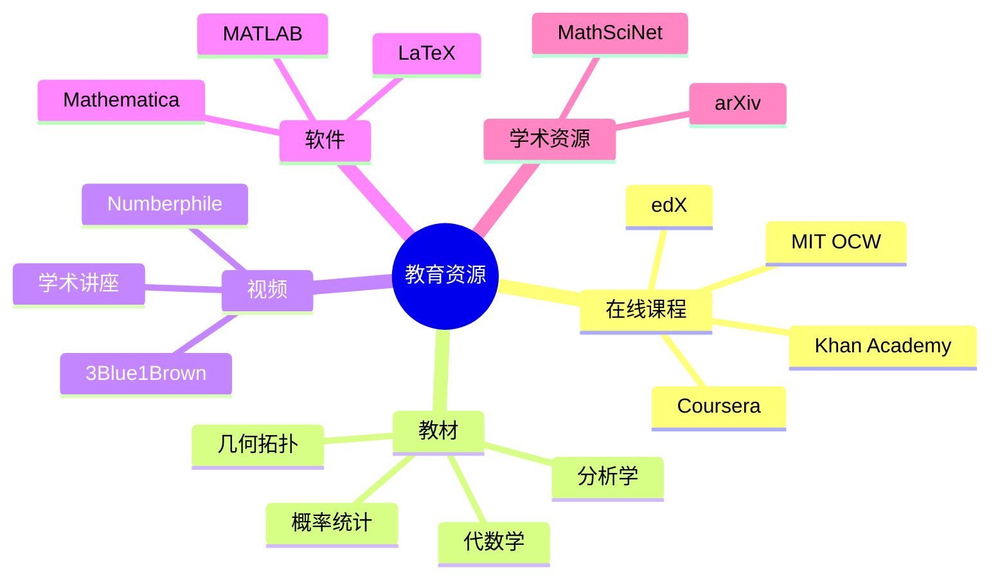

# 数学教育资源汇总

---

## 在线课程平台

### 综合平台

| 平台 | 特点 | 推荐课程 |
|-----|------|---------|
| **Coursera** | 名校课程、证书 | Stanford算法、Duke数据分析 |
| **edX** | MIT/Harvard | MIT微积分、Harvard统计 |
| **Khan Academy** | 免费、全面 | 基础数学全系列 |
| **Brilliant** | 互动学习 | 逻辑、概率、机器学习 |

### 数学专业平台

| 平台 | 特点 | 适用 |
|-----|------|-----|
| **MIT OCW** | 完整课程资料 | 本科/研究生 |
| **nLab** | 范畴论、高阶数学 | 研究级 |
| **MathOverflow** | 问答社区 | 研究者 |
| **StackExchange** | 多级别问答 | 各层次 |

---

## 经典教材推荐

### 分析学

| 书名 | 作者 | 难度 | 特点 |
|-----|------|-----|------|
| Principles of Mathematical Analysis | Rudin | ⭐⭐⭐⭐ | 经典"Baby Rudin" |
| Real Analysis | Folland | ⭐⭐⭐⭐⭐ | 测度论深入 |
| Understanding Analysis | Abbott | ⭐⭐⭐ | 入门友好 |

### 代数学

| 书名 | 作者 | 难度 | 特点 |
|-----|------|-----|------|
| Abstract Algebra | Dummit & Foote | ⭐⭐⭐⭐ | 全面参考 |
| Algebra | Artin | ⭐⭐⭐⭐ | 几何视角 |
| A Book of Abstract Algebra | Pinter | ⭐⭐⭐ | 入门首选 |

### 几何拓扑

| 书名 | 作者 | 难度 | 特点 |
|-----|------|-----|------|
| Topology | Munkres | ⭐⭐⭐ | 标准教材 |
| Algebraic Topology | Hatcher | ⭐⭐⭐⭐ | 免费下载 |
| Introduction to Smooth Manifolds | Lee | ⭐⭐⭐⭐ | 微分几何 |

### 概率统计

| 书名 | 作者 | 难度 | 特点 |
|-----|------|-----|------|
| Probability: Theory and Examples | Durrett | ⭐⭐⭐⭐ | 研究生标准 |
| Statistical Inference | Casella & Berger | ⭐⭐⭐⭐ | 经典教材 |
| All of Statistics | Wasserman | ⭐⭐⭐ | 简明全面 |

---

## 视频资源

### YouTube频道

| 频道 | 内容 | 语言 |
|-----|------|-----|
| **3Blue1Brown** | 可视化数学 | 英文 |
| **Numberphile** | 趣味数学 | 英文 |
| **Mathologer** | 深入讲解 | 英文 |
| **哔哩哔哩-李永乐** | 科普数学 | 中文 |
| **哔哩哔哩-宋浩** | 大学数学 | 中文 |

### 学术讲座

- **MSRI (数学科学研究所)**: 前沿讲座视频
- **IAS (高等研究院)**: 顶级数学家讲座
- **Fields Institute**: 加拿大数学研究所

---

## 软件工具

### 计算软件

| 软件 | 用途 | 费用 |
|-----|------|-----|
| **Mathematica** | 符号计算 | 商业 |
| **MATLAB** | 数值计算 | 商业/教育 |
| **SageMath** | 综合数学 | 免费 |
| **GeoGebra** | 几何教学 | 免费 |

### 排版工具

| 工具 | 用途 | 推荐 |
|-----|------|-----|
| **TeX Live** | LaTeX发行版 | 全面 |
| **Overleaf** | 在线协作 | 便捷 |
| **Typora** | Markdown | 笔记 |

---

## 学术资源

### 预印本与论文

| 平台 | 内容 | 访问 |
|-----|------|-----|
| **arXiv** | 数学预印本 | 免费 |
| **MathSciNet** | 数学评论 | 订阅 |
| **zbMATH** | 数学文摘 | 订阅 |
| **JSTOR** | 数学期刊 | 订阅 |

### 开放获取

- **Europubli**: 欧洲数学出版物
- **Project Euclid**: 数学统计期刊
- **Directory of Open Access Journals (DOAJ)**

---

## 竞赛资源

### IMO资源

- **IMO官方**: 历年题目与解答
- **AoPS**: Art of Problem Solving社区
- **Yufei Zhao**: IMO培训资料

### Putnam资源

- **Putnam Archive**: 历年题目
- **Kiran Kedlaya**: 解答汇编

---

## 学习路径建议

### 基础阶段 (高中-大一)

**资源组合**
- Khan Academy (基础)
- 3Blue1Brown (直观)
- 教材 (系统)

### 进阶阶段 (大二-大三)

**资源组合**
- MIT OCW (课程)
- 经典教材 (深入)
- MathOverflow (问题)

### 研究阶段 (研究生+)

**资源组合**
- 研究论文 (前沿)
- 学术会议 (交流)
- 导师指导 (方向)

---

## 思维导图：教育资源

---

*本文档汇总数学教育资源*  
*质量等级：A（实用性+全面性）*
