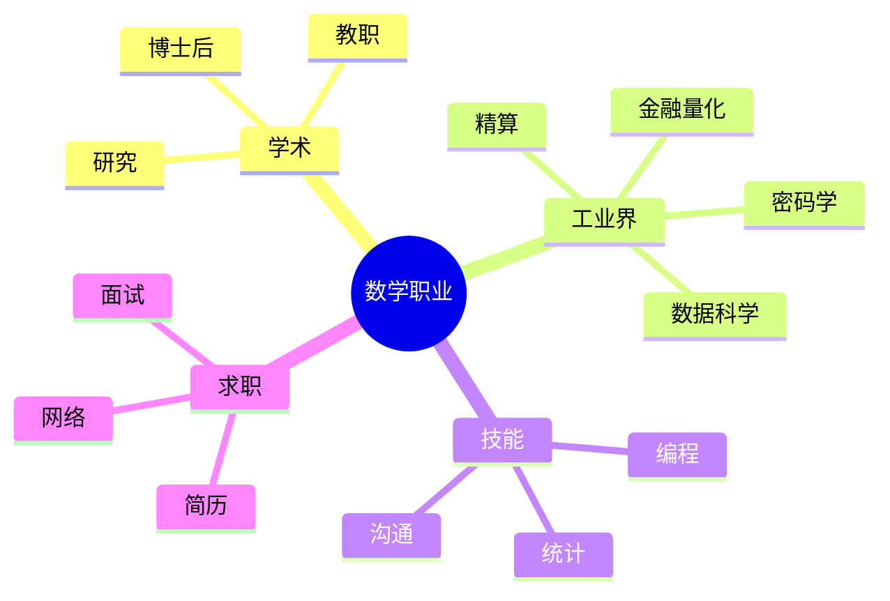

# 数学职业发展指南

---

## 数学相关职业概览

### 学术道路

| 职位 | 职责 | 要求 |
|-----|------|-----|
| **博士后** | 独立研究 | PhD毕业 |
| **助理教授** | 教学+研究 | 博士学位 |
| **副教授** | 研究主导 |  tenure track |
| **教授** | 学术领导 | 正教授 |

**学术路径特点**
- 研究自由度高
- 教学责任
- 基金申请压力
- 论文发表要求

### 工业界职业

| 领域 | 职位 | 技能要求 |
|-----|------|---------|
| **金融** | 量化分析师 | 随机过程、编程 |
| **科技** | 算法工程师 | 算法、数据结构 |
| **数据科学** | 数据科学家 | 统计、机器学习 |
| **咨询** | 分析师 | 建模、沟通 |
| **政府** | 统计学家 | 调查设计、分析 |

---

## 各职业详解

### 量化金融

**工作内容**
- 衍生品定价模型
- 风险管理
- 算法交易
- 投资组合优化

**所需技能**
- 随机微积分
- 数值方法
- C++/Python
- 金融市场知识

**职业发展**
- 初级量化 → 高级量化 → 量化主管 → 合伙人

### 数据科学

**工作内容**
- 数据清洗与探索
- 建模与预测
- 结果解释
- 产品化

**所需技能**
- 统计推断
- 机器学习
- Python/R
- SQL/大数据

**热门方向**
- 机器学习工程师
- AI研究员
- 推荐系统
- 自然语言处理

### 精算师

**工作内容**
- 保险定价
- 准备金评估
- 风险管理
- 监管合规

**考试体系**
- SOA/CAS考试
- 通常需5-10年通过

**特点**
- 工作稳定
- 薪酬优厚
- 考试压力大

### 密码学专家

**工作内容**
- 设计加密算法
- 安全分析
- 区块链开发
- 零知识证明

**所需技能**
- 数论
- 代数
- 计算复杂性
- 编程

---

## 职业选择建议

### 自我评估

| 因素 | 学术 | 工业界 |
|-----|------|-------|
| 工作稳定性 | 中 | 高 |
| 收入潜力 | 中 | 高 |
| 工作自主性 | 高 | 中 |
| 社交需求 | 低 | 高 |
| 地域灵活性 | 低 | 高 |

### 决策框架

**兴趣导向**
- 热爱研究 → 学术
- 喜欢应用 → 工业界
- 喜欢教学 → 教育

**技能匹配**
- 理论强 → 研究/量化
- 编程强 → 数据科学
- 沟通强 → 咨询/管理

---

## 求职准备

### 简历要点

**学术简历**
- 论文列表
- 会议报告
- 教学经历
- 推荐信

**工业界简历**
- 项目经验
- 技术技能
- 实习经历
- 量化成果

### 面试准备

**技术面试**
- 基础数学问题
- 编程测试
- 案例分析

**行为面试**
- 团队合作
- 问题解决
- 职业规划

---

## 职业发展资源

### 学术职位

- **MathJobs**: 北美数学职位
- **Euraxess**: 欧洲研究职位
- **Academic Jobs Online**: 综合学术招聘

### 工业界职位

- **LinkedIn**: 综合职业网络
- **Glassdoor**: 公司评价与薪资
- **QuantNet**: 量化金融专版
- **Kaggle Jobs**: 数据科学职位

### 专业组织

- **AMS (美国数学会)**
- **SIAM (工业与应用数学学会)**
- **IEEE (电气电子工程师学会)**
- **ACM (计算机协会)**

---

## 技能提升建议

### 编程技能

| 语言 | 用途 | 推荐学习 |
|-----|------|---------|
| **Python** | 数据科学、AI | 首选 |
| **R** | 统计分析 | 数据科学 |
| **C++** | 高性能计算 | 量化金融 |
| **Julia** | 科学计算 | 新兴 |

### 软技能

- 沟通能力
- 团队协作
- 项目管理
- 演讲展示

---

## 思维导图：数学职业

---

*本文档提供数学职业发展指南*  
*质量等级：A（实用性+指导性）*
