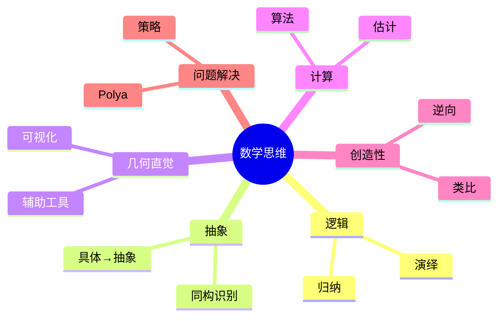

# 数学思维训练专题

---

## 逻辑思维训练

### 演绎推理

**三段论**
- 大前提：所有人都会死
- 小前提：苏格拉底是人
- 结论：苏格拉底会死

**数学应用**
- 定理证明
- 逻辑推导
- 结论验证

### 归纳推理

**从特殊到一般**
- 观察模式
- 形成猜想
- 严格证明

**示例**
$$1 + 3 + 5 + \cdots + (2n-1) = n^2$$

观察：
- n=1: 1 = 1²
- n=2: 1+3 = 4 = 2²
- n=3: 1+3+5 = 9 = 3²

猜想并证明。

---

## 抽象思维训练

### 从具体到抽象

**过程**
1. 研究具体例子
2. 提取共同特征
3. 定义抽象概念
4. 研究抽象性质

**示例：群的概念**
- 整数加法
- 非零实数乘法
- 置换
- 共同特征 → 群

### 抽象应用

**识别同构**
- 不同领域相同结构
- 转移知识
- 统一处理

---

## 几何直觉训练

### 可视化练习

**维度提升**
- 1D：数轴
- 2D：平面
- 3D：空间
- 4D+：投影/切片

**常见练习**
- 想象旋转
- 截面分析
- 拓扑变形

### 几何证明辅助

**画辅助线**
- 连接关键点
- 构造对称
- 添加坐标系

---

## 计算思维训练

### 算法思维

**分解问题**
- 大问题 → 小问题
- 递归求解
- 合并结果

**效率意识**
- 时间复杂度
- 空间复杂度
- 优化策略

### 近似与估计

**数量级估计**
- 快速估算
- 验证合理性
- 忽略小量

**舍入与误差**
- 理解误差来源
- 控制精度
- 数值稳定性

---

## 创造性思维

### 类比与联想

**跨领域类比**
- 电路与流体力学
- 热传导与扩散
- 经济与博弈

**类比步骤**
1. 识别相似结构
2. 转移方法
3. 调整适应
4. 验证有效性

### 逆向思维

**从结论出发**
- 假设结论成立
- 需要什么条件
- 逆向推导

**反证法**
- 假设反面
- 导出矛盾
- 证毕

---

## 问题解决策略

### Polya四步法（深化）

**1. 理解问题**
- 重述问题
- 画图辅助
- 识别已知和未知

**2. 制定计划**
- 回忆相关定理
- 尝试简化
- 考虑辅助问题

**3. 执行计划**
- 仔细检查每步
- 记录中间结果
- 调整策略

**4. 回顾**
- 验证结果
- 寻找其他解法
- 总结经验

### 具体策略

| 策略 | 适用场景 | 示例 |
|-----|---------|------|
| 极端原理 | 存在性问题 | 取最大元素 |
| 不变量 | 过程问题 | 守恒量 |
| 抽屉原理 | 必然性问题 | 鸽巢原理 |
| 归纳法 | 与n有关的问题 | 数学归纳 |
| 对称性 | 对称结构 | 简化问题 |

---

## 常见思维误区

### 直觉陷阱

**Monty Hall问题**
- 直觉：换不换一样
- 正确：换更有利（2/3）

**生日悖论**
- 直觉：需要很多人
- 正确：23人就有50%概率

### 纠正方法

- 严格计算验证
- 小例子测试
- 模拟实验

---

## 每日思维训练

### 练习题

**逻辑题**
- 数独
- 逻辑谜题
- 推理游戏

**几何题**
- 尺规作图
- 折叠问题
- 可视化挑战

**数论题**
- 数字模式
- 整除问题
- 素数性质

### 训练计划

| 时间 | 活动 | 目标 |
|-----|------|-----|
| 每日 | 1道思维题 | 保持思维活跃 |
| 每周 | 1个深度问题 | 培养专注力 |
| 每月 | 1个专题学习 | 系统提升 |

---

## 思维导图：数学思维

---

*本文档提供数学思维训练*  
*质量等级：A+（训练性+实用性）*
