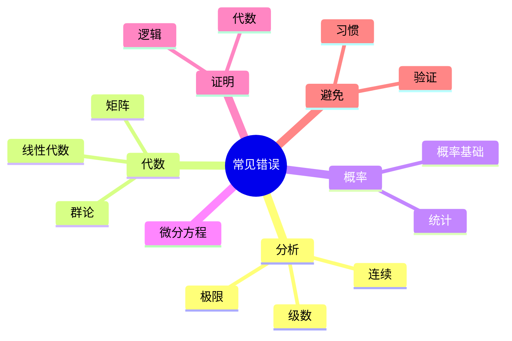

# 数学常见错误与纠正

---

## 分析学常见错误

### 极限相关

| 错误 | 正确 | 说明 |
|-----|------|-----|
| $\lim(f+g) = \lim f + \lim g$（不验证存在） | 需先验证极限存在 | 无穷大时不成立 |
| 交换极限和积分（无条件） | 需一致收敛或控制收敛 | DCT/MCT |
| $\frac{0}{0} = 1$ | 不定型，需进一步分析 | 洛必达法则 |

### 级数相关

| 错误 | 正确 | 说明 |
|-----|------|-----|
| 条件收敛级数重排不变 | 重排可能改变和 | Riemann重排定理 |
| $\sum a_n$ 收敛 ⟹ $\sum a_n^2$ 收敛 | 不成立 | 反例：$a_n = (-1)^n/\sqrt{n}$ |
| 交错级数都收敛 | 需满足Leibniz条件 | 递减趋于0 |

### 连续性相关

| 错误 | 正确 | 说明 |
|-----|------|-----|
| 逐点连续 ⟹ 一致连续 | 需紧集条件 | Heine-Cantor定理 |
| 可导 ⟹ 连续可导 | 导数可能不连续 | $x^2\sin(1/x)$ |

---

## 代数学常见错误

### 群论

| 错误 | 正确 | 说明 |
|-----|------|-----|
| 子群的并是子群 | 一般不成立 | 需包含关系 |
| 正规子群传递 | $K \trianglelefteq H \trianglelefteq G \nRightarrow K \trianglelefteq G$ | $D_8$反例 |
| 指数小则子群存在 | Lagrange逆不成立 | $A_4$无6阶子群 |

### 线性代数

| 错误 | 正确 | 说明 |
|-----|------|-----|
| $\det(A+B) = \det(A) + \det(B)$ | 一般不成立 | $\det$不是线性的 |
| $AB = AC \Rightarrow B = C$ | 需A可逆 | A不可逆时不成立 |
| 特征向量正交 | 仅对对称矩阵 | 一般矩阵不正交 |

### 矩阵运算

| 错误 | 正确 | 说明 |
|-----|------|-----|
| $(AB)^{-1} = A^{-1}B^{-1}$ | $(AB)^{-1} = B^{-1}A^{-1}$ | 顺序颠倒 |
| $(AB)^T = A^T B^T$ | $(AB)^T = B^T A^T$ | 顺序颠倒 |

---

## 概率统计常见错误

### 概率基础

| 错误 | 正确 | 说明 |
|-----|------|-----|
| $P(A \cap B) = P(A)P(B)$ | 仅当A,B独立 | 独立定义 |
| $P(A|B) = P(B|A)$ | 一般不成立 | Bayes公式 |
| 独立 ⟹ 互斥 | 独立不互斥 | 互斥 ⟹ 不独立（非零概率） |

### 统计推断

| 错误 | 正确 | 说明 |
|-----|------|-----|
| p值小 ⟹ 原假设为假 | p值小 ⟹ 拒绝原假设 | 不等于原假设为假 |
| 相关 ⟹ 因果 | 相关≠因果 | 可能有混杂因素 |
| 大样本 ⟹ 无偏 | 一致性≠无偏 | 大样本保证一致性 |

---

## 微分方程常见错误

| 错误 | 正确 | 说明 |
|-----|------|-----|
| 分离变量时不考虑零解 | 需单独讨论 | $y=0$可能是解 |
| 通解包含所有解 | 可能遗漏奇解 | 需验证 |
| 线性无关 ⟹ Wronskian非零 | 仅在一点非零即可 | Wronskian条件 |

---

## 证明常见错误

### 逻辑错误

**循环论证**
- 用结论证明结论
- 例：用$x^2 \geq 0$证明$(x-y)^2 \geq 0$

**偷换概念**
- 改变定义或条件
- 证明中悄悄改变假设

**以偏概全**
- 从特殊情况推广一般
- 未验证一般情况

### 代数错误

**除以零**
- 未检查分母是否为零
- 例：$x = y \Rightarrow x/y = 1$（当y=0时不成立）

**开方不取正负**
- $\sqrt{x^2} = x$（应为$|x|$）

---

## 如何避免错误

### 验证清单

**计算验证**
- [ ] 边界情况
- [ ] 特殊情况
- [ ] 极限情况
- [ ] 单位一致性

**证明验证**
- [ ] 假设是否全部使用
- [ ] 是否有隐含假设
- [ ] 逆命题是否成立
- [ ] 构造是否正确

### 学习习惯

1. **慢下来**：仔细阅读，理解每个步骤
2. **写清楚**：清晰的推导过程
3. **多验证**：从不同角度检验
4. **学反例**：了解边界情况
5. **讨论交流**：与他人讨论发现问题

---

## 思维导图：常见错误

---

*本文档收集数学常见错误*  
*质量等级：A+（警示性+教育性）*
