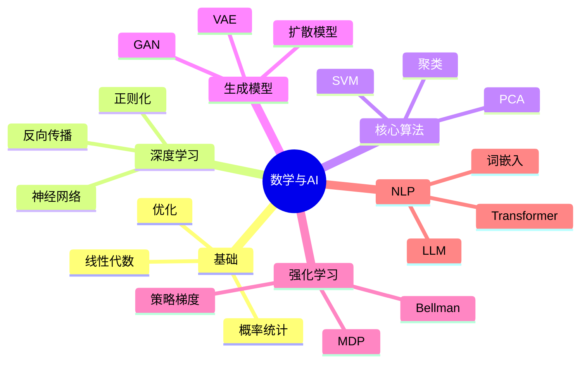

# 数学与人工智能

---

## 机器学习数学基础

### 线性代数在ML中的应用

**数据表示**
- 数据集：矩阵 $X \in \mathbb{R}^{n \times d}$
- 特征向量：行向量
- 样本：列向量

**核心运算**
- 矩阵乘法：层间传播
- 特征分解：PCA降维
- SVD：推荐系统
- 张量运算：深度学习

### 概率统计基础

**概率模型**
- 贝叶斯定理：$P(A|B) = \frac{P(B|A)P(A)}{P(B)}$
- 最大似然估计
- 最大后验估计

**统计推断**
- 置信区间
- 假设检验
- 贝叶斯推断

### 优化理论

**梯度下降**
$$\theta_{t+1} = \theta_t - \eta \nabla L(\theta_t)$$

**变体**
- 随机梯度下降 (SGD)
- Adam优化器
- 二阶方法

**凸优化**
- 凸函数性质
- 拉格朗日对偶
- KKT条件

---

## 深度学习数学

### 神经网络前向传播

**层间计算**
$$z^{[l]} = W^{[l]}a^{[l-1]} + b^{[l]}$$
$$a^{[l]} = g(z^{[l]})$$

**激活函数**
- Sigmoid：$\sigma(x) = \frac{1}{1+e^{-x}}$
- ReLU：$\max(0, x)$
- Tanh

### 反向传播算法

**链式法则应用**
$$\frac{\partial L}{\partial W} = \frac{\partial L}{\partial a} \cdot \frac{\partial a}{\partial z} \cdot \frac{\partial z}{\partial W}$$

**计算图**
- 自动微分
- 梯度计算

### 正则化技术

**L2正则**
$$L_{reg} = L + \lambda \sum_{i} w_i^2$$

**Dropout**
- 随机失活
- 防止过拟合

**Batch Normalization**
- 批标准化
- 加速训练

---

## 核心算法数学

### 支持向量机 (SVM)

**优化问题**
$$\min_{w,b} \frac{1}{2}\|w\|^2 + C\sum_{i=1}^n \max(0, 1 - y_i(w^T x_i + b))$$

**对偶问题**
- 核技巧
- 高维映射

**核函数**
- 线性核
- 多项式核
- RBF核：$K(x,y) = \exp(-\gamma\|x-y\|^2)$

### 主成分分析 (PCA)

**数学原理**
- 特征值分解：$X^TX = V\Lambda V^T$
- 取前k个特征向量
- 投影降维

**应用**
- 数据压缩
- 可视化
- 去噪

### 聚类算法

**K-means**
- 目标函数：$\sum_{i=1}^k \sum_{x \in C_i} \|x - \mu_i\|^2$
- EM算法思想

**谱聚类**
- 图拉普拉斯
- 特征分解

---

## 生成模型数学

### 变分自编码器 (VAE)

**变分推断**
- 证据下界 (ELBO)
- KL散度：$D_{KL}(q||p)$
- 重参数化技巧

### 生成对抗网络 (GAN)

**博弈论框架**
$$\min_G \max_D V(D, G)$$

**纳什均衡**
- 生成器 vs 判别器
- 对抗训练

### 扩散模型

**前向扩散**
- 加噪过程
- 马尔可夫链

**反向去噪**
- 学习去噪
- 得分匹配

---

## 强化学习数学

### 马尔可夫决策过程

**五元组** $(S, A, P, R, \gamma)$
- 状态空间 $S$
- 动作空间 $A$
- 转移概率 $P$
- 奖励函数 $R$
- 折扣因子 $\gamma$

### Bellman方程

**价值函数**
$$V^\pi(s) = \mathbb{E}[R_t + \gamma V^\pi(S_{t+1}) | S_t = s]$$

**Q函数**
$$Q^\pi(s,a) = \mathbb{E}[R_t + \gamma Q^\pi(S_{t+1}, A_{t+1}) | S_t=s, A_t=a]$$

### 策略优化

**策略梯度**
$$\nabla_\theta J(\theta) = \mathbb{E}[\nabla_\theta \log \pi_\theta(a|s) \cdot Q^\pi(s,a)]$$

---

## 自然语言处理数学

### 词嵌入

**Word2Vec**
- Skip-gram
- CBOW
- 负采样

**GloVe**
- 全局向量
- 共现矩阵

### Transformer

**自注意力**
$$\text{Attention}(Q, K, V) = \text{softmax}(\frac{QK^T}{\sqrt{d_k}})V$$

**位置编码**
- 正弦/余弦
- 可学习位置编码

### 大语言模型

**规模定律**
- 参数量、数据量、计算量
- 涌现能力

**RLHF**
- 人类反馈强化学习
- 对齐训练

---

## 数学前沿

### 神经正切核 (NTK)

**无限宽网络**
- 核方法视角
- 训练动态分析

### 图神经网络

**谱图理论**
- 图傅里叶变换
- 图卷积

### 拓扑数据分析

**持久同调**
- 数据形状分析
- 机器学习应用

---

## 思维导图：数学与AI

---

*本文档探讨数学与人工智能*  
*质量等级：A+（前沿性+实用性）*
