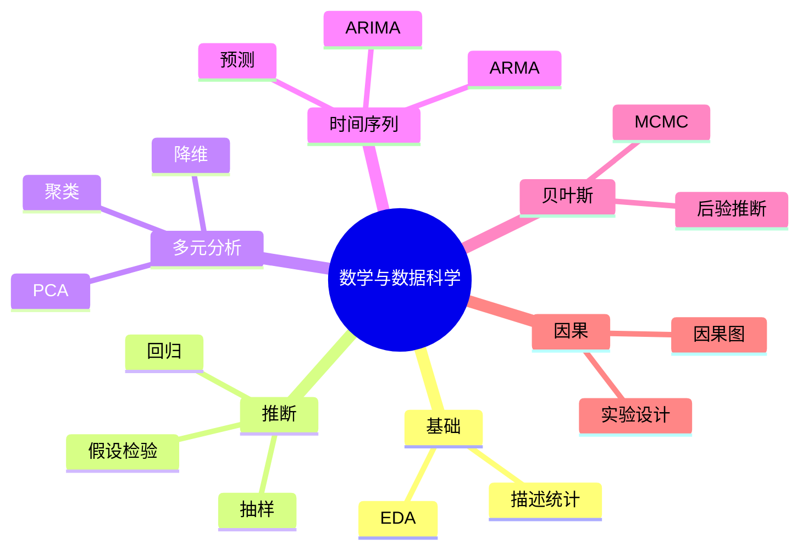

# 数学与数据科学

---

## 数据科学数学基础

### 描述性统计

**中心趋势度量**
- 均值：$\bar{x} = \frac{1}{n}\sum_{i=1}^n x_i$
- 中位数：排序后中间值
- 众数：出现频率最高

**离散程度**
- 方差：$\sigma^2 = \frac{1}{n}\sum(x_i - \bar{x})^2$
- 标准差：$\sigma$
- 四分位距 (IQR)

**分布形状**
- 偏度 (Skewness)
- 峰度 (Kurtosis)

### 探索性数据分析 (EDA)

**可视化方法**
- 直方图：分布
- 箱线图：五数概括
- 散点图：关系
- 热力图：相关性

**数据清洗**
- 缺失值处理
- 异常值检测
- 数据变换

---

## 统计推断

### 抽样理论

**抽样分布**
- 中心极限定理
- 样本均值分布

**置信区间**
$$\bar{x} \pm z_{\alpha/2} \frac{\sigma}{\sqrt{n}}$$

### 假设检验

**基本步骤**
1. 建立原假设 $H_0$ 和备择假设 $H_1$
2. 选择检验统计量
3. 确定显著性水平 $\alpha$
4. 计算p值
5. 做出决策

**常见检验**
- t检验：均值比较
- 卡方检验：独立性
- F检验：方差比较
- KS检验：分布比较

### 回归分析

**线性回归**
$$y = \beta_0 + \beta_1 x + \epsilon$$

**最小二乘法**
$$\min_{\beta} \sum_{i=1}^n (y_i - \hat{y}_i)^2$$

**诊断**
- 残差分析
- $R^2$ 决定系数
- 多重共线性

---

## 多元统计分析

### 协方差与相关

**协方差矩阵**
$$\Sigma_{ij} = \text{Cov}(X_i, X_j)$$

**相关系数**
$$\rho_{XY} = \frac{\text{Cov}(X,Y)}{\sigma_X \sigma_Y}$$

### 降维技术

**主成分分析 (PCA)**
- 方差最大化
- 正交投影

**t-SNE**
- 非线性降维
- 可视化高维数据

**UMAP**
- 流形学习
- 保持局部结构

### 聚类分析

**层次聚类**
- 凝聚式
- 分裂式

**DBSCAN**
- 密度聚类
- 噪声识别

**高斯混合模型**
- 软聚类
- EM算法

---

## 时间序列分析

### 基本模型

**AR模型**
$$X_t = c + \sum_{i=1}^p \phi_i X_{t-i} + \varepsilon_t$$

**MA模型**
$$X_t = \mu + \varepsilon_t + \sum_{i=1}^q \theta_i \varepsilon_{t-i}$$

**ARMA模型**
- 自回归移动平均

**ARIMA模型**
- 差分整合
- 非平稳序列

### 预测方法

**指数平滑**
- 简单指数平滑
- Holt-Winters

**Prophet**
- Facebook开源
- 趋势+季节性

---

## 贝叶斯数据分析

### 贝叶斯定理

$$P(\theta|D) = \frac{P(D|\theta)P(\theta)}{P(D)}$$

- 先验 $P(\theta)$
- 似然 $P(D|\theta)$
- 后验 $P(\theta|D)$

### MCMC方法

**Metropolis-Hastings**
- 随机游走
- 接受-拒绝

**Gibbs采样**
- 条件分布
- 迭代采样

**应用**
- 参数估计
- 模型选择

---

## 因果推断

### 基本概念

**相关≠因果**
- 混杂因素
- 选择偏差

**因果图**
- 有向无环图 (DAG)
- d-分离

### 方法

**随机实验**
- 黄金标准
- A/B测试

**观察研究**
- 倾向得分匹配
- 工具变量
- 双重差分

---

## 大数据处理

### 分布式计算

**MapReduce**
- 分而治之
- 并行处理

**Spark**
- 内存计算
- 机器学习库 (MLlib)

### 流式处理

**实时分析**
- 滑动窗口
- 在线算法

---

## 实验设计

### A/B测试

**设计原则**
- 随机化
- 对照组
- 样本量计算

**统计分析**
- 假设检验
- 效应量
- 功效分析

### 多臂老虎机

**探索vs利用**
- ε-贪婪
- UCB算法
- Thompson采样

---

## 思维导图：数学与数据科学

---

*本文档探讨数学与数据科学*  
*质量等级：A+（实用性+系统性）*
