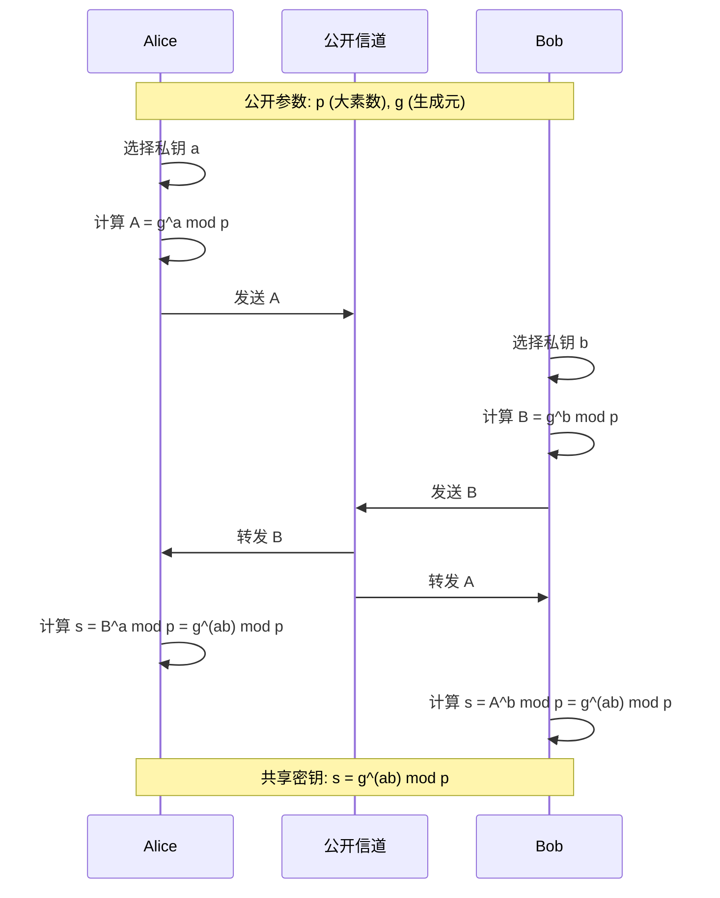

msc_primary: "94A60"
msc_secondary: ['11T71', '11Y16']
concept_type: "应用可视化"
visualization_type: "交互流程图、协议序列"
---

# Diffie-Hellman密钥交换可视化

## 描述

本可视化展示Diffie-Hellman密钥交换协议，这是第一个实用的公钥密码学方法，允许双方在不安全的信道上建立共享密钥。

## 数学概念

DH基于离散对数问题的困难性。双方通过交换基于私钥的公开值，各自计算出相同的共享密钥，而窃听者无法从公开信息计算出该密钥。

## 可视化代码

### DH协议流程



### ASCII详细过程

```

Diffie-Hellman密钥交换协议
═══════════════════════════════════════════════════════════════

公开参数 (双方都知道):
───────────────────────────────────────────────────────────────
┌─────────────────────────────────────────────────────────────┐
│  p = 一个大素数                                             │
│  g = 模 p 的原根 (生成元)                                   │
│                                                             │
│  例如: p = 23, g = 5                                        │
└─────────────────────────────────────────────────────────────┘

协议执行:
═══════════════════════════════════════════════════════════════

Alice                        公开信道                      Bob
──────                        ────────                      ────

选择私钥 a                    公开 (p, g)               选择私钥 b
例如 a = 6                    ─────────────→            例如 b = 15

计算 A = g^a mod p                                      计算 B = g^b mod p
     = 5^6 mod 23                                              = 5^15 mod 23
     = 8                                                      = 19

发送 A = 8 ───────────────→   公开值 A = 8
                              ←─────────────── 发送 B = 19
                              公开值 B = 19

接收 B = 19                                               接收 A = 8

计算 s = B^a mod p                                        计算 s = A^b mod p
     = 19^6 mod 23                                              = 8^15 mod 23
     = 2                                                       = 2

                              ┌─────────┐
                              │ s = 2   │  ← 共享密钥！
                              └─────────┘

安全分析:
═══════════════════════════════════════════════════════════════

窃听者Eve能看到:
┌─────────────────────────────────────────────────────────────┐
│  • 公开参数: p = 23, g = 5                                  │
│  • Alice的公开值: A = 8                                     │
│  • Bob的公开值: B = 19                                      │
└─────────────────────────────────────────────────────────────┘

Eve需要计算:
┌─────────────────────────────────────────────────────────────┐
│  从 A = g^a mod p 求 a                                      │
│  即: 从 8 = 5^a mod 23 求 a                                 │
│  这是离散对数问题！                                           │
│                                                             │
│  对于小数字可以暴力破解 (a=6)                                 │
│  但对于数百位的大素数，计算不可行                            │
└─────────────────────────────────────────────────────────────┘

为什么双方得到相同密钥?
───────────────────────────────────────────────────────────────

Alice计算: s = B^a = (g^b)^a = g^(ba) = g^(ab) mod p
Bob计算:   s = A^b = (g^a)^b = g^(ab) mod p

因此: s_Alice = s_Bob = g^(ab) mod p  ✓

协议特点:
═══════════════════════════════════════════════════════════════
┌─────────────────────────────────────────────────────────────┐
│  ✓ 无需预先共享秘密                                          │
│  ✓ 密钥不在信道上传输                                        │
│  ✓ 每次会话可生成新密钥                                      │
│  ✓ 支持前向保密 (使用临时密钥)                               │
│  ✗ 易受中间人攻击 (需要身份验证)                             │
└─────────────────────────────────────────────────────────────┘

现代应用:
───────────────────────────────────────────────────────────────
• TLS/SSL 握手 (ECDHE)
• SSH 密钥交换
• VPN 协议 (IPsec)
• 即时通讯加密 (Signal协议)

```

## 参考

1. Diffie, W., & Hellman, M. E. (1976). New Directions in Cryptography.
2. Stinson, D. R. (2005). Cryptography: Theory and Practice. CRC Press.
