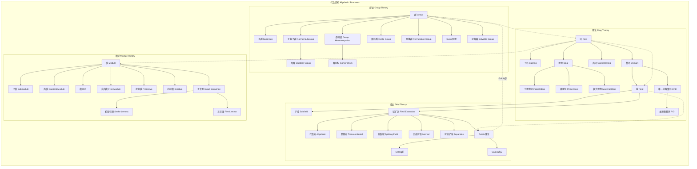

msc_primary: "00A99"
msc_secondary: ['00-00']
---

# 代数结构分支架构图

## 分支概述
代数结构是研究数学对象及其运算规则的数学分支，包括群、环、域、模等基本结构。

## 核心概念层次

## 概念关联说明

### 群论 → 环论
- 环的加法群是交换群
- 环的单位群是乘法群
- 环的理想对应群的正规子群

### 环论 → 域论
- 域是特殊的整环（非零元可逆）
- 整环的分式域构造
- 域的代数扩张理论

### 环论 → 模论
- 模是环上的"向量空间"
- 每个环都是自身的模
- 模论推广了线性代数

### 域论 ↔ 群论
- Galois理论的核心联系
- 域扩张 ↔ Galois群子群
- 方程可解性 ↔ 群可解性

## 与其他分支的联系

| 分支 | 联系内容 |
|------|----------|
| 数论 | 代数整数环、类域论、椭圆曲线 |
| 几何 | 代数几何、代数群、李群 |
| 拓扑 | 代数拓扑、同调代数、K-理论 |
| 分析 | 算子代数、Banach代数、泛函分析 |
| 逻辑 | 模型论、可计算性、自动机理论 |

## 应用领域

1. **密码学**: RSA、椭圆曲线密码、群论应用
2. **编码理论**: 循环码、代数几何码
3. **物理学**: 规范场论、李群表示
4. **化学**: 晶体学、分子对称性
5. **计算机科学**: 自动机理论、计算复杂性
