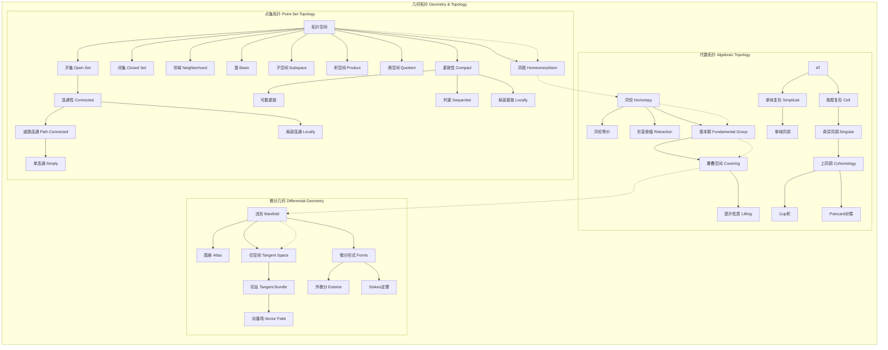

msc_primary: "00A99"
msc_secondary: ['00-XX']
---

# 几何拓扑分支架构图

## 分支概述
几何拓扑学研究空间的形状、结构和变形，包括点集拓扑、代数拓扑和微分几何。

## 核心概念层次

## 概念关联说明

### 点集拓扑 → 代数拓扑
- 连续映射是同伦的基础
- 同胚是同伦等价的特例
- 拓扑不变量区分空间

### 代数拓扑核心
- 基本群捕捉一维洞
- 同调群捕捉高维洞
- 上同调有乘法结构

### 拓扑 → 几何
- 流形是局部欧氏的拓扑空间
- 切空间是流形在每点的线性化
- 微分形式是积分的对象

### 几何核心
- 流形是光滑的空间
- 切丛是所有切空间的集合
- Stokes定理统一各种积分定理

## 与其他分支的联系

| 分支 | 联系内容 |
|------|----------|
| 分析 | 微分形式、流形上的分析、Sobolev空间 |
| 代数 | 同调代数、K-理论、代数几何 |
| 物理 | 规范场论、广义相对论、弦理论 |
| 数论 | 算术几何、代数簇、 motive理论 |
| 逻辑 | 拓扑斯理论、几何逻辑 |

## 应用领域

1. **物理学**: 广义相对论、规范场论、弦理论、凝聚态物理
2. **机器人学**: 运动规划、构型空间
3. **数据科学**: 拓扑数据分析、持久同调
4. **计算机图形学**: 曲面建模、网格处理
5. **材料科学**: 拓扑绝缘体、晶体结构
