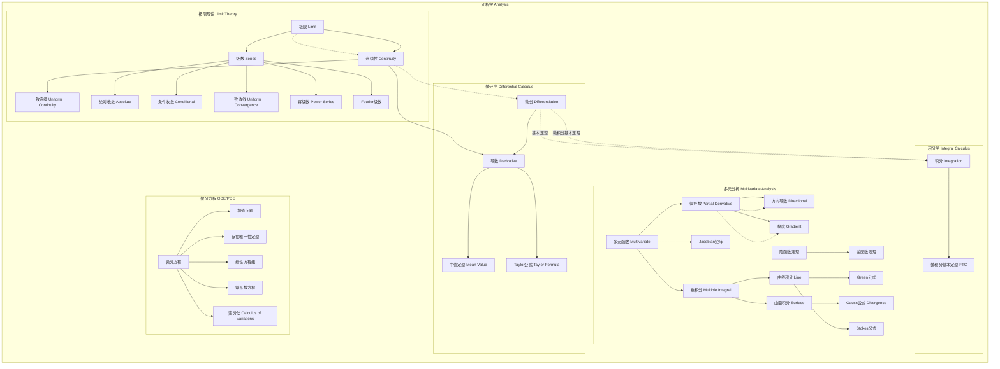

msc_primary: "00A99"
msc_secondary: ['00-00']
---

# 分析学分支架构图

## 分支概述
分析学研究极限、连续性、微分、积分等概念，是数学的核心分支之一。

## 核心概念层次

## 概念关联说明

### 极限 → 连续性
- 连续性用极限定义
- 一致连续是更强的连续性
- 极限是分析学的基石

### 连续性 → 微分学
- 可导必连续，连续不一定可导
- 微分是局部线性近似
- 中值定理连接微分与函数值

### 微分学 → 积分学
- 微积分基本定理连接两者
- 导数与积分互为逆运算
- 定积分用极限定义

### 一元 → 多元
- 偏导数是沿坐标方向的导数
- 梯度是偏导数组成的向量
- Jacobian矩阵是多元函数的导数

### 分析与方程
- 微分方程研究含导数的方程
- 变分法研究泛函极值
- 存在唯一性定理保证解的存在

## 与其他分支的联系

| 分支 | 联系内容 |
|------|----------|
| 拓扑 | 拓扑空间、连续性、紧致性 |
| 代数 | 代数函数、形式幂级数、算子代数 |
| 几何 | 微分几何、流形、曲率 |
| 概率 | 测度论、概率分布、随机过程 |
| 物理 | 经典力学、量子力学、场论 |

## 应用领域

1. **物理学**: 力学、电磁学、量子力学、相对论
2. **工程学**: 信号处理、控制系统、结构分析
3. **经济学**: 优化理论、动态模型、金融数学
4. **生物学**: 种群动力学、生物物理模型
5. **计算机科学**: 数值分析、机器学习、图像处理
