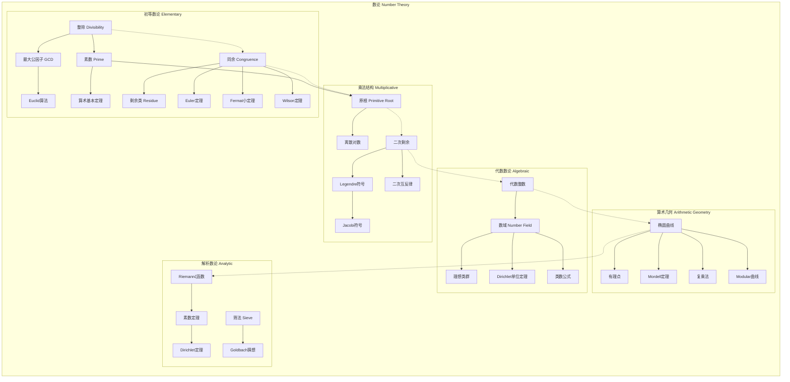

msc_primary: "00A99"
msc_secondary: ['00-XX']
---

# 数论分支架构图

## 分支概述
数论研究整数的性质，是数学中最古老的分支之一，包括初等数论、代数数论和解析数论。

## 核心概念层次

## 概念关联说明

### 初等数论基础
- 整除是数论的基本关系
- 素数是乘法的基本构件
- 同余是模运算的基础

### 乘法结构
- 原根是乘法群的生成元
- 二次剩余研究平方模素数
- 二次互反律是数论瑰宝

### 初等 → 代数
- 代数整数推广整数概念
- 数域是有理数的有限扩张
- 理想类群衡量唯一分解失效

### 代数 → 几何
- 椭圆曲线是算术几何的核心
- Mordell定理描述有理点结构
- 模形式与椭圆曲线深刻联系

### 解析方法
- ζ函数研究素数分布
- 素数定理描述素数渐近密度
- 筛法估计素数分布

## 与其他分支的联系

| 分支 | 联系内容 |
|------|----------|
| 代数 | 代数数论、类域论、椭圆曲线 |
| 分析 | 解析数论、ζ函数、L-函数 |
| 几何 | 算术几何、代数几何、模空间 |
| 逻辑 | 可计算性、丢番图方程 |
| 密码学 | RSA、椭圆曲线密码、算法数论 |

## 应用领域

1. **密码学**: RSA、Diffie-Hellman、椭圆曲线密码
2. **编码理论**: 代数几何码、循环码
3. **计算机科学**: 算法、计算复杂性、随机数生成
4. **物理学**: 弦理论、Calabi-Yau流形
5. **通信**: 纠错码、扩频通信
