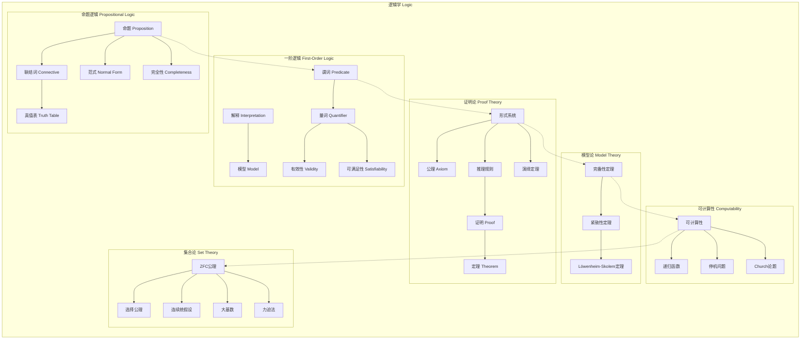

msc_primary: "00A99"
msc_secondary: ['00-00']
---

# 逻辑学分支架构图

## 分支概述
逻辑学研究推理的形式结构和有效推理规则，是数学的基础和计算机科学的理论基础。

## 核心概念层次

## 概念关联说明

### 命题 → 谓词
- 命题逻辑是基础
- 谓词逻辑引入量词和变元
- 表达能力大大增强

### 语法 → 语义
- 形式系统提供语法
- 模型论提供语义
- 完备性连接两者

### 证明 → 可计算
- 证明是有限对象
- 可计算性研究算法
- 停机问题是极限

### 基础 → 集合论
- ZFC是现代数学基础
- 选择公理有争议但强大
- 独立性问题用 forcing

## 与其他分支的联系

| 分支 | 联系内容 |
|------|----------|
| 数学基础 | ZFC公理、范畴论基础 |
| 计算机科学 | 自动机、复杂性理论、程序验证 |
| 代数 | 代数逻辑、布尔代数、模型论 |
| 拓扑 | 拓扑斯理论、几何逻辑 |
| 语言学 | 形式语言、语义学 |

## 应用领域

1. **计算机科学**: 程序验证、形式化方法、人工智能
2. **数学基础**: 公理化、一致性证明、独立性
3. **语言学**: 形式语义、自然语言处理
4. **哲学**: 数学哲学、认识论
5. **电路设计**: 布尔代数、逻辑门设计
