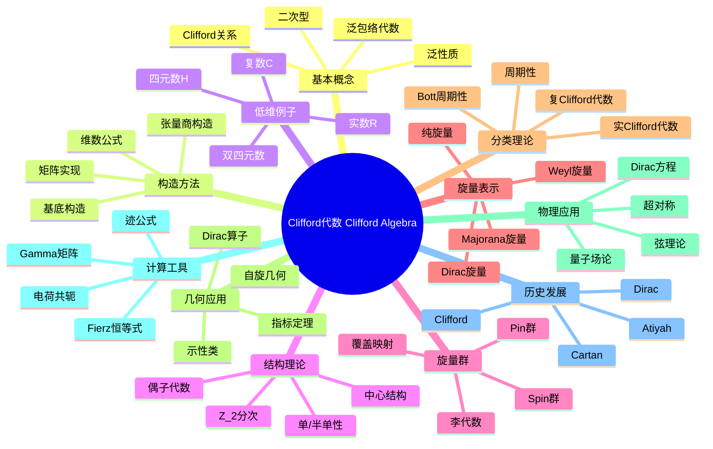

msc_primary: "00A99"
msc_secondary: ['00-XX']
---

# Clifford代数 思维导图

## 中心概念
Clifford代数是结合二次型构造的代数结构，统一了外代数和复数/四元数理论。它在几何、物理（尤其是量子场论和自旋几何）以及表示论中具有核心地位。

## 核心分支

### 定义与公理
- **形式化定义**: $Cl(V,Q) = T(V)/\langle v \otimes v - Q(v) \cdot 1 \rangle$
- **Clifford关系**: $v^2 = Q(v)$ 或等价地 $vw + wv = 2B(v,w)$
- **泛性质**: 到满足 $f(v)^2 = Q(v)$ 的结合代数的泛映射
- **维数**: $\dim Cl(V,Q) = 2^{\dim V}$

### 基本性质
- **$\mathbb{Z}_2$-分次**: $Cl(V) = Cl^0(V) \oplus Cl^1(V)$（偶/奇次）
- **偶子代数**: $Cl^0(V,Q)$ 与低一维空间的Clifford代数同构
- **反自同构**: 转置和阶化转置
- **Clifford群**: 由可逆元构成的群，包含Pin群和Spin群

### 重要例子
- **$Cl_{0,1} \cong \mathbb{C}$**: 复数（1维负定型）
- **$Cl_{0,2} \cong \mathbb{H}$**: 四元数（2维负定型）
- **$Cl_{1,3} \cong M_2(\mathbb{H})$**: 物理时空的Dirac代数
- **$Cl_{3,0} \cong M_2(\mathbb{C})$**: Pauli代数
- **$Cl_{n,0}$**: 欧几里得空间的Clifford代数

### 核心定理
- **周期性定理**: $Cl_{p+8,q} \cong Cl_{p,q} \otimes M_{16}(\mathbb{R})$（Bott周期性）
- **分类定理**: 实Clifford代数由 $(p-q) \mod 8$ 决定（证明思路：矩阵实现）
- **Spin群双覆盖**: $Spin(V) \to SO(V)$ 是2:1覆盖（单连通）
- **Atiyah-Bott-Shapiro**: Clifford模与KO理论的周期对应

### 相关概念
- **父概念**: 张量代数、外代数、二次型理论
- **子概念**: Spin群、旋量、Twistor理论
- **相邻概念**: K-理论、指标定理、超对称

### 应用领域
- **几何**: 自旋流形、Dirac算子、指标定理
- **物理**: Dirac方程、量子场论、超弦理论
- **表示论**: 正交群和李代数的旋量表示
- **机器人学**: 刚体运动的Clifford代数表示

### 历史发展
- **创立者**: William Kingdon Clifford (1849-1879)，1876年提出
- **关键发展**:
  - 1913：Cartan引入"旋量"概念
  - 1928：Dirac发现Dirac方程与Clifford代数的关系
  - 1960年代：Atiyah-Singer指标定理
  - 1980年代：超弦理论中的应用
- **现代研究**: 非交换几何、Twistor理论

### 参考资源
- **推荐教材**: Lawson-Michelsohn《Spin Geometry》、Garling《Clifford Algebras: An Introduction》
- **相关论文**: Dirac《The Quantum Theory of the Electron》(1928)、Atiyah-Singer《The Index of Elliptic Operators》(1968)
- **在线资源**: Geometry of Physics (Theodore Frankel)

---

**概念链接**: [[张量代数]] [[Hopf代数]] [[李代数]] [[指标定理]] [[量子场论]]
