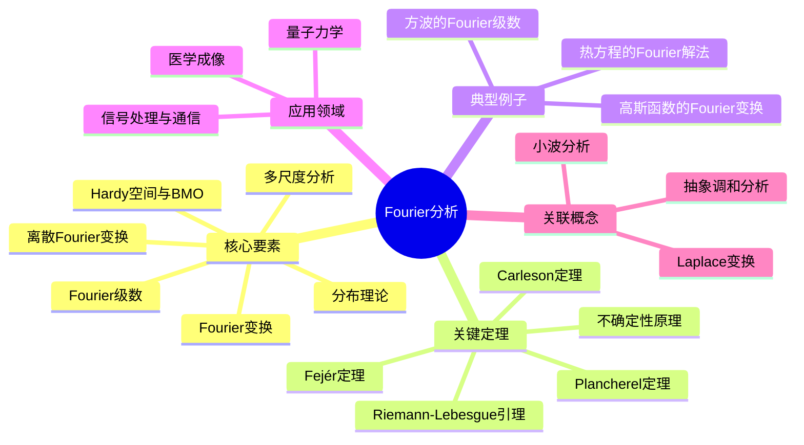

# Fourier分析 思维导图

## 中心概念

- **一句话定义**：Fourier分析是将函数表示为三角函数（正弦和余弦）叠加的数学理论，揭示了时域与频域之间的深刻对偶关系。
- **直观理解**：如同将复杂的声音分解为不同音调的纯音，Fourier分析将任意函数分解为不同频率简谐振动的叠加。

## 核心要素

### 1. Fourier级数

- 周期函数的三角级数展开
- 正交函数系 {e^{inx}} 的完备性
- 收敛性问题（点态、一致、L²收敛）

### 2. Fourier变换

- 非周期函数的频谱分析
- 定义：$\hat{f}(\xi) = \int_{-\infty}^{\infty} f(x)e^{-2\pi ix\xi}dx$
- 逆变换与Plancherel定理

### 3. 离散Fourier变换(DFT)

- 有限序列的频谱分析
- 快速算法(FFT)的计算效率
- 数字信号处理的核心工具

### 4. 分布理论与广义函数

- Dirac delta函数的严格化
- 缓增分布与缓增函数
- 弱导数与Sobolev空间

### 5. Hardy空间与BMO

- 上半平面的解析函数边界值
- BMO(有界平均振动)函数
- H¹-BMO对偶性

### 6. 多尺度分析

- 小波变换与多分辨率分析
- 时频局部化
- 信号压缩与去噪应用

## 关键定理

### 1. Plancherel定理

**陈述**：Fourier变换是L²(ℝ)上的酉算子，满足 $\|f\|_{L^2} = \|\hat{f}\|_{L^2}$
**意义**：能量在时域和频域守恒，为量子力学和信号处理提供数学基础

### 2. Riemann-Lebesgue引理

**陈述**：若 f ∈ L¹(ℝ)，则 $\hat{f}(\xi) \to 0$ 当 $|\xi| \to \infty$
**意义**：可积函数的频谱在高频处衰减，反映函数的平滑性

### 3. 不确定性原理

**陈述**：$\|xf(x)\|_{L^2} \cdot \|\xi\hat{f}(\xi)\|_{L^2} \geq \frac{1}{4\pi}\|f\|_{L^2}^2$
**意义**：函数与其Fourier变换不能同时高度集中，量子力学中海森堡原理的数学表达

### 4. Carleson定理(1966)

**陈述**：L²函数的Fourier级数几乎处处收敛
**意义**：解决了Fourier分析长达150年的核心问题，Carleson因此获得Abel奖

### 5. Fejér定理

**陈述**：连续周期函数的Cesàro平均一致收敛于函数本身
**意义**：通过求和法改善收敛性，为逼近论提供重要工具

## 典型例子

### 1. 方波的Fourier级数

方波函数可表示为奇次谐波的叠加：
$\frac{4}{\pi}\sum_{n=0}^{\infty} \frac{\sin((2n+1)x)}{2n+1}$
展示Gibbs现象——在间断点附近的振荡 overshoot

### 2. 高斯函数的Fourier变换

$e^{-\pi x^2}$ 的Fourier变换仍是高斯函数 $e^{-\pi \xi^2}$
唯一在Fourier变换下不变的函数（差一个常数因子）

### 3. 热方程的Fourier解法

利用Fourier变换将偏微分方程转化为常微分方程
热核的卷积形式解：$u(x,t) = (G_t * f)(x)$

## 应用领域

### 1. 信号处理与通信

- 频谱分析与滤波器设计
- 调制解调与信道编码
- JPEG/MPEG图像音频压缩标准

### 2. 量子力学

- 位置与动量的Fourier对偶
- 波函数的演化与测量
- 量子场论中的产生湮灭算符

### 3. 医学成像

- MRI(磁共振成像)的k空间重建
- CT扫描的Radon变换与反演
- 超声成像的信号处理

## 关联概念

### 相似概念

- **Laplace变换**：Fourier变换的推广，适用于增长性函数
- **小波分析**：Fourier分析的时空局部化推广

### 对偶概念

- **时间 ↔ 频率**：时域与频域的对偶表示
- **周期 ↔ 离散**：时域周期性与频域离散性的对应

### 推广方向

- **抽象调和分析**：局部紧群上的Fourier理论
- **非交换调和分析**：非交换群上的表示论方法

## Mermaid思维导图

