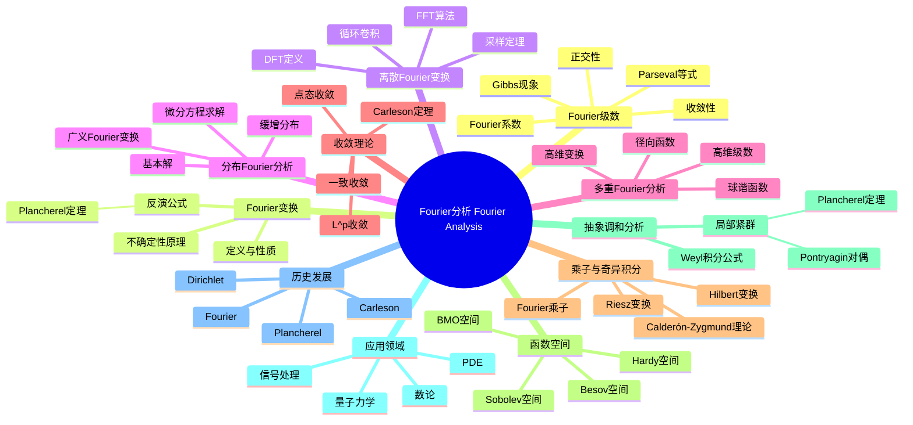

# Fourier分析 思维导图

## 中心概念
Fourier分析研究函数分解为简谐波（正弦/余弦）叠加的理论，是调和分析的核心。它在信号处理、偏微分方程、量子力学和数论中具有不可替代的地位。

## 核心分支

### 定义与公理
- **Fourier级数**: $f(x) \sim \sum_{n=-\infty}^\infty \hat{f}(n) e^{inx}$，其中 $\hat{f}(n) = \frac{1}{2\pi}\int_{-\pi}^\pi f(x)e^{-inx}dx$
- **Fourier变换**: $\hat{f}(\xi) = \int_{-\infty}^\infty f(x)e^{-2\pi i x \xi}dx$
- **反演公式**: $f(x) = \int_{-\infty}^\infty \hat{f}(\xi)e^{2\pi i x \xi}d\xi$
- **正交性**: $\int_{-\pi}^\pi e^{imx}e^{-inx}dx = 2\pi \delta_{mn}$

### 基本性质
- **线性性**: Fourier变换是线性算子
- **平移**: $\widehat{f(x-a)} = e^{-2\pi i a \xi}\hat{f}(\xi)$
- **调制**: $\widehat{e^{2\pi i a x}f(x)} = \hat{f}(\xi - a)$
- **微分**: $\widehat{f'} = 2\pi i \xi \hat{f}$（将微分变为乘法）

### 重要例子
- **方波**: 方波函数的Fourier级数收敛于周期延拓
- **Gauss函数**: $\widehat{e^{-\pi x^2}} = e^{-\pi \xi^2}$（自对偶）
- **矩形函数**: $\widehat{\chi_{[-a,a]}} = \frac{\sin(2\pi a \xi)}{\pi \xi}$
- **Dirac δ函数**: $\widehat{\delta} = 1$
- **Poisson核**: $P_r(\theta) = \sum_{n=-\infty}^\infty r^{|n|}e^{in\theta}$

### 核心定理
- **Parseval等式**: $\|f\|_{L^2}^2 = \sum |\hat{f}(n)|^2$（能量守恒）
- **Plancherel定理**: $\|\hat{f}\|_{L^2} = \|f\|_{L^2}$
- **Carleson定理**: $L^2$ 函数Fourier级数几乎处处收敛（证明思路：时间-频率分析）
- **不确定性原理**: $\Delta x \cdot \Delta \xi \geq \frac{1}{4\pi}$
- **采样定理**: 带限函数可由采样值重构

### 相关概念
- **父概念**: 积分、级数、正交展开
- **子概念**: 调和分析、小波分析、时频分析
- **相邻概念**: 偏微分方程、信号处理、概率论

### 应用领域
- **信号处理**: 滤波、压缩、频谱分析
- **偏微分方程**: 热方程、波动方程的Fourier方法
- **量子力学**: 位置-动量对偶、量子谐振子
- **数论**: 解析数论、模形式

### 历史发展
- **创立者**: Jean-Baptiste Joseph Fourier (1768-1830)，研究热传导
- **关键发展**:
  - 1829：Dirichlet证明分段光滑函数级数收敛
  - 1910：Plancherel定理（$L^2$理论）
  - 1965：Cooley-Tukey FFT算法
  - 1966：Carleson证明 $L^2$ 几乎处处收敛
- **现代发展**: 小波理论、压缩感知

### 参考资源
- **推荐教材**: Stein-Shakarchi《Fourier Analysis》、Katznelson《An Introduction to Harmonic Analysis》
- **相关论文**: Fourier《Théorie analytique de la chaleur》(1822)、Carleson《On convergence and growth of partial sums of Fourier series》(1966)
- **在线资源**: 3Blue1Brown傅里叶变换可视化

---

**概念链接**: [[调和分析]] [[复分析]] [[PDE]] [[信号处理]] [[量子力学]]
