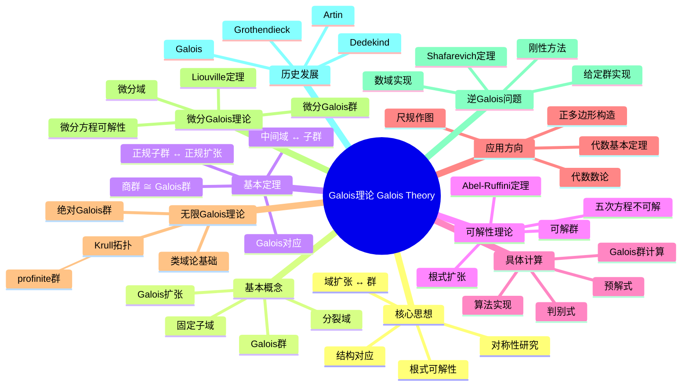

# Galois理论 思维导图

## 中心概念
Galois理论建立了域扩张与群之间的深刻联系，通过Galois群将域扩张的可解性问题转化为群论问题，是解决多项式方程根式可解性的终极理论。

## 核心分支

### 定义与公理
- **Galois扩张**: 正规且可分的代数扩张 $K/F$
- **Galois群**: $\text{Gal}(K/F) = \{\sigma \in \text{Aut}(K) : \sigma|_F = \text{id}_F\}$
- **固定子域**: 对于 $H \leq \text{Gal}(K/F)$，$K^H = \{x \in K : \sigma(x) = x, \forall \sigma \in H\}$
- **分裂域**: 多项式 $f$ 在其中完全分解的最小扩张

### 基本性质
- **Galois对应**: 中间域与Galois群的子群一一对应
- **正规子群 ↔ 正规扩张**: $H \triangleleft \text{Gal}(K/F)$ 当且仅当 $K^H/F$ 是Galois扩张
- **商群同构**: $\text{Gal}(K/F)/H \cong \text{Gal}(K^H/F)$
- **扩张次数**: $[K:F] = |\text{Gal}(K/F)|$

### 重要例子
- **二次扩张**: $\mathbb{Q}(\sqrt{d})/\mathbb{Q}$，Galois群为 $\mathbb{Z}/2\mathbb{Z}$
- **分圆扩张**: $\mathbb{Q}(\zeta_n)/\mathbb{Q}$，Galois群 $(\mathbb{Z}/n\mathbb{Z})^\times$
- **三次方程**: 判别式决定Galois群是 $A_3$ 还是 $S_3$
- **四次方程**: Galois群可能是 $V_4$, $D_4$, $A_4$, $S_4$ 之一
- **一般五次方程**: Galois群为 $S_5$，不可解

### 核心定理
- **Galois理论基本定理**: 中间域与Galois群子群的反序格同构
- **Abel-Ruffini定理**: 一般五次及以上方程无根式解（证明思路：$S_n$ ($n \geq 5$) 不可解）
- **Kronecker-Weber定理**: $\mathbb{Q}$ 的Abel扩张都包含于分圆域（类域论特例）
- **Hilbert不可约性定理**: 用于逆Galois问题

### 相关概念
- **父概念**: 域论、群论、域扩张
- **子概念**: 无限Galois理论、微分Galois理论、Galois上同调
- **相邻概念**: 代数数论、类域论、代数基本定理

### 应用领域
- **尺规作图**: 三等分角、倍立方体不可作图证明
- **正多边形构造**: 可作图当且仅当 $n = 2^k p_1 \cdots p_m$，$p_i$ 为Fermat素数
- **代数基本定理**: Galois理论证明复数域代数闭
- **代数数论**: 类域论的起点

### 历史发展
- **创立者**: Évariste Galois (1811-1832)，21岁死于决斗，遗稿包含核心思想
- **关键发展**:
  - 1850年代：Dedekind清晰阐述Galois理论
  - 1920-1940：Artin建立抽象Galois理论
  - 1960年代：Grothendieck引入Galois群的几何观点
- **现代研究**: 逆Galois问题、anabelian几何

### 参考资源
- **推荐教材**: Morandi《Field and Galois Theory》、Cox《Galois Theory》
- **相关论文**: Galois《Mémoire sur les conditions de résolubilité des équations par radicaux》
- **在线资源**: LMFDB、PARI/GP文档

---

**概念链接**: [[域]] [[群]] [[同态与同构]] [[代数数论]] [[类域论]]
