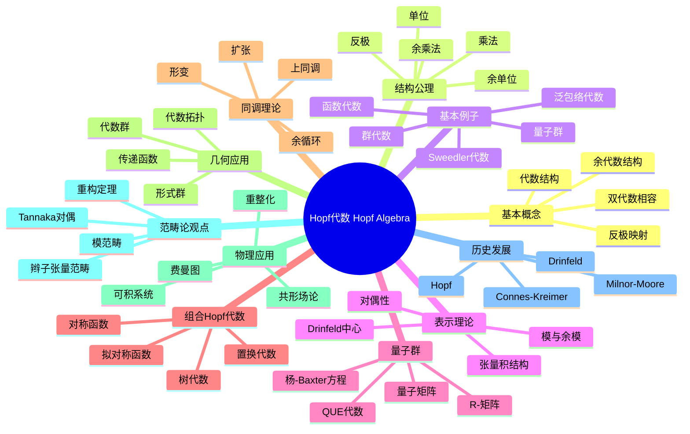

msc_primary: "00A99"
msc_secondary: ['00-00']
---

# Hopf代数 思维导图

## 中心概念
Hopf代数是同时具有代数结构和余代数结构的代数系统，配备反极映射（antipode），是量子群和代数拓扑中上同调环的核心结构，统一了群代数和李代数泛包络代数的性质。

## 核心分支

### 定义与公理
- **双代数**: 同时具有代数结构 $(H, m, u)$ 和余代数结构 $(H, \Delta, \epsilon)$，相容
- **Hopf代数**: 双代数配备反极 $S: H \to H$ 满足 $m \circ (S \otimes \text{id}) \circ \Delta = u \circ \epsilon$
- **余交换性**: $\Delta = \tau \circ \Delta$，其中 $\tau$ 交换张量因子
- **Sweedler记号**: $\Delta(h) = \sum h_{(1)} \otimes h_{(2)}$

### 基本性质
- **反极性质**: $S$ 是反同态（余交换时是反对合）
- **有限维对偶**: 有限维Hopf代数的对偶仍是Hopf代数
- **本原元素**: $\Delta(x) = x \otimes 1 + 1 \otimes x$，构成李代数
- **群-like元素**: $\Delta(g) = g \otimes g$，构成群

### 重要例子
- **群代数** $F[G]$: $\Delta(g) = g \otimes g$，$S(g) = g^{-1}$
- **函数代数** $\mathcal{O}(G)$: 代数群的坐标环
- **泛包络代数** $U(\mathfrak{g})$: 李代数的本原元素生成
- **量子群** $U_q(\mathfrak{sl}_2)$: Drinfeld-Jimbo形变
- **Sweedler代数**: 4维非交换非余交换Hopf代数

### 核心定理
- **Milnor-Moore定理**: 特征0域上余交换、连通、分次Hopf代数由本原元素生成（证明思路：PBW型论证）
- **Cartier-Gabriel定理**: 特征0域上交换Hopf代数是群代数的积
- **Kostant结构定理**: 复半单李代数的泛包络代数的结构
- **Tannaka重构**: 从纤维函子重构Hopf代数

### 相关概念
- **父概念**: 双代数、张量代数、泛包络代数
- **子概念**: 量子群、Yetter-Drinfeld模、Hopf-Galois扩张
- **相邻概念**: 李代数、表示论、辫群、形变量子化

### 应用领域
- **量子群**: 可积系统、纽结不变量、量子场论
- **代数拓扑**: H-空间的上同调、Steenrod代数
- **组合数学**: 对称函数、置换模式、树枚举
- **物理**: Connes-Kreimer重整化代数

### 历史发展
- **早期发展**: Heinz Hopf 研究H-空间上同调 (1941)
- **关键发展**:
  - 1965：Milnor-Moore《On the structure of Hopf algebras》
  - 1986：Drinfeld引入量子群
  - 1998：Connes-Kreimer重整化Hopf代数
  - 2000年代：组合Hopf代数的兴起
- **现代研究**: 高阶范畴、Hopf范畴、拓扑序

### 参考资源
- **推荐教材**: Sweedler《Hopf Algebras》、Kassel《Quantum Groups》、Montgomery《Hopf Algebras and Their Actions on Rings》
- **相关论文**: Drinfeld《Quantum Groups》、Connes-Kreimer《Hopf Algebras, Renormalization and Noncommutative Geometry》
- **在线资源**: arXiv math.QA、nLab

---

**概念链接**: [[李代数]] [[量子群]] [[张量代数]] [[表示论]] [[代数拓扑]]
