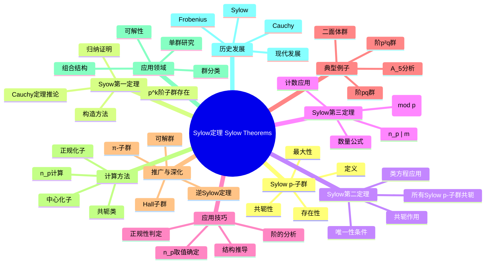

msc_primary: "00A99"
msc_secondary: ['00-00']
---

# Sylow定理 思维导图

## 中心概念

Sylow定理是有限群论中最基本的定理之一，描述了有限群中 $p$-子群的存在性、共轭性和数量。它是研究有限群结构的核心工具。

## 核心分支

### Sylow p-子群定义

- **定义**: 设 $|G| = p^k \cdot m$，其中 $p \nmid m$，则 $G$ 的 $p^k$ 阶子群称为Sylow $p$-子群

- **存在性**: Sylow第一定理保证存在性
- **共轭性**: 任意两个Sylow $p$-子群共轭
- **最大性**: Sylow $p$-子群是 $G$ 的极大 $p$-子群

### Sylow第一定理

- **定理**: 若 $p^k \mid |G|$，则 $G$ 有 $p^k$ 阶子群
- **证明方法**: 对 $|G|$ 归纳，利用类方程
- **Cauchy定理**: 若 $p \mid |G|$，则 $G$ 有 $p$ 阶元（Sylow定理的推论）

- **构造**: 通过群作用构造子群

### Sylow第二定理

- **定理**: $G$ 的所有Sylow $p$-子群彼此共轭
- **推论**: Sylow $p$-子群正规当且仅当它是唯一的
- **共轭类**: 所有Sylow $p$-子群形成共轭类
- **正规化子**: 若 $P$ 是Sylow $p$-子群，则 $[G:N_G(P)] = n_p$

### Sylow第三定理

- **记法**: $n_p$ 表示Sylow $p$-子群的数量
- **定理**: $n_p \equiv 1 \pmod{p}$ 且 $n_p \mid m$（其中 $|G| = p^k \cdot m$）

- **应用**: 通过 $n_p$ 的取值推断群结构
- **正规性**: $n_p = 1$ 当且仅当Sylow $p$-子群正规

### 应用技巧

- **阶的分析**: 从群的阶出发确定可能的 $n_p$ 值
- **正规性判定**: $n_p = 1$ 时得到正规子群
- **半直积**: 当Sylow子群结构明确时可构造半直积
- **分类**: 小阶群的分类

### 典型例子

- **15阶群**: $n_3 = 1$，$n_5 = 1$，必为循环群
- **21阶群**: $n_7 = 1$，有正规7阶子群，可能是非交换群
- **$A_5$**: $|A_5| = 60 = 2^2 \cdot 3 \cdot 5$，分析Sylow子群证明单性

- **二面体群**: $D_{2n}$ 的Sylow子群分析

### 核心定理

- **Sylow定理集**: 三定理构成有限群论的基础
- **Frattini论证**: 若 $N \trianglelefteq G$，$P$ 是 $N$ 的Sylow $p$-子群，则 $G = N \cdot N_G(P)$
- **Burnside定理**: $p^a q^b$ 阶群可解
- **逆Sylow定理**: 关于Sylow子群存在性的逆问题

### 相关概念

- **父概念**: [[群]]、[[子群]]、[[有限群]]
- **子概念**: [[p-群]]、[[可解群]]、[[单群]]
- **相邻概念**: [[群作用]]、[[正规子群]]、[[共轭]]

### 应用领域

- **群分类**: 有限群的分类定理
- **单群研究**: 证明群的单性
- **可解性**: 可解群的判定
- **组合结构**: 群作用与组合设计

### 历史发展

- **Cauchy (1844)**: Cauchy定理
- **Sylow (1872)**: 系统阐述Sylow定理
- **Frobenius (1890s)**: Sylow定理的推广
- **现代**: 有限单群分类中的Sylow方法

---

**概念链接**: [[群]] [[子群]] [[正规子群]] [[有限群]] [[群作用]]
