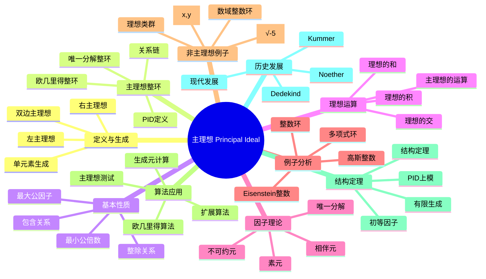

# 主理想 思维导图

## 中心概念
主理想是由单个元素生成的理想，是最简单的理想类型。主理想整环（PID）是每个理想都是主理想的整环，具有许多良好的性质。

## 核心分支

### 定义与生成
- **主理想**: $I = (a) = Ra = \{ra : r \in R\}$（交换环情形）
- **双边主理想**: $(a) = RaR = \{ras : r, s \in R\}$
- **生成元**: $a$ 称为理想 $I$ 的生成元
- **相伴**: $(a) = (b)$ 当且仅当 $a$ 与 $b$ 相伴

### 主理想整环 (PID)
- **定义**: 每个理想都是主理想的整环
- **欧几里得整环**: 欧几里得整环都是PID
- **唯一分解整环**: PID都是UFD
- **关系链**: 欧几里得整环 $\Rightarrow$ PID $\Rightarrow$ UFD $\Rightarrow$ 整环

### 基本性质
- **包含关系**: $(a) \subseteq (b)$ 当且仅当 $b \mid a$
- **理想的和**: $(a) + (b) = (\gcd(a,b))$
- **理想的交**: $(a) \cap (b) = (\text{lcm}(a,b))$
- **理想的积**: $(a)(b) = (ab)$

### 因子理论
- **素元**: $p$ 是素元，若 $(p)$ 是素理想
- **不可约元**: 只能被单位和相伴元整除
- **相伴元**: $a \sim b$ 若 $a = ub$，$u$ 是单位
- **唯一分解**: PID中每个非零元可唯一分解为素元的乘积

### 核心定理
- **Bezout等式**: 在PID中，$\gcd(a,b) = ax + by$ 有解
- **PID结构定理**: 有限生成PID-模的结构定理
- **主理想测试**: 理想是否为主理想的判定方法
- **类数1**: 数域的理想类群平凡 $\Leftrightarrow$ 整数环是PID

### 重要例子
- **整数环**: $\mathbb{Z}$ 是欧几里得整环，从而是PID
- **域上多项式**: $F[x]$ 是欧几里得整环（次数函数）
- **高斯整数**: $\mathbb{Z}[i]$ 是欧几里得整环
- **Eisenstein整数**: $\mathbb{Z}[\omega]$，$\omega = e^{2\pi i/3}$，是欧几里得整环

### 非主理想例子
- **$\mathbb{Z}[\sqrt{-5}]$**: $(2, 1+\sqrt{-5})$ 不是主理想
- **$k[x,y]$**: $(x, y)$ 不是主理想
- **理想类群**: 衡量理想与主理想差距的群
- **类数**: 理想类群的阶，类数1表示PID

### 算法应用
- **欧几里得算法**: 计算最大公因子
- **扩展欧几里得算法**: 求Bezout系数
- **主理想测试**: 判断给定理想是否为主理想
- **生成元计算**: 求主理想的生成元

### 相关概念
- **父概念**: [[理想]]
- **子概念**: [[主理想整环]]、[[欧几里得整环]]、[[唯一分解整环]]
- **相邻概念**: [[素理想]]、[[因子分解]]、[[理想类群]]

### 应用领域
- **数论**: 代数整数的因子分解
- **编码理论**: 循环码的代数结构
- **计算代数**: 多项式理想的计算
- **代数几何**: 主理想与超曲面对应

### 历史发展
- **Kummer (1840s)**: 理想数的概念
- **Dedekind (1870s)**: 理想理论的公理化，主理想概念
- **Noether (1920s)**: 抽象理想理论
- **现代**: 计算数论中的主理想问题

---

**概念链接**: [[理想]] [[主理想整环]] [[欧几里得整环]] [[唯一分解整环]] [[因子分解]]
