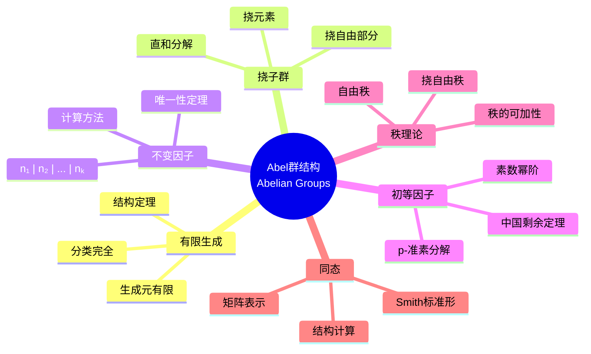
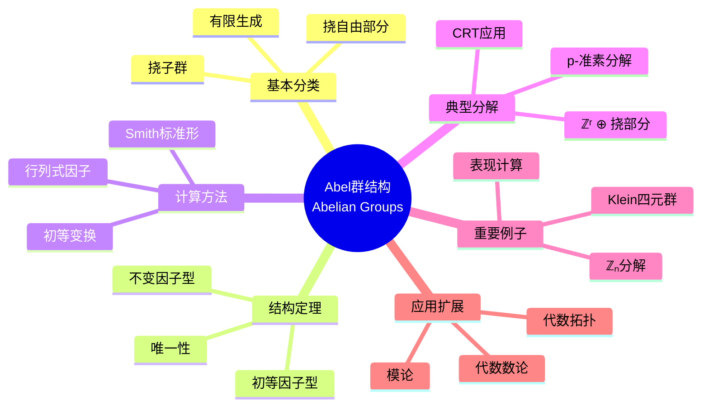

msc_primary: "00A99"
msc_secondary: ['00-XX']
---

# Abel群结构思维导图

## 中心概念精确定义

**有限生成Abel群 (Finitely Generated Abelian Group)**

Abel群 $A$ 称为**有限生成**的，若存在有限集 $S \subseteq A$ 使 $A = \langle S \rangle$。

**挠子群 (Torsion Subgroup)**：$A_{\text{tor}} = \{a \in A : na = 0 \text{ for some } n \neq 0\}$

**挠自由部分**：$A/A_{\text{tor}}$ 是自由Abel群。

**结构定理**：有限生成Abel群 $A$ 可唯一分解为：
$$A \cong \mathbb{Z}^r \oplus \mathbb{Z}_{n_1} \oplus \mathbb{Z}_{n_2} \oplus \cdots \oplus \mathbb{Z}_{n_k}$$

其中：
- $r \geq 0$ 是**秩**（自由部分的秩）
- $n_1 \mid n_2 \mid \cdots \mid n_k$（不变因子分解）
- 或分解为素数幂阶循环群的直和（初等因子分解）

---

## 核心要素

### 1. 挠子群与挠自由部分

**挠子群 $A_{\text{tor}}$**：
- 是 $A$ 的子群
- 由所有有限阶元素组成
- $A/A_{\text{tor}}$ 无挠（挠自由）

**分解定理**：有限生成Abel群有分裂正合列
$$0 \to A_{\text{tor}} \to A \to A/A_{\text{tor}} \to 0$$

即 $A \cong A_{\text{tor}} \oplus \mathbb{Z}^r$

### 2. 不变因子分解

**定理**：$A_{\text{tor}} \cong \mathbb{Z}_{n_1} \oplus \cdots \oplus \mathbb{Z}_{n_k}$，满足 $n_1 \mid n_2 \mid \cdots \mid n_k$。

**唯一性**：序列 $(n_1, \ldots, n_k)$ 由 $A$ 唯一确定。

**计算方法**：
- 计算初等因子
- 从小到大配对相乘

### 3. 初等因子分解

**p-准素分支**：对素数 $p$，$A(p) = \{a \in A : p^k a = 0 \text{ for some } k\}$

**定理**：$A_{\text{tor}} = \bigoplus_p A(p)$（所有素数的直和）

**初等因子**：每个 $A(p) \cong \mathbb{Z}_{p^{e_1}} \oplus \cdots \oplus \mathbb{Z}_{p^{e_m}}$

**唯一性**：对每个 $p$，指数序列 $(e_1, \ldots, e_m)$ 唯一。

### 4. Smith标准形

**矩阵表示**：有限生成Abel群可用整数矩阵表示。

**Smith标准形**：任意整数矩阵 $M$ 等价于对角矩阵 $\text{diag}(d_1, \ldots, d_r, 0, \ldots, 0)$，满足 $d_1 \mid d_2 \mid \cdots \mid d_r$。

**应用**：计算Abel群的表现矩阵的不变因子。

---

## 性质与定理

### 定理1：有限生成Abel群结构定理

**命题**：有限生成Abel群 $A$ 有唯一分解：
$$A \cong \mathbb{Z}^r \oplus \mathbb{Z}_{n_1} \oplus \cdots \oplus \mathbb{Z}_{n_k}$$

其中 $n_1 \mid \cdots \mid n_k$。

**证明概要**：
1. 证明 $A \cong \mathbb{Z}^m/\text{Im}(M)$（表现）
2. Smith标准形化简
3. 唯一性由初等因子唯一性保证

### 定理2：有限Abel群分类

**命题**：有限Abel群完全由不变因子（或初等因子）分类。

**计数**：阶为 $n = p_1^{e_1} \cdots p_k^{e_k}$ 的Abel群个数为 $p(e_1) \cdots p(e_k)$，其中 $p(e)$ 是 $e$ 的划分个数。

### 定理3：对偶群（Pontryagin对偶）

**命题**：局部紧Abel群 $G$，其对偶群 $\hat{G} = \text{Hom}(G, \mathbb{T})$ 是同构类型相同的群。

**有限情形**：有限Abel群 $A$ 满足 $A \cong \text{Hom}(A, \mathbb{C}^\times)$。

### 定理4：秩的可加性

**命题**：若 $0 \to A \to B \to C \to 0$ 正合，则 $\text{rank}(B) = \text{rank}(A) + \text{rank}(C)$。

### 定理5：投射与内射Abel群

**命题**：
- 自由Abel群是投射的
- $\mathbb{Q}/\mathbb{Z}$ 是内射上生成元
- 一般Abel群不是投射的（如 $\mathbb{Z}_n$）

---

## 典型例子

### 例子1：$\mathbb{Z}_6$ 的分解

**不变因子**：$\mathbb{Z}_6$（单因子）

**初等因子**：$\mathbb{Z}_2 \oplus \mathbb{Z}_3$（因 $6 = 2 \times 3$）

**同构**：$\mathbb{Z}_6 \cong \mathbb{Z}_2 \oplus \mathbb{Z}_3$（中国剩余定理）

### 例子2：Klein四元群 $\mathbb{Z}_2 \times \mathbb{Z}_2$

**结构**：初等因子分解 $\mathbb{Z}_2 \oplus \mathbb{Z}_2$

**不变因子**：无法写成 $\mathbb{Z}_n$（因无4阶元）

**特点**：不是循环群，但所有真子群正规。

### 例子3：$\mathbb{Z}^2 / \langle (2,0), (0,3) \rangle$

**表现矩阵**：$\begin{pmatrix} 2 & 0 \\ 0 & 3 \end{pmatrix}$

**Smith标准形**：对角形，不变因子为 $1, 6$（需计算）

**结果**：$\mathbb{Z}^2 / \langle (2,0), (0,3) \rangle \cong \mathbb{Z}_6 \oplus \mathbb{Z}$（需验证）

---

## 关联概念

| 概念 | 关系 | 说明 |
|------|------|------|
| **模论** | 推广 | Abel群 = $\mathbb{Z}$-模 |
| **主理想整环** | 推广 | PID上有限生成模结构定理 |
| **线性代数** | 工具 | Smith标准形、行列式因子 |
| **代数拓扑** | 应用 | 同调群是Abel群 |
| **代数几何** | 应用 | 代数群的结构理论 |
| **数论** | 联系 | 类群、单位群的结构 |

---

## 思维导图可视化

---

## 深入学习

### 推荐教材
- Dummit & Foote, *Abstract Algebra*, Chapter 12
- Hungerford, *Algebra*, Chapter 2
- Lang, *Algebra*, Chapter 1

### 相关课程
- MIT 18.704 (Seminar in Algebra)
- Harvard Math 122 (Algebra I)

### 进阶主题
- **PID上模的结构定理**：Abel群的推广
- **同调代数**：Ext与Tor函子
- **代数K-理论**：投射模的分类

---

*本思维导图系统呈现有限生成Abel群的结构理论，从挠子群分解到不变因子定理，是代数学分类理论的典范。*
